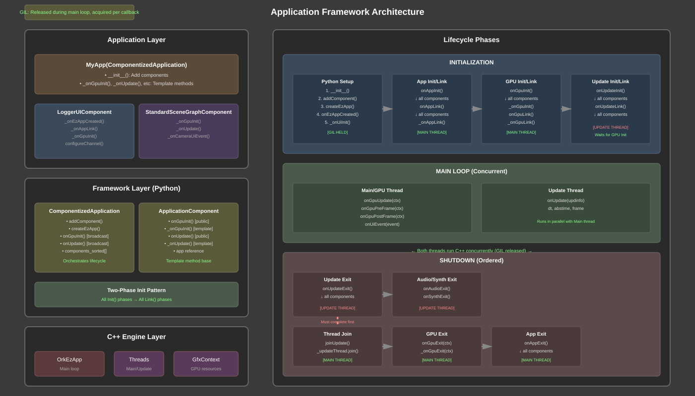
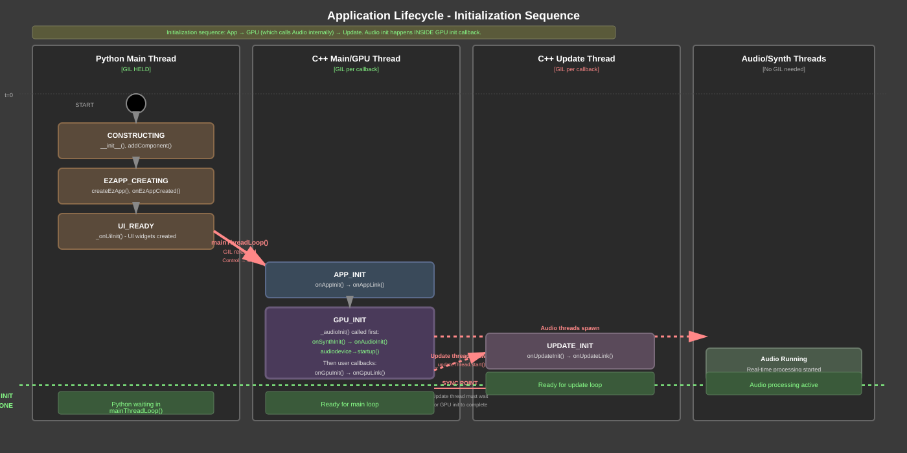
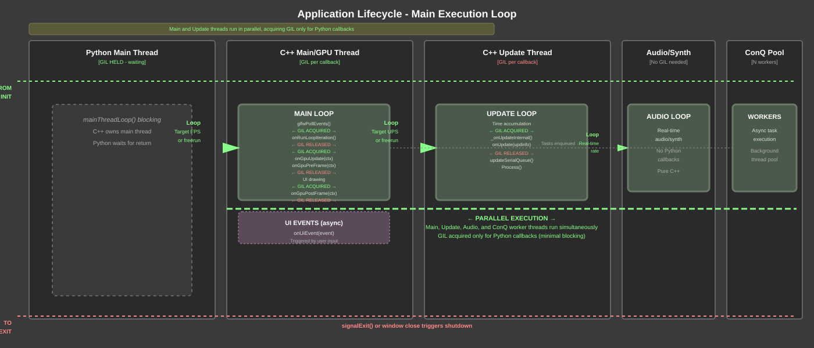
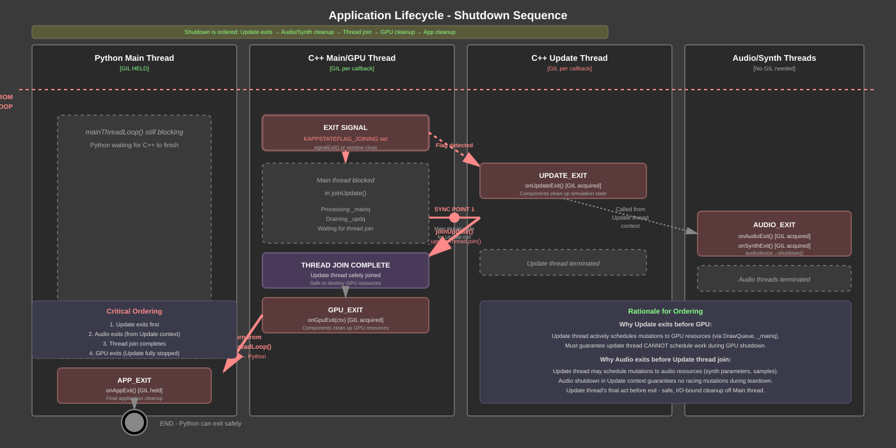
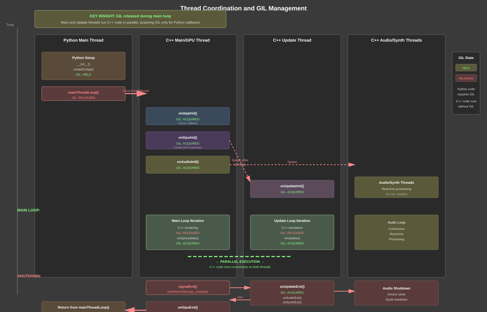

# Application Framework - Technical Design Document

---

## Overview

The Orkid Application Framework is a component-based application lifecycle system that provides structured coordination of multi-threaded execution, resource initialization, and clean shutdown across Python and C++. It combines Entity-Component-System (ECS) principles with a strict two-phase initialization pattern and template method architecture.

### What It Does

- **Component-Based Architecture**: Composable application components with lifecycle hooks
- **Multi-Threaded Coordination**: Manages Main/GPU, Update, and Audio/Synth threads
- **Two-Phase Initialization**: Init→Link pattern ensures resources exist before cross-referencing
- **Template Method Pattern**: Clean separation between framework and application logic
- **GIL Management**: Proper Python Global Interpreter Lock handling for parallelism

### Key Benefits

- **Deterministic Lifecycle**: Guaranteed initialization and shutdown order
- **Composability**: Build applications from reusable components
- **Thread Safety**: Atomic state flags and proper synchronization
- **Clean Separation**: Framework broadcasts, components implement, apps customize
- **Parallelism**: UPDATE and MAIN threads run C++ concurrently between Python callbacks

---

## Basic Concepts

### ComponentizedApplication

The base application class that manages the lifecycle and component coordination:
- Maintains sorted collection of components
- Broadcasts lifecycle events to all components
- Provides template methods for app-specific customization
- Manages EzApp creation and configuration
- Coordinates thread startup and shutdown

### ApplicationComponent

Base class for reusable application components:
- Implements lifecycle hooks via template method pattern
- Public `onXxx()` methods called by framework
- Protected `_onXxx()` methods overridden by subclasses
- No direct interaction with other components during Init phase
- Cross-component communication happens during Link phase

### Lifecycle Phases

Each subsystem follows a two-phase initialization pattern:

**Init Phase**: Create resources, allocate memory, set up state
- Components initialize internal state
- Resources created but not yet connected
- No cross-component dependencies

**Link Phase**: Connect resources, establish references, configure relationships
- All Init phases complete before any Link begins
- Safe to reference other components
- Configure channels, connections, relationships

### Thread Model

**MAIN/GPU Thread**: Process origin, owns GPU context
- Initialization: onAppInit → onGpuInit (which calls onSynthInit → onAudioInit internally)
- Loop: onGpuUpdate, onGpuPreFrame, onGpuPostFrame, onUiEvent
- Shutdown: onGpuExit → onAppExit

**UPDATE Thread**: Simulation and logic, spawned from C++
- Initialization: onUpdateInit (waits for GPU init to complete)
- Loop: onUpdate (freerun or lockstep)
- Shutdown: onUpdateExit → onAudioExit → onSynthExit

**AUDIO/SYNTH Threads**: Real-time audio processing
- Spawned after initialization
- Run concurrently with Main and Update threads
- Shut down from Update thread context

---

## Core Features

### Essential Capabilities

- **Component Lifecycle Management**
  - Sorted execution order (alphabetically by component name)
  - Broadcast pattern ensures all components initialized before linking
  - Template methods for app-level customization
  - Clean component addition/removal API

- **Two-Phase Initialization**
  - App level: onAppInit → onAppLink
  - GPU level: onGpuInit → onGpuLink
  - Audio level: onSynthInit → onSynthLink → onAudioInit → onAudioLink
  - Update level: onUpdateInit → onUpdateLink
  - Prevents circular dependencies and initialization order issues

- **Multi-Threaded Execution**
  - Main thread: GPU rendering and UI events
  - Update thread: Simulation and game logic
  - Audio threads: Real-time audio synthesis
  - Proper GIL management for Python parallelism
  - Atomic state flags for thread coordination

- **Clean Shutdown Sequencing**
  - Update thread exits first
  - Audio/Synth shutdown from Update thread context
  - GPU cleanup after Update thread joins
  - App-level cleanup last
  - Prevents resource cleanup order issues

- **Python-C++ Integration**
  - GIL released for C++ main loop
  - GIL acquired individually for each callback
  - Maximizes concurrent execution
  - Proper exception handling and traceback reporting

---

## High-Level Architecture



The architecture provides clean separation between application code, framework orchestration, and C++ engine integration.

---

## Lifecycle Phases

The application progresses through three distinct phases: initialization, execution loop, and shutdown. Each phase is shown with thread coordination and synchronization points.

### Initialization Sequence



Sequential initialization with specific ordering constraints (App → GPU (which contains Audio) → Update).

### Main Execution Loop



Parallel execution of Main/GPU, Update, and Audio threads with minimal GIL contention.

### Shutdown Sequence



Ordered shutdown ensuring Update thread exits before GPU cleanup, preventing resource corruption.

---

## Thread Coordination and Synchronization

Multiple threads execute concurrently during the main loop, with careful synchronization at startup and shutdown.



---

## Two-Phase Initialization Pattern

### Rationale

The Init→Link pattern solves a fundamental problem in component-based architectures: **initialization order dependencies**.

**Without Two-Phase Init:**
```python
# Component A needs Component B's channel
class ComponentA:
    def __init__(self):
        # ERROR: ComponentB might not exist yet!
        self.channel = app.findComponent("B").get_channel()
```

**With Two-Phase Init:**
```python
class ComponentA(ApplicationComponent):
    def _onAppInit(self, app, initdata):
        # Create my own resources
        self.my_resource = create_resource()

    def _onAppLink(self, app, initdata):
        # Now safe - all components have initialized
        comp_b = app.findComponentByName("B")
        self.channel = comp_b.get_channel()
```

### Execution Guarantee

The framework enforces this ordering:

```
Component A: onInit()
Component B: onInit()
Component C: onInit()
  ↓ ALL Init phases complete
Component A: onLink()
Component B: onLink()
Component C: onLink()
```

This pattern is applied at every subsystem level:
- **App level**: Application components initialize, then link
- **GPU level**: GPU resources created, then linked
- **Audio level**: Synth/Audio initialized, then linked
- **Update level**: Simulation state created, then linked

### Benefits

1. **Eliminates Race Conditions**: No component can access another during Init
2. **Clear Dependencies**: Link phase makes cross-component dependencies explicit
3. **Predictable Order**: Alphabetical component sorting ensures deterministic execution
4. **Testability**: Each component can be initialized in isolation
5. **Debugging**: Easy to identify initialization vs. configuration issues

---

## Template Method Pattern

### Rationale

The Template Method pattern separates **framework concerns** from **application logic**.

**Framework Responsibilities** (ComponentizedApplication):
- Broadcast lifecycle events to all components
- Enforce ordering (Init before Link)
- Manage component collection
- Handle thread coordination

**Application Responsibilities** (via `_onXxx` template methods):
- Custom initialization logic
- App-specific resource setup
- UI construction
- Scene configuration

### Implementation

Each lifecycle hook follows this pattern:

```python
class ComponentizedApplication:
    def onGpuInit(self, ctx):
        # Framework brings all components to gpu init phase first
        for component in self.components_sorted:
            component.onGpuInit(ctx)

        # Then calls app template method
        self._onGpuInit(ctx)

        # Framework brings all components to gpu link phase 
        for component in self.components_sorted:
            component.onGpuLink(ctx)

        # Then calls app template method
        self._onGpuLink(ctx)

    def _onGpuInit(self, ctx):
        pass  # App overrides this
```

### Benefits

1. **Separation of Concerns**: Framework doesn't know about app details
2. **Extensibility**: Apps extend without modifying framework
3. **Consistency**: All apps follow same lifecycle
4. **Reusability**: Components work with any application
5. **Maintenance**: Framework changes don't break apps

---

## GIL Management and Parallelism

### The Challenge

Python's Global Interpreter Lock (GIL) prevents true parallel execution of Python code. The framework must:
- Release GIL to allow C++ parallelism
- Re-acquire GIL for Python callbacks
- Avoid deadlocks and race conditions

### The Solution

```
[Python owns GIL]
  ↓
app.createEzApp()  # Setup in Python
  ↓
ezapp.mainThreadLoop()  ← GIL RELEASED HERE
  ↓
[C++ Main Loop Running - No GIL]
  ↓
onGpuUpdate() callback ← GIL ACQUIRED
  [Python executes]
  ↓ Return
← GIL RELEASED
  ↓
[C++ continues]
  ↓
onUpdate() callback (UPDATE THREAD) ← GIL ACQUIRED
  [Python executes]
  ↓ Return
← GIL RELEASED
```

### Parallelism Achieved

While GIL is released:
- **MAIN Thread** runs C++ rendering code
- **UPDATE Thread** runs C++ simulation code
- Both can execute **simultaneously**

When Python callbacks execute:
- Thread acquires GIL
- Other python threads wait if they need GIL
- Keep callbacks short to maximize parallelism

### Best Practices

1. **Keep Python Callbacks Short**: Minimize time holding GIL
2. **Heavy Lifting in C++**: Move computation to C++ where possible
3. **Use Component Pattern**: Distribute work across components
4. **Leverage Queues**: Use C++ queues (_mainq, _updq, _conq) for inter-thread communication

When using the best practices, you will be suprised by how much parallelism and performance you can get out of a python program. Orkid's application topology goes out of its way to help achieve this.

---

## Critical Sequencing Constraints

The C++ engine enforces these orderings to prevent resource corruption:

### 1. GPU Init Before Update Init

```
onGpuInit() must complete before onUpdateInit()
```

**Rationale**: Update thread actively schedules mutations to GPU resources (via DrawQueue, _mainq). GPU context must be fully initialized before Update thread can schedule work.

**Enforcement**: Update thread spawn deferred until after `onGpuInit` completes.

### 2. Update Exit Before GPU Exit

```
onUpdateExit() must complete before onGpuExit()
```

**Rationale**: Update thread actively schedules mutations to GPU resources (via DrawQueue, _mainq). Must guarantee Update thread CANNOT schedule work during GPU shutdown. Thread join ensures Update has fully stopped before GPU cleanup begins.

**Enforcement**: `joinUpdate()` called inside `_onGpuExit` callback before user GPU cleanup.

### 3. Audio Initialization Order

```
onSynthInit() → onSynthLink() → onAudioInit() → onAudioLink()
```

**Rationale**: Audio device needs synthesizer instance for routing. Synth must exist before audio startup.

**Enforcement**: Sequenced in `OrkEzApp::_audioInit()`.

### 4. Audio Shutdown in Update Thread

```
onUpdateExit() → onAudioExit() → onSynthExit()
```

**Rationale**: Update thread may schedule mutations to audio resources (synth parameters, samples). Audio shutdown in Update thread context guarantees no racing mutations during teardown. Additionally, audio shutdown is I/O bound (device close, driver teardown) - keeping it off Main thread prevents rendering stalls.

**Enforcement**: `_audioExit()` called from update thread after `onUpdateExit()`.

---

## Memory Management

### Ownership Model

- **EzApp**: Created by application, owned as `shared_ptr`
- **Components**: Owned by application in sorted vector
- **InitData**: Created by EzApp, shared via `shared_ptr`
- **Resources**: Component-owned, RAII cleanup in destructors

### RAII Everywhere

Components should use RAII for cleanup:

```python
class MyComponent(ApplicationComponent):
    def _onGpuInit(self, ctx):
        self.texture = lev2.Texture.load("image.png")
        # No explicit cleanup needed - Python GC handles it

    def _onGpuExit(self, ctx):
        # Explicit cleanup if needed for C++ resources
        self.texture = None
```

### No Shared-From-This

The application framework explicitly avoids `shared_from_this` pattern:

- Static factory methods receive parent as parameter
- No circular reference issues
- Clear ownership semantics
- Easier debugging

---

## Component Communication Patterns

### During Init: Forbidden

```python
def _onGpuInit(self, ctx):
    # WRONG - other component may not exist yet!
    other = self.app.findComponentByName("other")
```

### During Link: Encouraged

```python
def _onGpuLink(self, ctx):
    # CORRECT - all components initialized
    logger = self.app.findComponentByName("logger")
    self.channel = logger.configureChannel("MYCOMP", color)
```

### During Runtime: Via Notify

```python
# Component A
self.app.notify(CrcString("event_happened"), data=value)

# Component B
def _onNotify(self, eventid, **kwargs):
    if eventid == "event_happened":
        self.handle_event(kwargs['data'])
```

### Component Discovery

```python
# By name (unique)
logger = app.findComponentByName("logger")

# By class (potentially multiple)
overlays = app.findComponentsByClass(OverlayComponent)
```

---

## Common Patterns

### Logger Integration

```python
class MyApp(ComponentizedApplication):
    def __init__(self):
        super().__init__()
        self.addComponent("logger", LoggerUIComponent)
        # ... other components
        self.createEzApp()

    def _onAppLink(self):
        logger = self.findComponentByName("logger")
        self.channel = logger.configureChannel(
            "MYAPP",
            vec3(1, 0.5, 0),
            enable_channel=True
        )
```

### Standard SceneGraph

```python
class MyApp(ComponentizedApplication):
    def __init__(self):
        super().__init__()
        self.addComponent("scenegraph", StandardSceneGraphComponent)
        self.createEzApp()

    def _onGpuLink(self, ctx):
        sg = self.findComponentByName("scenegraph")
        # Add drawables to sg.layer1
```

### Custom Component

```python
class SimulationComponent(ApplicationComponent):
    def _onUpdateInit(self):
        self.entities = []
        self.physics_world = PhysicsWorld()

    def _onUpdate(self, updinfo):
        dt = updinfo.dt
        for entity in self.entities:
            entity.update(dt)
        self.physics_world.step(dt)

    def _onUpdateExit(self):
        self.physics_world.cleanup()
```

---

## Testing Strategies

### Component Isolation

Test components independently by mocking the application:

```python
class MockApp:
    def __init__(self):
        self.components = {}

    def findComponentByName(self, name):
        return self.components.get(name)

def test_my_component():
    app = MockApp()
    comp = MyComponent()
    comp.onAppInit(app, initdata)
    comp.onAppLink(app, initdata)
    assert comp.is_initialized
```

### Lifecycle Verification

Verify Init happens before Link:

```python
def test_init_before_link():
    events = []

    class TrackedComponent(ApplicationComponent):
        def _onGpuInit(self, ctx):
            events.append("init")
        def _onGpuLink(self, ctx):
            events.append("link")
            assert "init" in events

    app = ComponentizedApplication()
    app.addComponent("tracked", TrackedComponent)
    # ... execute lifecycle
    assert events == ["init", "link"]
```

### Thread Safety Testing

Verify no data races in multi-threaded execution:

```python
def test_thread_safety():
    app = MyApp()
    app.ezapp.mainThreadLoop()
    # ThreadSanitizer will catch issues during execution
```

---

## Performance Considerations

### Minimize GIL Hold Time

**Bad:**
```python
def _onUpdate(self, updinfo):
    # Long computation holding GIL
    for i in range(1000000):
        result = expensive_python_math(i)
```

**Good:**
```python
def _onUpdate(self, updinfo):
    # Quick Python, delegate to C++
    self.cpp_system.update(updinfo.dt)
```

### Component Sorting Overhead

Components sorted alphabetically for determinism. With many components:
- Sort happens once during `addComponent()`
- Iteration is O(n) per broadcast
- Keep component count reasonable (<50)

### Update Thread Timing

**Freerun Mode**: Update runs as fast as possible
- Good for: Interactive applications, games
- CPU: Higher utilization

**Lockstep Mode**: Update runs at fixed virtual time
- Good for: Deterministic simulation, replays
- CPU: Lower utilization, more predictable

Configure via `ezapp_args`:
```python
self.ezapp_args = {
    'enable_freerun_ups': True,  # Freerun
    'enable_freerun_fps': True,
}
```

---

## Migration Guide

### From Direct EzApp to ComponentizedApplication

**Before:**
```python
class MyApp:
    def __init__(self):
        self.ezapp = lev2.OrkEzApp.create(self)
        self.ezapp.onGpuInit(self.gpu_init)

    def gpu_init(self, ctx):
        # Setup code
```

**After:**
```python
class MyApp(ComponentizedApplication):
    def __init__(self):
        super().__init__()
        self.createEzApp()

    def _onGpuInit(self, ctx):
        # Same setup code
```

### Adding Components

**Before:**
```python
def __init__(self):
    self.logger = LoggerUI()
    self.scenegraph = SceneGraph()
```

**After:**
```python
def __init__(self):
    super().__init__()
    self.addComponent("logger", LoggerUIComponent)
    self.addComponent("scenegraph", StandardSceneGraphComponent)
    self.createEzApp()
```

---

## Future Enhancements

### Potential Improvements

1. **Dependency Declaration**: Explicit component dependencies
2. **Parallel Component Init**: Init components concurrently where possible
3. **Dynamic Component Loading**: Add/remove components at runtime
4. **Component State Serialization**: Save/load component state
5. **Hot Reload**: Reload components without restart

### Backward Compatibility

The framework maintains compatibility by:
- Template methods default to empty implementations
- Optional lifecycle hooks (components override what they need)
- Graceful degradation when features not used

---

## References

- **C++ Implementation**: `ork.lev2/src/ezapp.cpp`
- **Python Framework**: `obt.project/scripts/ork/app/application.py`
- **Python Bindings**: `ork.lev2/pyext/src/pyext_ezapp.cpp`
- **ECS Pattern**: `ork.dox/ecs.md`
- **Session Notes**: `ork.data/misc/session_notes.md`

---

## Appendix: Complete Lifecycle Reference

### Initialization Sequence

1. `Application.__init__()` [PYTHON MAIN, GIL HELD]
2. `Application.createEzApp()` [PYTHON MAIN, GIL HELD]
   - Components: `onEzAppCreated()`
   - App: `_onEzAppCreated()` → `_onUiInit()`
3. `ezapp.mainThreadLoop()` [GIL RELEASED]
4. `onAppInit()` [MAIN THREAD, GIL ACQUIRED]
   - Components broadcast
   - Calls `onAppLink()` immediately
5. `onAppLink()` [MAIN THREAD, GIL ACQUIRED]
   - Components broadcast
   - App: `_onAppLink()`
6. `onGpuInit()` [MAIN THREAD, GIL ACQUIRED]
   - **INSIDE GPU INIT CALLBACK:**
   - `_audioInit()` called first:
     - `onSynthInit()` → Components broadcast → `onSynthLink()`
     - `onAudioInit()` → Components broadcast → `onAudioLink()`
     - **[AUDIO/SYNTH THREADS SPAWNED]**
   - Then user GPU callbacks:
     - Components: `onGpuInit()`
     - App: `_onGpuInit()`
     - Components: `onGpuLink()`
     - App: `_onGpuLink()`
   - **[UPDATE THREAD SPAWNED]** at end of GPU init
7. `onUpdateInit()` [UPDATE THREAD, GIL ACQUIRED]
   - Components broadcast
   - Components: `onUpdateLink()`

### Main Loop

**MAIN Thread:**
- `onGpuUpdate(ctx)` [per frame]
- `onGpuPreFrame(ctx)` [per frame]
- `onGpuPostFrame(ctx)` [per frame]
- `onUiEvent(event)` [on events]

**UPDATE Thread:**
- `onUpdate(updinfo)` [per update tick]

### Shutdown Sequence

1. `KAPPSTATEFLAG_JOINING` set [MAIN THREAD]
2. `onUpdateExit()` [UPDATE THREAD, GIL ACQUIRED]
   - Components broadcast
3. `onAudioExit()` [UPDATE THREAD, GIL ACQUIRED]
   - Components broadcast
4. `onSynthExit()` [UPDATE THREAD, GIL ACQUIRED]
   - Components broadcast
5. **[UPDATE THREAD JOIN]** [MAIN THREAD, GIL RELEASED]
6. `onGpuExit(ctx)` [MAIN THREAD, GIL ACQUIRED]
   - Components broadcast
   - App: `_onGpuExit()`
7. `onAppExit()` [MAIN THREAD, GIL ACQUIRED]
   - Components broadcast
8. **[MAIN THREAD RETURNS]** [PYTHON MAIN, GIL HELD]
