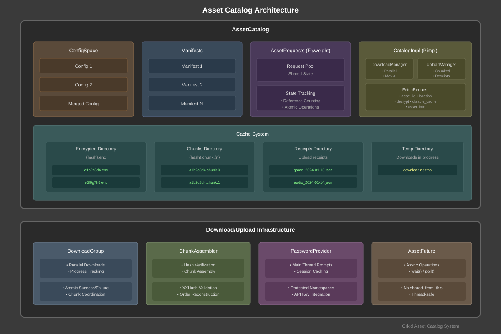
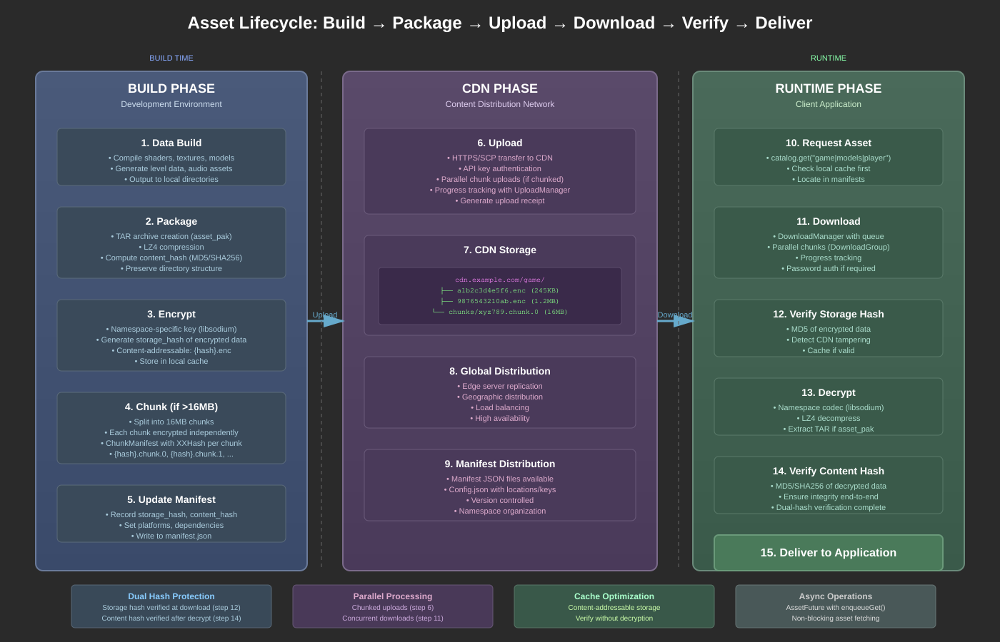
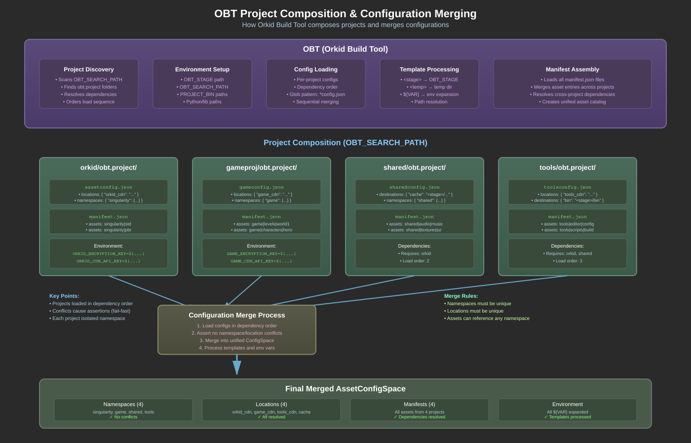

# Asset Catalog System - Technical Design Document

---

## Overview

The Asset Catalog is a comprehensive content management system designed for the Orkid game engine. It handles both build-time asset packaging and runtime asset delivery with a focus on security, performance, and reliability.

### What It Does

- **Build Time**: Packages game assets, encrypts them, and uploads to CDN servers
- **Runtime**: Downloads assets on-demand, verifies integrity, and delivers to the game
- **Caching**: Maintains local cache to minimize redundant downloads
- **Security**: Encrypts assets with per-namespace keys and dual-hash verification

### Key Benefits

- **Symmetric Design**: What goes up (build) comes down (runtime) intact
- **Thread-Safe**: All operations safe for concurrent access
- **Memory Efficient**: Flyweight pattern minimizes memory overhead
- **Scalable**: Supports parallel downloads and chunked transfers

---

## Basic Concepts

### Namespaces
Assets are organized into namespaces (e.g., "game", "shared", "tools"). Each namespace has:
- Its own encryption key
- Associated CDN location
- Independent configuration

### Asset IDs
Assets are identified by fully-qualified IDs: `namespace|category|name`
- Example: `game|models|player`
- Example: `shared|audio|music`

### Content-Addressable Storage
Assets stored using their hash as filename:
- Enables deduplication
- Provides built-in integrity checking
- Example: `a1b2c3d4e5f6.enc`

---

## Core Features

### Essential Capabilities

- **Unified Asset Management**
  - Single interface for all asset operations across namespaces
  - Flyweight pattern for AssetRequests with reference counting
  - Atomic state tracking throughout asset lifecycle
  - Thread-safe operations via LockedResource pattern

- **Namespace Organization**
  - Hierarchical namespace structure for asset organization
  - Per-namespace encryption keys and codecs
  - Namespace-specific configuration and policies
  - Pattern-based asset discovery and filtering

- **Robust Download Management**
  - Parallel downloads with DownloadGroup coordination
  - Concurrent asset fetching via AssetFuture/enqueueGet()
  - Progress tracking and cancellation support
  - Chunk-based downloads for large files (>16MB)
  - Configurable concurrent download limits (default: 4)

- **Security and Integrity**
  - Per-namespace encryption with libsodium
  - Hash verification (MD5, XXHash) with corruption detection
  - Password-protected namespace support with caching
  - Content-addressable storage using hash-based filenames

- **Async/Concurrent Operations**
  - AssetFuture-based async API for non-blocking fetches
  - Parallel chunk downloads for large assets
  - Thread-safe state management without shared_from_this
  - Background download queue with opq::concurrentQueue

---

## High-Level Architecture



The architecture consists of four main layers:
1. **Configuration Layer**: Manages namespaces and locations
2. **Request Layer**: Handles asset requests with flyweight pattern
3. **Implementation Layer**: Core download/upload managers
4. **Cache Layer**: Local storage for encrypted and decrypted assets

---

## Asset Lifecycle

The Asset Catalog system manages the complete lifecycle of assets from development through delivery to runtime applications. This symmetric design ensures data integrity and optimal performance at every stage.



### Build Phase (Development Environment)

1. **Data Build**: The development pipeline generates raw or cooked assets (textures, models, audio, levels) and outputs them to local directories specified in manifests.

2. **Package**: Assets are bundled into TAR archives (for asset_pak types), compressed with LZ4, and a content hash is computed from the original data.

3. **Encrypt**: Using namespace-specific libsodium keys (which can reference environment variables like `${GAME_ENCRYPTION_KEY}`), assets are encrypted and a storage hash is generated from the encrypted form, creating content-addressable filenames.

4. **Chunk**: Large files (>16MB) are automatically split into 16MB chunks, each encrypted independently with XXHash verification per chunk.

5. **Manifest Update**: Asset metadata including both hashes, platforms, and dependencies are recorded in the manifest JSON.

### CDN Phase (Content Distribution)

6. **Upload**: Encrypted assets are transferred to the CDN using HTTPS/SCP with API key authentication, parallel chunk uploads, and progress tracking.

7. **CDN Storage**: Assets are stored using content-addressable naming ({hash}.enc), enabling deduplication and cache efficiency.

8. **Global Distribution**: CDN replicates assets to edge servers for geographic distribution and high availability.

9. **Manifest Distribution**: Manifest and configuration files are made available for client discovery.

### Runtime Phase (Client Application)

10. **Request Asset**: Application requests an asset through the catalog API, which first checks local cache before initiating download.

11. **Download**: DownloadManager handles retrieval with parallel chunk downloads, progress tracking, and authentication.

12. **Verify Storage Hash**: The MD5 hash of the encrypted data is verified to detect any CDN tampering or corruption.

13. **Decrypt**: Using the namespace codec, data is decrypted, decompressed, and extracted (for TAR archives).

14. **Verify Content Hash**: The original content hash is verified against the decrypted data, completing the dual-hash verification.

15. **Deliver**: Verified asset data is returned to the application through AssetResult.

### Key Design Features

- **End-to-End Verification**: Dual-hash system ensures integrity from build to delivery
- **Parallel Operations**: Chunked uploads and downloads maximize throughput
- **Cache Optimization**: Content-addressable storage enables efficient caching and deduplication
- **Async Operations**: Non-blocking asset fetching with AssetFuture allows concurrent loading
- **Symmetric Operations**: What goes up (build/encrypt/upload) comes down (download/decrypt/verify) intact

---

## Configuration Management

### OBT Project Composition

The Orkid Build Tool (OBT) discovers and composes multiple projects into a unified build environment:



### Configuration Loading Process

1. **Project Discovery pt1**: OBT launch uses --project arg to add project to environment. 
2. **Project Discovery pt2**: for each --project PROJECTDIR dir OBT will scan for PROJECTDIR/obt.project/obt.manifest and parse it. this typically leads to init_env.py
3. **Project Discovery pt3**: Each project's `init_env.py` script runs, appending to `ORKID_ASSET_MANIFEST_DIRS`
4. **Config Loading**: AssetConfig::loadGlobalConfigs() finds all `config.json`'s in the ORKID_ASSET_MANIFEST_DIRS list
5. **Config Merging**: Each project's configs merged sequentially into ConfigSpace
6. **Conflict Detection**: Namespace/location conflicts cause assertions (fail-fast)
7. **Manifest Loading**: AssetCatalog::loadFromGlobalManifests() reads all directories in `ORKID_ASSET_MANIFEST_DIRS`
8. **Template Processing**: `<stage>`, `<temp>`, and `${VAR}` expansion
9. **Final ConfigSpace**: Unified configuration with all manifests ready for use

### Merge Rules

- **Namespaces must be unique**: No two projects can define the same namespace
- **Locations must be unique**: Each CDN location ID must be distinct
- **Assets can cross-reference**: Assets can depend on any loaded namespace
- **Environment variables expanded**: All `${VAR_NAME}` patterns resolved

### Example Project Structure

```
assuming environment launch script does:
obt.env.launch.py --numcores 16 --stagedir ~/.staging --project ~/projects/orkid --project ~/projects/shared --project ~/projects/gameproj 

  orkid/
    obt.project/
      obt.manifest            # sets autoexec to scripts/init_env.py
      scripts/init_env.py     # Appends orkid/ork.data/asset_manifests to ORKID_ASSET_MANIFEST_DIRS
    ork.data/
      asset_manifests/
        config.json           # Base framework config
        singularity.json      # Singularity assets
  shared/
    obt.project/
      obt.manifest            # sets autoexec to scripts/init_env.py
      scripts/init_env.py     # Appends shared/manifests to ORKID_ASSET_MANIFEST_DIRS
      asset_manifests/
        config.json           # Shared-specific config
        game_manifest.json    # Shared assets
  gameproj/
    obt.project/
      obt.manifest            # sets autoexec to scripts/init_env.py
      scripts/init_env.py     # Appends gameproj/assets/manifests to ORKID_ASSET_MANIFEST_DIRS
      asset_manifests/
        config.json           # Game-specific config
        game_manifest.json    # Game assets
```

---

## Authentication and Environment Variables

### Protected Namespaces
Namespaces reference locations and have encryption keys that support environment variable expansion:

```json
{
  "namespaces": {
    "game": {
      "encryption_key": "${GAME_ENCRYPTION_KEY}",
      "remote_location": "game_cdn"
    }
  }
}
```

### Location Authentication
Locations can require authentication with environment variable support:
- Separate API keys for read and write operations
- API keys can reference environment variables: `"api_key_read": "${PRJ_DEVCDN_API_KEY}"`
- Special value `<PasswordAuthentication>` triggers interactive password prompts
- PasswordProvider prompts on main thread for `<PasswordAuthentication>` case
- Passwords cached for session duration

### Environment Variable Best Practices

#### Setting Environment Variables
```bash
# Development environment (.env.development)
export GAME_ENCRYPTION_KEY="dev-key-unsafe-for-testing"
export PRJ_DEVCDN_API_KEY="dev-api-key"

# Staging environment (.env.staging)
export GAME_ENCRYPTION_KEY="staging-key-semi-secure"
export PRJ_DEVCDN_API_KEY="staging-api-key"

# Production environment (injected by CI/CD)
# Never commit production keys to source control
# Use secure secret management (Vault, AWS Secrets Manager, etc.)
```

#### Security Best Practices
1. **Never commit real keys** to source control
2. **Use different keys** for dev/staging/production
3. **Namespace-specific keys**: `ORKID_ASSET_KEY_<namespace>` pattern
4. **CI/CD integration**: Inject secrets at build/deploy time
5. **Development**: Inject secrets at dev environment startup time

#### Configuration Example
```json
{
  "namespaces": {
    "public_assets": {
      "encryption_key": "public-key-123",  // Literal key (less secure)
      "remote_location": "public_cdn"
    },
    "secure_assets": {
      "encryption_key": "${SECURE_ASSET_KEY}",  // Env var (recommended)
      "remote_location": "secure_cdn"
    }
  },
  "locations": {
    "secure_cdn": {
      "url": "${CDN_BASE_URL}/secure",
      "api_key_read": "${CDN_READ_KEY}",
      "api_key_write": "${CDN_WRITE_KEY}"
    }
  }
}
```

---

## Cache Management

### Cache Structure
```
${OBT_STAGE}/assetcache/
  enc/              # Encrypted assets
    {hash}.enc      # Single file assets
    chunks/         # Chunked assets
      {hash}.chunk.0
      {hash}.chunk.manifest
  receipts/         # Upload receipts
  temp/             # Temporary downloads
```

### Cache Control
- `disable_cache` parameter bypasses cache entirely
- Cache verification via hash checking
- Automatic cleanup of corrupted entries

---

## Design Principles

### Flyweight Pattern for Memory Efficiency
AssetRequests use flyweight pattern where identical asset IDs share the same request object, reducing memory overhead and enabling efficient reference counting.

### Thread-Safe State Management
All state transitions use atomic operations and LockedResource pattern for thread-safe access. The catalog uses direct mutation with proper locking rather than versioned state copies.

### Pimpl Pattern
Public interfaces use private-implementation (pimpl) pattern via CatalogImpl, hiding implementation details and enabling ABI stability.

### Content-Addressable Storage
Assets stored using hash-based filenames ({storage_hash}.enc) enabling deduplication and integrity verification.

---

## Component Details

### AssetCatalog
Central coordinator managing all asset operations, caching, and namespace organization. Thread-safe public interface.

### CatalogImpl
Private implementation containing:
- DownloadManager with parallel download support (max 4 concurrent)
- UploadManager for CDN uploads
- Stats tracking for cache hits/misses and performance metrics
- Direct state mutation via LockedResource

### FetchRequest
Encapsulates all parameters for asset fetching:
```cpp
struct FetchRequest {
  assetid_t asset_id;
  AssetLocation location;
  assetentry_ptr_t asset_info;
  bool decrypt = true;
  bool disable_cache = false;
};
```

### AssetFuture
Async fetch result with wait() and polling support:
- No catalog reference (avoiding shared_from_this)
- Thread-safe completion notification via condition variable
- Cancellation support

### DownloadGroup
Coordinates parallel downloads for chunks:
- Manages multiple concurrent Download objects
- Tracks overall progress across all chunks
- Atomic success/failure tracking

### ChunkAssembler
Reconstructs files from downloaded chunks:
- Verifies chunk hashes (XXHash)
- Assembles in correct order
- Handles decryption after assembly

### PasswordProvider
Interactive authentication for protected namespaces:
- Main thread password prompts (not background)
- Password caching for session
- Integration with namespace API keys

---

## State Management

### AssetState Enumeration
```cpp
enum class AssetState {
  NOT_AVAILABLE,    // Not in catalog
  QUEUED,          // Download queued
  DOWNLOADING,     // Active download
  ASSEMBLING,      // Chunk assembly
  VERIFYING,       // Hash verification
  CACHED_MEMORY,   // In memory
  CACHED_DISK,     // On disk
  FAILED,          // Operation failed
  CORRUPTED        // Hash mismatch
};
```

### AssetStatus Enumeration
```cpp
enum class AssetStatus {
  OK,                  // Success
  NETWORK,            // Network error
  DOWNLOAD_FAILED,    // Download error
  UPLOAD_FAILED,      // Upload error
  FILE_NOT_FOUND,     // Missing file
  PERMISSION,         // Access denied
  TIMEOUT,            // Operation timeout
  CANCELLED,          // User cancelled
  NOT_FOUND,          // Asset not in catalog
  CHECKSUM,           // Hash verification failed
  DECRYPT_FAILED,     // Decryption error
  DECOMPRESS_FAILED,  // Decompression error
  UNSUPPORTED         // Unknown format
};
```

---

## Chunking System

### Automatic Chunking
Files >16MB automatically split into 16MB chunks during repackage():
- Each chunk encrypted independently
- Chunk hashes tracked in ChunkManifest
- Storage hash = hash of concatenated chunk hashes

### Parallel Chunk Downloads
DownloadGroup manages concurrent chunk fetches:
- Each chunk to unique temp file (avoiding collision)
- Per-chunk hash verification
- Assembly only after all chunks complete

### Chunk Storage
```
cache/enc/chunks/
  {storage_hash}.chunk.0
  {storage_hash}.chunk.1
  ...
  {storage_hash}.chunk.manifest
```

---

## Security Considerations

### Encryption
- Per-namespace libsodium encryption
- Environment variable support for keys (`${VAR_NAME}` syntax)
- Password-protected namespaces with interactive prompts
- Secure key storage via environment variables (never in source control)

### Integrity

The Asset Catalog employs a **dual-hash verification system** that exponentially improves collision resistance:

- **Content Hash**: MD5/SHA256 of original unencrypted data
- **Storage Hash**: MD5 of encrypted data on CDN-CAFS
- **Combined Effect**: P(collision) = P(content) × P(storage)

This means finding a collision requires matching both the original AND encrypted forms simultaneously, transforming even MD5+MD5 (2^128 operations) to be as strong as single SHA256. With SHA256+MD5, the attack complexity reaches 2^192 operations - computationally infeasible even with quantum computers.

Additional benefits include cache validation without decryption, tamper evidence at two points, and cryptographic proof of content integrity from CDN to application.

### Access Control
- API key authentication
- Password caching with session scope
- TLS certificate validation (configurable)

---

## Error Handling

### Mixed Error Model
- Fatal errors use OrkAssert (development)
- Recoverable errors return AssetStatus codes
- Async operations store errors in AssetResult

### Error Propagation
- Synchronous: Immediate AssetResult with status
- Asynchronous: Error stored in future, retrieved via wait()
- Callbacks: Error callbacks for progress tracking

---

## Performance Optimizations

### Parallel Operations
- Max 4 concurrent downloads (configurable)
- Chunk-level parallelism for large files
- Async enqueueing for batch operations

### Memory Management
- Flyweight pattern for request deduplication
- Shared pointers for safe async operations
- Direct buffer operations avoiding copies

### Progress Tracking
- Real-time bandwidth calculation
- Per-chunk and overall progress
- Pending bytes tracking at enqueue time

---

## Implementation Notes

### Thread Safety
- All public methods thread-safe
- LockedResource for shared state
- Atomic operations for counters

### Resource Management
- RAII for file handles
- Automatic temp file cleanup
- Graceful shutdown handling

### Platform Support
- Cross-platform file operations
- Platform-specific path resolution
- Endian-neutral hash algorithms