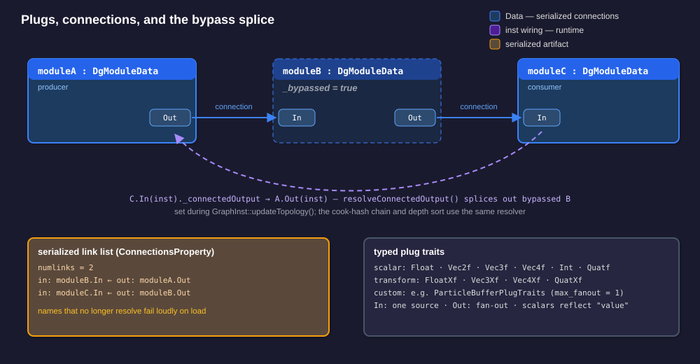
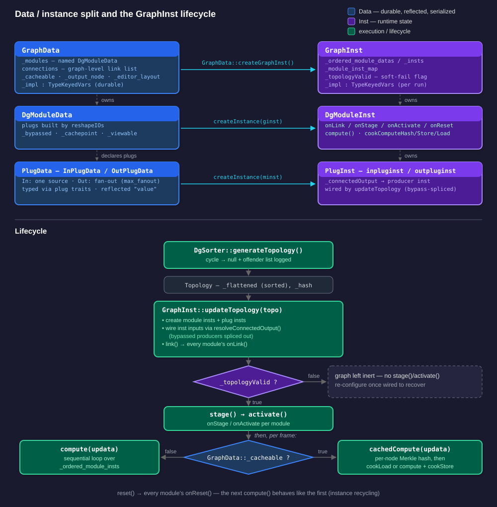
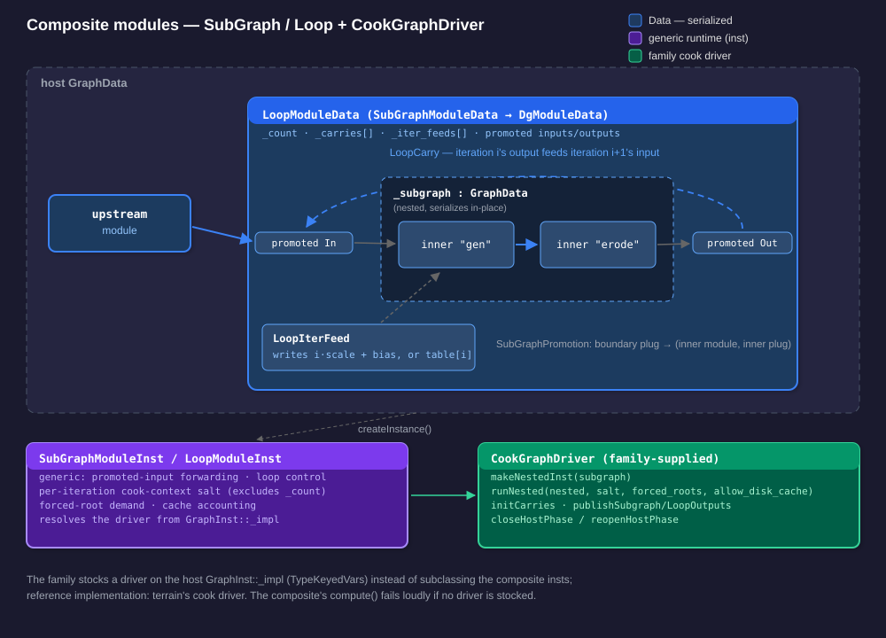
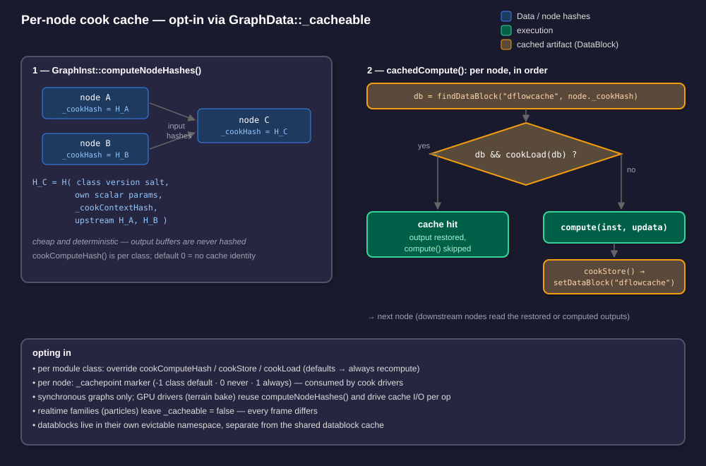
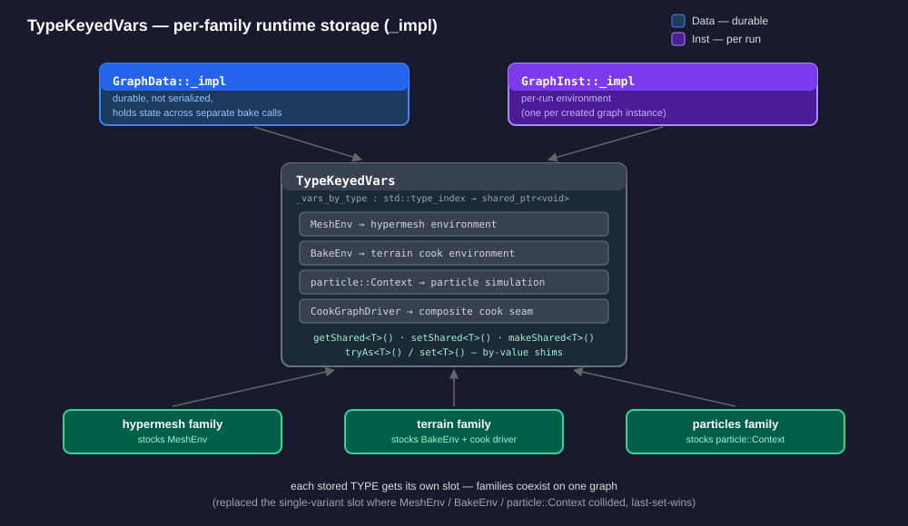
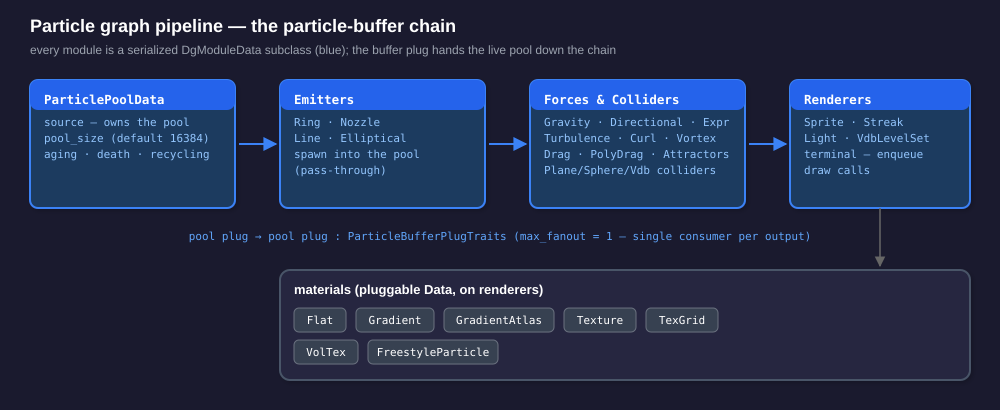
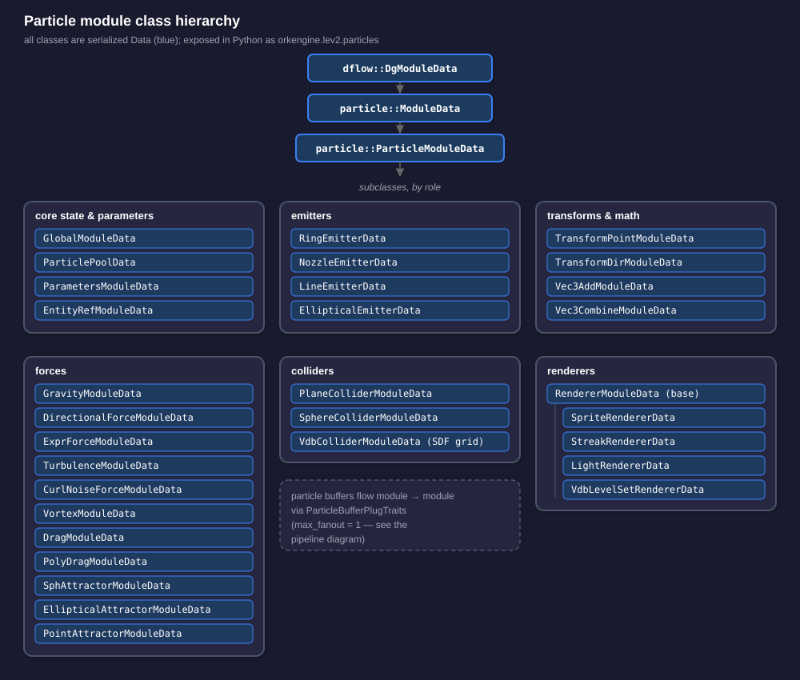

## Orkid Dataflow Architecture

The Orkid dataflow system provides a visual/modular programming model for processing data through connected nodes. It's designed for real-time applications where data flows through a directed acyclic graph (DAG) of processing modules.

---

## Core Concepts

### 1. Data vs Instance Separation

A key architectural pattern in the dataflow system is the separation between **Data** (definition/template) and **Inst** (runtime instance):

- **Data objects** define the structure, parameters, and connections - they are serializable and represent the "blueprint"
- **Inst objects** are created at runtime from Data objects and hold mutable state during execution

This separation allows:
- Multiple runtime instances from a single definition
- Clean serialization (only Data is saved)
- Clear ownership and lifetime semantics

### 2. Graphs

Container structures that hold and manage modules and their connections.

**GraphData** (`ork::dataflow::GraphData`)
- Defines the topology of connected modules
- Contains `orklut<std::string, object_ptr_t> _modules` - named modules in the graph
- Signals topology changes via `_sigTopologyUpdated`
- Provides methods: `addModule()`, `removeModule()`, `safeConnect()`, `disconnect()`
- Connections serialize as a graph-level link list (input module/plug, output module/plug by name) and are re-wired directly during deserialization
- Carries graph-level state beyond topology: the opt-in cook-cache flag `_cacheable`, the select-as-output marker `_output_node`, editor node layout `_editor_layout`, and a per-family runtime slot `_impl` (each covered in its own section below)

**GraphInst** (`ork::dataflow::GraphInst`)
- Runtime instance of a graph created via `GraphData::createGraphInst()`
- Maintains ordered module lists for execution: `_ordered_module_datas`, `_ordered_module_insts`
- `updateTopology()` is the lifecycle driver: it instantiates modules and plugs, wires instance-level connections, then runs `link()` / `stage()` / `activate()`
- Topology soft-fail: if a module cannot resolve a required link during `link()` it clears `_topologyValid`, and `updateTopology()` leaves the graph inert (skipping `stage()`/`activate()`) instead of crashing on a partial graph; re-configuring once the graph is wired recovers
- `compute()` runs the modules each frame; `reset()` returns the instance to a just-created state via per-module `onReset()`
- Carries a per-family runtime slot `_impl` (see TypeKeyedVars below)

### 3. Modules

Processing units that receive input, process data, and produce output.

**ModuleData** / **DgModuleData**
- Abstract definition of module behavior and configuration
- Declares input and output plugs
- Creates corresponding ModuleInst via `createInstance(GraphInst*)`
- DgModuleData carries per-node graph state that round-trips with the graph: `_bypassed` (transparent pass-through, see Bypass below) and the `_cachepoint` / `_viewable` markers (strategic cook-cache point and progressive-display overrides: -1 = class default, 0 = never, 1 = always; consumed by cook drivers, inert elsewhere)

**ModuleInst** / **DgModuleInst**
- Runtime instance of a module
- Implements `compute(GraphInst*, ui::updatedata_ptr_t)` for processing
- Implements `onLink(GraphInst*)` for initialization after connections are resolved, plus `onStage()` / `onActivate()` for the later lifecycle phases
- `onReset(GraphInst*)` clears per-instance state (first-compute timebases, live particles, RNG seeds) when the host calls `GraphInst::reset()`
- Optional cook-cache hooks `cookComputeHash()` / `cookStore()` / `cookLoad()` (see Per-Node Cook Cache below)

**LambdaModuleData**
- Supports functional-style module implementation using lambdas

**SubGraphModuleData** / **LoopModuleData**
- Composite modules that own a nested GraphData (see Composite Modules below)

### 4. Plugs

Connection points on modules for data to flow through. Plugs are strongly typed using C++ templates.

**PlugData** / **PlugInst**
- Base classes for plug definition and instances
- Track parent module, direction (input/output), rate, and data type

**InPlugData** / **OutPlugData**
- Directional data connectors
- InPlugData can connect to one OutPlugData (single source)
- OutPlugData can fan out to multiple inputs (configurable via `max_fanout`)

**Plug Traits**
Plugs use a traits-based system for type configuration:

```cpp
struct FloatPlugTraits {
  using elemental_data_type = float;     // Data-side type
  using elemental_inst_type = float;     // Instance-side type
  using xformer_t = nullpassthrudata;    // Optional transformer
  using range_type = float_range;        // Value constraints
  using out_traits_t = FloatPlugTraits;  // Output plug traits
  static constexpr size_t max_fanout = 0; // 0 = unlimited
  static std::shared_ptr<float> data_to_inst(std::shared_ptr<float> inp);
};
```

Built-in scalar/vector traits: `FloatPlugTraits`, `Vec2fPlugTraits`, `Vec3fPlugTraits`, `Vec4fPlugTraits`, `IntPlugTraits`, `QuatfPlugTraits`.

**Transformer Plugs (XF variants)**
- `FloatXfPlugTraits`, `Vec3XfPlugTraits`, `Vec4XfPlugTraits`, `QuatXfPlugTraits`
- Support data modification through the connection (scaling, offsetting, etc.)
- The `xformer_t` type defines the transformation applied



**Editor metadata**
- `PlugData::annotateRange(mn, mx)` gates a clamped slider over the range in property editors
- `PlugData::markDisplayOnly()` marks a plug that is shown editable but has no effect on a bake (e.g. a t=0 snapshot knob), so editors can render the row honestly distinct
- Both are class-level, set at plug-creation time, surfaced through `dflow.plugSpec()` (see Introspection), and affect nothing in evaluation

**Plug-write clock**
- `bumpPlugWriteClock()` / `peekPlugWriteClock()` - a monotonic process-global counter bumped every time an input plug's value is written; each InPlugData stamps `_writeEpoch` on write
- A pure observable (no evaluation semantics depend on it): a live consumer snapshots the clock once and compares per-plug epochs to detect values poked after the snapshot (used by live cook-cache eviction)

### 5. Registers

Virtual register system to manage data lifetimes, dependencies, and computational resources.

**DgRegister**
- Abstraction of a "machine register" - holds data flowing between modules
- Tracks downstream dependents for lifetime management
- Bound to a specific plug

**DgRegisterBlock**
- Pool of registers for a given datatype
- Typically one register block per datatype in a graph
- Provides `Alloc()` and `Free()` for register management

### 6. Topology and Sorting

**DgSorter**
Topologically sorts modules into execution order ensuring:
1. All modules are computed
2. No module is computed before its inputs are ready
3. Modules compute soon after their parents (cache locality)
4. Minimal register usage

`generateTopology()` also detects cycles: when no pending module can make progress, it logs the offending module set (cycle members plus anything downstream of them) and returns null instead of spinning.

**Topology**
- Contains `_flattened` - ordered list of modules for execution
- Stores `_hash` for change detection

**DgNodeInfo**
- Tracks module metadata for sorting: `_serial`, `_depth`, `_modifier`
- `computeSorkKey()` generates sort priority

### 7. Scheduler

The `scheduler` / `processor` / `cluster` / `workunit` classes (`scheduler.h`) sketch a parallel, affinity-aware execution system (heterogeneous CPU/GPU processing), but they are currently **unused** - there are no call sites, and `GraphInst::_scheduler` is never assigned. Graph execution today is `GraphInst::compute()`: a single-threaded, sequential loop over the topologically sorted module instances (with an optional per-module timing sink a family may install for perf counters). The one live remnant is the `scheduler::CpuAffinity` constant used as the default module affinity.

---

## Execution Model



1. **Graph Construction**: Modules are added to GraphData, plugs are connected
2. **Topology Generation**: `DgSorter::generateTopology()` sorts modules into execution order and allocates registers; a cyclic graph yields null with the offenders logged
3. **Instance Creation and Linking**: `GraphInst::updateTopology(topo)` drives the whole bring-up - it creates a ModuleInst per ModuleData, instantiates every plug, and wires instance-level connections. Each input's producer is resolved through `resolveConnectedOutput()`, so bypassed modules are spliced out of the instance wiring entirely. It then calls `link()` so instances resolve their plug connections
4. **Topology Soft-Fail**: if any module reports an unresolvable link during `link()` (clearing `_topologyValid`), `stage()`/`activate()` are skipped and the graph is left inert rather than crashing; a later re-configure links clean
5. **Staging and Activation**: `stage()` then `activate()` - instances prepare for execution and enter the active state
6. **Computation**: `compute()` called each frame:
   - Modules execute sequentially in topologically sorted order
   - Data flows through connected plugs from outputs to inputs
   - Registers manage data lifetimes across the execution
   - When the GraphData is `_cacheable`, `cachedCompute()` runs instead (see Per-Node Cook Cache)
7. **Reset**: `reset()` runs every module's `onReset()` in topological order, so the next `compute()` behaves as the first for this instance (used to recycle instances without paying creation cost)

---

## Composite Modules: SubGraphs and Loops

`subgraph_module.h` provides composite modules that own a **nested GraphData** (a subgraph/subnet model):

**SubGraphModuleData**
- A concrete DgModuleData holding a `_subgraph` plus boundary *promotion tables*: each promoted boundary plug on the composite maps to an (inner module, inner plug) inside the nested graph, symmetrically for inputs and outputs
- Because a group is a real module, bypass, the output marker, serialization, and editor dive-in (`childGraph()`) all fall out of the one module code path

**LoopModuleData**
- Extends SubGraphModuleData with an iteration count, **carries** (promoted-input/promoted-output pairs fed forward each iteration: iteration i's output becomes iteration i+1's input), and per-iteration **index feeds** that write `i*scale + bias` (or a per-iteration value table) into inner scalar plugs

The composite runtime (SubGraphModuleInst / LoopModuleInst) is family-neutral: promoted-input forwarding, loop control, per-iteration cook-context salting (the salt excludes the count, so raising N to N+k keeps the first N iterations' caches warm). The GPU/memory-model-specific work - building the nested GraphInst, running the nested cook, boundary-resource device copies, phase choreography - is delegated to a **CookGraphDriver** (`cook_driver.h`): a family-neutral hook interface the family stocks on the host GraphInst's `_impl`. A family need not subclass the composite insts, only supply a driver; terrain's cook driver is the reference implementation.



---

## Per-Node Cook Cache

An opt-in, content-addressed cache of per-node outputs, enabled by `GraphData::_cacheable`:

1. `GraphInst::computeNodeHashes()` Merkle-hashes every node into its `_cookHash`. Each node's class builds the hash via `cookComputeHash(input_hashes, context)` from a version salt (so changing an op's logic invalidates its cache), the node's own scalar parameters, the graph's `_cookContextHash`, and the upstream node hashes. Output buffers are never hashed - the pass is cheap and deterministic
2. `cachedCompute()` then walks the nodes: on a cache hit `cookLoad()` restores the node's output and `compute()` is skipped; on a miss the node computes and `cookStore()` serializes its output for next time. Datablocks live in their own evictable DataBlockCache namespace, separate from the shared cache



Modules opt in per class by overriding the three `DgModuleInst` hooks (the defaults mean "not cacheable - always recompute"). Content can override strategic cache points per node via the `_cachepoint` marker. The synchronous `cachedCompute()` path fits graphs whose `compute()` produces output synchronously; drivers with their own execution model (the GPU terrain bake) reuse `computeNodeHashes()` and drive the per-node cache I/O themselves. Realtime families (particles) leave `_cacheable` false - every frame differs.

---

## Bypass and Select-as-Output

Structural editor state that is first-class, serialized graph state rather than an editor-side rewrite:

- **Bypass** - `DgModuleData::_bypassed` (reflected, round-trips with the graph). A bypassed module is a transparent pass-through: `resolveConnectedOutput()` resolves an input's producer *through* any bypassed module(s) to the first non-bypassed output actually feeding it. Every read that expresses a data dependency (instance wiring, the cook-hash chain, depth/order sorting) routes through this resolver, so the module drops out of the dependency chain without being deleted
- **Select-as-output** - `GraphData::_output_node` names the module to treat as the graph's display output (empty = none). It survives serialization, so drivers (e.g. the terrain bake) can re-point their captures to that node instead of the marker being flattened away at graph-build time
- **Editor layout** - `GraphData::_editor_layout` maps module name to canvas position. It deliberately lives on the graph, not on the modules: per-module cook identity hashes each module's reflected JSON, so a per-module position field would turn every node drag into a cache miss. Pure editor data, absent in old saves, no bake semantics

---

## Per-Family Runtime Storage: TypeKeyedVars

Both GraphData and GraphInst carry a `TypeKeyedVars _impl` - runtime storage keyed by *type* (`getShared<T>()` / `setShared<T>()` / `makeShared<T>()` over a `std::type_index` map, type-erased via `shared_ptr<void>`). Each stored type gets its own slot. This replaced the previous single-variant slot where the hypermesh MeshEnv, terrain BakeEnv, and particle Context all collided - last-set-wins made a mixed-family graph instance impossible. With type-keyed slots, families coexist on one graph, which is what cross-family edges (e.g. field inputs, instance sources) require.



A family stocks family-private objects here with no core knowledge of the type:

- `GraphInst::_impl` - per-run environment: cook environments, the family's CookGraphDriver, the particle context
- `GraphData::_impl` - durable (non-serialized) storage on the graph itself, which Python holds across separate bake calls; e.g. a bake stamps its parameters here so an already-baked graph can later be re-dispatched by a family-neutral entry point

---

## Introspection

The reflection class tree *is* the node registry - there is no hand-maintained table:

- `dflow.moduleClasses()` (Python) walks the DgModuleData subtree, exposing each concrete, factory-bearing class with its reflected properties and annotations
- `dflow.plugSpec(classname)` (Python) returns a class's plug schema - plug names, data types, rates, range and display-only metadata - without the caller instantiating a module. Internally it builds one scratch instance via the reflection factory (which runs the class's plug-creation function), reads its plugs, discards it, and caches the result per class. The schema therefore always tracks the code

---

## Serialization Contract

- GraphData, modules, plugs, and connections serialize through the reflection system (`describeX` properties)
- Plug **values** round-trip: each scalar plug specialization reflects a `"value"` property in its `describeX`, so a constant plug's value survives the JSON round-trip. Any *new* scalar plug trait must do the same - an unreflected value silently reverts to the plug-creation default on reload
- Schema drift refuses **loudly**: an unknown/unregistered class in the stream, an uninstantiable class, or a pre-instantiated slot whose runtime class no longer matches the serialized one (a stale asset whose plug layout changed) throws a catchable, named `std::runtime_error` instead of silently corrupting state or crashing. Stale assets refuse to load and must be regenerated from source
- Serialized connections whose module or plug names no longer resolve also fail loudly instead of silently dropping the edge (which used to leave a half-wired graph computing garbage downstream)

---

## Creating Custom Modules

### Step 1: Define the Module Data Class

```cpp
struct MyModuleData : public dflow::DgModuleData {
  DeclareConcreteX(MyModuleData, dflow::DgModuleData);
public:
  MyModuleData();
  static std::shared_ptr<MyModuleData> createShared();
  dflow::dgmoduleinst_ptr_t createInstance(dflow::GraphInst* ginst) const final;

  // Parameters (reflect them in describeX)
  float _multiplier = 1.0f;
};
```

### Step 2: Define the Module Instance Class

```cpp
struct MyModuleInst : public dflow::DgModuleInst {
  MyModuleInst(const MyModuleData* data, dflow::GraphInst* ginst);

  void onLink(dflow::GraphInst* inst) final;
  void compute(dflow::GraphInst* inst, ui::updatedata_ptr_t updata) final;

  dflow::float_inp_pluginst_ptr_t _input;
  dflow::float_out_pluginst_ptr_t _output;
  const MyModuleData* _data;
};
```

### Step 3: Implement the Module

Plug creation lives in a *reshape* function so both construction paths run it: `createShared()` at authoring time, and the `"reshapeIOs"` class annotation on deserialize.

```cpp
static void _reshapeMyIOs(dflow::moduledata_ptr_t data) {
  dflow::ModuleData::createInputPlug<dflow::FloatPlugTraits>(data, dflow::EPR_UNIFORM, "Input");
  dflow::ModuleData::createOutputPlug<dflow::FloatPlugTraits>(data, dflow::EPR_UNIFORM, "Output");
}

std::shared_ptr<MyModuleData> MyModuleData::createShared() {
  auto data = std::make_shared<MyModuleData>();
  _reshapeMyIOs(data);
  return data;
}

void MyModuleData::describeX(class_t* clazz) {
  clazz->setSharedFactory([]() -> rtti::castable_ptr_t { //
    return MyModuleData::createShared();
  });
  clazz->annotateTyped<dflow::moduleIOreshape_fn_t>(
      "reshapeIOs", [](dflow::moduledata_ptr_t m) { _reshapeMyIOs(m); });
}

dflow::dgmoduleinst_ptr_t MyModuleData::createInstance(dflow::GraphInst* ginst) const {
  return std::make_shared<MyModuleInst>(this, ginst);
}

void MyModuleInst::onLink(dflow::GraphInst* inst) {
  _input  = typedInputNamed<dflow::FloatPlugTraits>("Input");
  _output = typedOutputNamed<dflow::FloatPlugTraits>("Output");
}

void MyModuleInst::compute(dflow::GraphInst* inst, ui::updatedata_ptr_t updata) {
  _output->setValue(_input->value() * _data->_multiplier);
}
```

### Step 4: Register the Class

```cpp
ImplementReflectionX(mynamespace::MyModuleData, "myfamily::MyModule");
```

Critically, the class must also be *touched* during initialization - `MyModuleData::GetClassStatic()` called from the owning module's registration path (core dataflow classes are touched in ork.core's reflection init; each lev2 family touches its own in its registry). An untouched class serializes as an empty `"class": ""` in the JSON and refuses to load (the deserializer's loud-refusal error). This applies to *every* reflected class the module embeds (transformer datas, sub-object tables), not just the module itself.

Also keep reshape functions idempotent: `reshapeIOs` runs twice on deserialize (once via the factory, once via the post-deserialize hook), which is why `addInput()`/`addOutput()` dedup plugs by name.

---

## Custom Plug Types

For domain-specific data types, define custom plug traits:

```cpp
struct MyDataType { /* ... */ };

struct MyPlugTraits {
  using elemental_data_type = MyDataType;
  using elemental_inst_type = MyDataType;
  using data_impl_type_t = MyDataType;
  using inst_impl_type_t = MyDataType;
  using xformer_t = dflow::nullpassthrudata;
  using range_type = no_range;
  using out_traits_t = MyPlugTraits;
  static constexpr size_t max_fanout = 1;  // Limit connections

  static std::shared_ptr<MyDataType> data_to_inst(std::shared_ptr<MyDataType> inp);
};

using my_inplugdata_t = dflow::inplugdata<MyPlugTraits>;
using my_outplugdata_t = dflow::outplugdata<MyPlugTraits>;
```

If the plug holds a scalar value that should persist, its `inplugdata<MyPlugTraits>::describeX` specialization must reflect a `"value"` property (see the Serialization Contract) - otherwise saved graphs silently lose the value on reload.

---

## Generic Modules

`basic_modules.h` provides family-neutral modules at the core dataflow layer (usable from any graph, no consumer-specific namespace):

- **MinModule** / **MaxModule** - two scalar (FloatXf) inputs A, B; one float output
- **LerpModule** - A, B, T; output = A*(1-T) + B*T (GLSL `mix` semantics, no clamping)
- **PowModule** - X, K; output = pow(X, K)
- **Vec4CombineModule** - four scalar (FloatXf) inputs X/Y/Z/W; one fvec4 output

Each input carries the full floatxf transform chain, so per-input scale/bias/sine stages compose normally. The HyperSyn DSL lowerer emits these from expression trees, but direct authoring works identically.

---

## Notable Features

- **Transformation Pipeline**: Elaborate transformation system for data modification through XF plug variants
- **Morphable Data**: Support for interpolating between different data states via `morphable` interface
- **Topological Sorting**: Ensures modules execute in correct dependency order, with loud cycle detection (offender list, no hang)
- **Register Management**: Virtual register system optimizes data lifetimes and resource usage
- **Composite Modules**: SubGraph and Loop modules nest a full GraphData inside a module, with promoted boundary plugs and loop carries
- **Per-Node Cook Cache**: Opt-in (`_cacheable`) content-addressed caching of node outputs via Merkle node hashes
- **Bypass and Select-as-Output**: First-class, serialized graph state - bypassed modules splice out of the dependency chain transparently
- **Introspection**: `moduleClasses()` / `plugSpec()` expose the node registry and per-class plug schemas straight from reflection
- **Python Bindings**: Full Python API for graph construction and manipulation
- **Serialization**: GraphData and all module configurations serialize via reflection, with loud (catchable) refusal on schema drift rather than silent corruption

---

## Usage in Orkid

### Particle Systems

See the dedicated section below.

### Procedural Synthesis (HyperSyn)

The HyperSyn Python DSL layer (`obt.project/scripts/ork/hypergraph/`) authors procedural content as Python expression DAGs. Its particle, terrain, hypermesh, sdf, lsystem, and roads families lower those expressions onto dflow graphs (emitting the generic and family modules described here); the ptex3d procedural-surface family shares the expression-IR approach but materializes shaders rather than dflow graphs. See the hypersyn documentation for the DSL itself.

---

## Particle System Implementation

The particle system is the primary user of the dataflow architecture in Orkid. It demonstrates a complete implementation of the dataflow pattern for real-time simulation.

### Architecture Overview



### Particle Buffer Plug Type

Particles flow through the graph via a custom plug type:

```cpp
struct ParticleBufferPlugTraits {
  using elemental_data_type = ParticleBufferData;
  using elemental_inst_type = ParticleBufferInst;
  using xformer_t = dflow::nullpassthrudata;
  using range_type = no_range;
  static constexpr size_t max_fanout = 1;  // Single consumer per output
};
```

The `ParticleBufferInst` contains:
- `pool_ptr_t _pool` - The actual particle pool with live particles

### Module Hierarchy



### Module Types

**ParticlePoolData / ParticlePoolModuleInst**
- Source module - creates and manages the particle pool
- Configurable pool size (default 16384 particles)
- Manages particle lifecycle (aging, death, recycling)
- Output: particle buffer

**Emitter Modules**
- Spawn new particles into the pool
- Various emission patterns: ring, nozzle (directional cone), line, elliptical
- Configure: emission rate, initial velocity, position distribution
- Input: particle buffer, Output: particle buffer (pass-through with spawning)

**Force and Collider Modules**
- Modify particle velocities each frame
- Types:
  - **Gravity / DirectionalForce**: constant or center-seeking directional force
  - **Drag / PolyDrag**: velocity-dependent resistance
  - **Turbulence / CurlNoiseForce**: noise-based chaotic motion
  - **Vortex**: rotational force around an axis
  - **Attractors**: point/spherical/elliptical attraction
  - **ExprForce**: per-particle force from an authored expression
  - **Colliders**: plane, sphere, and VDB SDF-grid collision response
- Input: particle buffer, Output: particle buffer (modified velocities)

**Renderer Modules**
- Terminal modules - consume particles for rendering
- Types:
  - **Sprite**: camera-facing billboards
  - **Streak**: velocity-aligned trails
  - **Light**: dynamic point lights per particle
  - **VdbLevelSet**: level-set surface rendering
- Input: particle buffer (no output - end of chain)

### Particle Data Flow Example

```cpp
// In compute(), forces iterate the pool and modify particles:
void GravityModuleInst::compute(dflow::GraphInst* inst, ui::updatedata_ptr_t updata) {
  float dt = updata->_dt;
  fvec3 gravity_vec = _data->_gravity;

  for (auto& particle : *_pool) {
    if (particle.isAlive()) {
      particle.velocity += gravity_vec * dt;
      particle.position += particle.velocity * dt;
    }
  }
}
```

### Materials System

Renderers use pluggable materials:

```cpp
struct MaterialBase : public ork::Object {
  virtual void gpuInit(const RenderContextInstData& RCID) = 0;
  virtual void update(const RenderContextInstData& RCID) {}

  freestyle_mtl_ptr_t _material;
  fxpipeline_ptr_t _pipeline;
  fxtechnique_constptr_t _tek_sprites;
  fxtechnique_constptr_t _tek_streaks;
};
```

Material types:
- **FlatMaterial**: solid color
- **GradientMaterial**: color based on particle age via gradient lookup
- **GradientAtlasMaterial**: gradient lookup plus modulation texture
- **TextureMaterial**: textured sprites
- **TexGridMaterial**: sprite sheet animation
- **VolTexMaterial**: 3D texture sampling
- **FreestyleParticleMaterial**: user-supplied freestyle shader

### Python API Example

```python
from orkengine.core import dataflow
from orkengine.lev2 import particles, ParticlesDrawableData

# Create graph
graphdata = dataflow.GraphData.createShared()

# Add modules
ptc_pool = graphdata.create("POOL", particles.Pool)
ptc_pool.pool_size = 16384
emitter  = graphdata.create("EMITN", particles.NozzleEmitter)
gravity  = graphdata.create("GRAV", particles.Gravity)
sprites  = graphdata.create("SPRI", particles.SpriteRenderer)
sprites.material = particles.GradientMaterial.createShared()

# Configure plugs by name
emitter.inputs.EmissionRate = 800
emitter.inputs.LifeSpan = 10
gravity.inputs.G = 0.03

# Connect the particle-buffer chain
graphdata.connect(emitter.inputs.pool, ptc_pool.outputs.pool)
graphdata.connect(gravity.inputs.pool, emitter.outputs.pool)
graphdata.connect(sprites.inputs.pool, gravity.outputs.pool)

# Wrap for the scenegraph
drawable_data = ParticlesDrawableData()
drawable_data.graphdata = graphdata
```

### Rendering Integration

Particle systems integrate with the Orkid rendering pipeline:

1. **DrawableData**: `ParticlesDrawableData` wraps a particle GraphData
2. **DrawableInst**: Created per-scene-instance, holds the GraphInst
3. **Enqueue**: During render traversal, particle renderers enqueue draw calls
4. **Render**: GPU renders particles using the material's pipeline
5. **Soft-fail**: if the graph's topology is invalid (an unwired required input), drawable creation returns null instead of asserting - the sim stays inert until the graph is wired

The compute/render split allows:
- Simulation on the update thread
- Render buffer snapshot for GPU submission
- Double-buffering for thread safety
