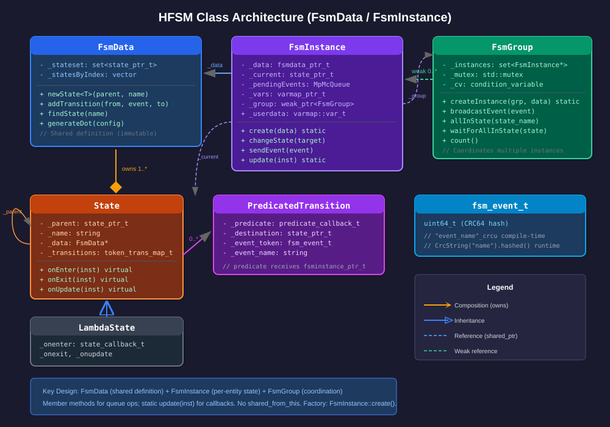
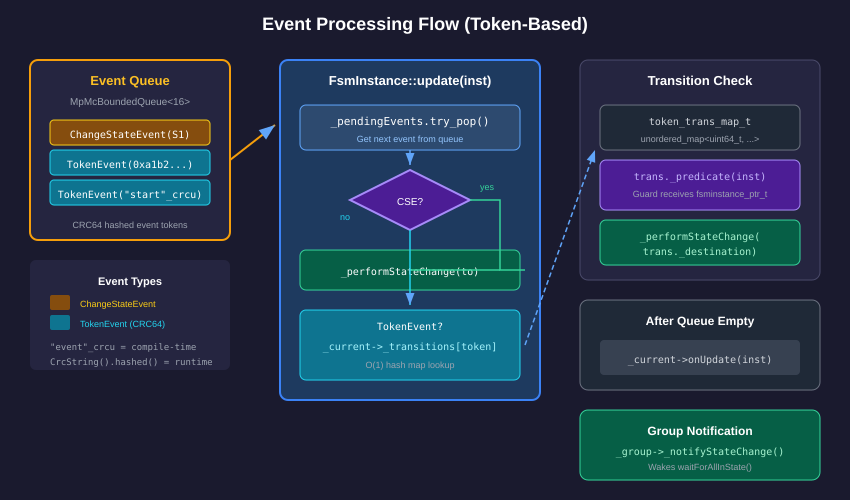
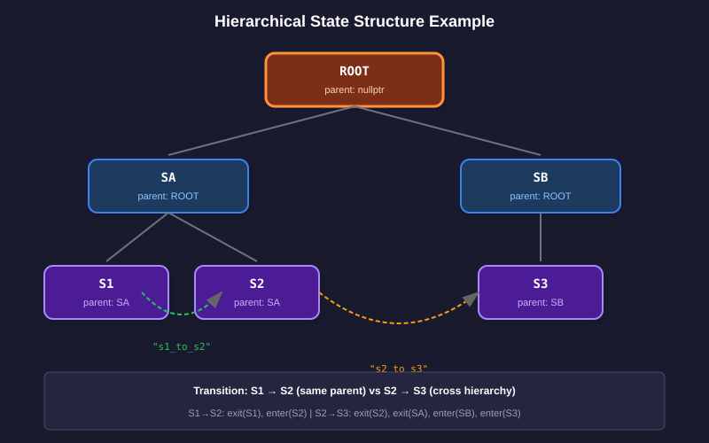
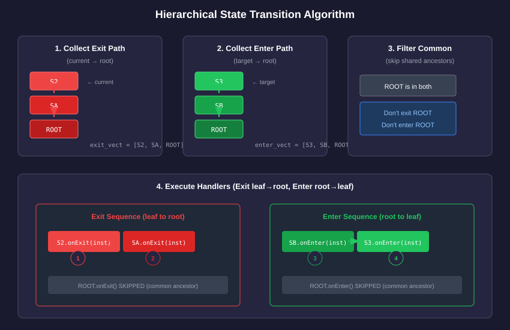
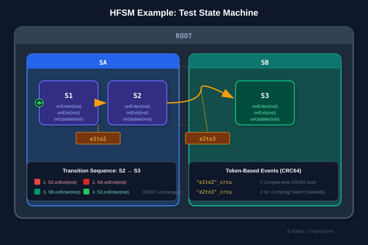

# Hierarchical Finite State Machine (HFSM) Technical Design Document

## Overview

The Orkid HFSM is a hierarchical finite state machine implementation that supports:
- **Nested states** with parent-child relationships
- **Token-based events** using CRC64 hashed strings for efficient dispatch
- **Predicated transitions** with guard conditions
- **Thread-safe event queuing** via lock-free bounded queue
- **Lambda-based states** for lightweight state definitions
- **Instance-level variables** for per-instance state data
- **Shared definitions** via FsmData/FsmInstance separation
- **Group coordination** via FsmGroup for multi-instance synchronization

## Architecture

The FSM is split into two main classes:

- **FsmData**: Shared state machine definition (states, transitions, callbacks). Immutable after setup.
- **FsmInstance**: Per-entity runtime state (current state, variables, event queue).

This separation allows multiple entities to share a single state machine definition while maintaining independent runtime state.

### Class Diagram



## Core Components

### FsmData

Shared state machine definition that owns states and transitions.

```cpp
namespace ork::fsm {

struct FsmData {
    FsmData();
    ~FsmData();

    // State creation
    template <typename T>
    std::shared_ptr<T> newState(state_ptr_t parent, std::string name = "");
    template <typename T>
    std::shared_ptr<T> newState();  // Root state (no parent)

    // Transition registration
    void addTransition(state_ptr_t from, fsm_event_t event, state_ptr_t to);
    void addTransition(state_ptr_t from, const std::string& event_name, state_ptr_t to);
    void addTransition(state_ptr_t from, const std::string& event_name,
                       const PredicatedTransition& predicated);

    // State lookup
    state_ptr_t findState(const std::string& name) const;
    const std::set<state_ptr_t>& states() const;

    // DOT graph generation
    std::string generateDot(const DotConfig& config = DotConfig(),
                            state_ptr_t current = nullptr) const;
};

} // namespace ork::fsm
```

### FsmInstance

Per-entity runtime state. Each entity gets its own instance referencing shared FsmData.

```cpp
struct FsmInstance {
    // Factory method
    static fsminstance_ptr_t create(fsmdata_ptr_t data);

    // Update - static because it passes shared_ptr to callbacks
    static void update(fsminstance_ptr_t inst);

    FsmInstance(fsmdata_ptr_t data);
    ~FsmInstance();

    // State changes (member methods - just queue events)
    void changeState(state_ptr_t target);
    void sendEvent(fsm_event_t event);
    void sendEvent(const std::string& event_name);

    // Accessors
    state_ptr_t currentState() const;
    fsmdata_ptr_t data() const;
    varmap::varmap_ptr_t vars() const;

    // User data (arbitrary typed storage)
    varmap::var_t _userdata;

    // DOT generation (highlights current state)
    std::string generateDot(const DotConfig& config = DotConfig()) const;
};
```

### State

Base class for all states. Callbacks receive the instance pointer.

```cpp
struct State {
    State(FsmData* data, state_ptr_t parent = nullptr, std::string name = "");

    // Lifecycle hooks - receive instance pointer for context
    virtual void onEnter(fsminstance_ptr_t inst) {}
    virtual void onExit(fsminstance_ptr_t inst) {}
    virtual void onUpdate(fsminstance_ptr_t inst) {}

    // Transition table: token → PredicatedTransition
    token_trans_map_t _transitions;

    state_ptr_t _parent;      // Parent state (nullptr for root)
    std::string _name;        // Debug name
    FsmData* _data;           // Owning data
    size_t _index;            // Index in data's state vector
};
```

### LambdaState

Convenience class for defining states with lambda callbacks.

```cpp
struct LambdaState : public State {
    LambdaState(FsmData* data, state_ptr_t parent, std::string name = "");

    // Callbacks receive instance pointer
    state_callback_t _onenter;   // std::function<void(fsminstance_ptr_t)>
    state_callback_t _onexit;
    state_callback_t _onupdate;
};
```

### PredicatedTransition

Conditional transition with optional guard predicate.

```cpp
using predicate_callback_t = std::function<bool(fsminstance_ptr_t)>;

struct PredicatedTransition {
    // Always-true transition
    PredicatedTransition(state_ptr_t destination);

    // Guarded transition
    PredicatedTransition(state_ptr_t destination, predicate_callback_t predicate);

    predicate_callback_t _predicate;  // Guard condition (receives instance)
    state_ptr_t _destination;         // Target state
    fsm_event_t _event_token;         // CRC64 hash of event name
    std::string _event_name;          // Original name (for DOT generator)
};
```

### FsmGroup

Coordinate multiple FSM instances for synchronized operations like graceful shutdown.

```cpp
struct FsmGroup {
    FsmGroup() = default;
    ~FsmGroup() = default;

    // Factory method to create instances in this group
    static fsminstance_ptr_t createInstance(fsmgroup_ptr_t group, fsmdata_ptr_t data);

    // Broadcast event to all instances in the group
    void broadcastEvent(fsm_event_t event);
    void broadcastEvent(const std::string& event_name);

    // Check if all instances are in a specific state
    bool allInState(state_ptr_t state);
    bool allInState(const std::string& state_name);

    // Block until all instances are in a specific state
    void waitForAllInState(state_ptr_t state);
    void waitForAllInState(const std::string& state_name);

    // Number of instances in the group
    size_t count() const;

    // Get current instances (returns copy for thread safety)
    std::vector<FsmInstance*> instances() const;
};
```

**Lifetime Management**: FsmGroup uses `weak_ptr` internally. Instances auto-unregister on destruction. Safe regardless of destruction order.

## Event System



Events are CRC64 hashed tokens for efficient dispatch.

### Defining Events

```cpp
// String-based (hashed at runtime)
data->addTransition(idle, "start", running);
data->addTransition(running, "stop", idle);

// Token-based (compile-time hash with _crcu literal)
data->addTransition(idle, "start"_crcu, running);

// Get event token programmatically
fsm_event_t token = CrcString("myevent").hashed();
```

### Sending Events

```cpp
// String-based
inst->sendEvent("start");

// Token-based
inst->sendEvent("start"_crcu);

// Process events
FsmInstance::update(inst);
```

## State Hierarchy



States form a tree structure via `_parent` pointers.

### Hierarchy Rules

1. **Root states** have `_parent = nullptr`
2. **Child states** reference their parent via `_parent`
3. **Siblings** share the same parent
4. **Transitions** can cross any hierarchy level

### Transition Algorithm



The hierarchical transition algorithm ensures proper exit/enter ordering:

1. Collect exit path: current → root
2. Collect enter path: target → root
3. Execute exits (leaf to root), skip common ancestors
4. Execute enters (root to leaf), skip common ancestors

### Transition Examples

| From | To | Exit Sequence | Enter Sequence |
|------|-----|---------------|----------------|
| S1 | S2 | S1 | S2 |
| S1 | S3 | S1, SA | SB, S3 |
| S3 | S1 | S3, SB | SA, S1 |

## Usage Examples



### Basic State Machine (C++)

```cpp
#include <ork/util/fsm.h>
using namespace ork::fsm;

// Create shared definition
auto data = std::make_shared<FsmData>();

// Create states
auto idle = data->newState<LambdaState>(nullptr, "idle");
auto running = data->newState<LambdaState>(nullptr, "running");

// Configure callbacks (receive instance pointer)
idle->_onenter = [](fsminstance_ptr_t inst) {
    printf("Entering idle\n");
};
running->_onenter = [](fsminstance_ptr_t inst) {
    printf("Starting...\n");
};

// Register transitions
data->addTransition(idle, "start", running);
data->addTransition(running, "stop", idle);

// Create instance
auto inst = FsmInstance::create(data);

// Start machine
inst->changeState(idle);
FsmInstance::update(inst);  // → "Entering idle"

// Trigger transitions
inst->sendEvent("start");
FsmInstance::update(inst);  // → "Starting..."

inst->sendEvent("stop");
FsmInstance::update(inst);  // → "Entering idle"
```

### Python Usage

```python
from orkengine.core import fsm

# Create shared definition
data = fsm.FsmData()

# Create states
idle = data.createState(None, "idle")
running = data.createState(None, "running")

# Configure callbacks
idle.onEnter = lambda inst: print("Entering idle")
running.onEnter = lambda inst: print("Starting...")

# Register transitions
data.addTransition(idle, "start", running)
data.addTransition(running, "stop", idle)

# Create instance
inst = fsm.FsmInstance(data)

# Use the machine
inst.changeState(idle)
inst.update()  # → "Entering idle"

inst.sendEvent("start")
inst.update()  # → "Starting..."
```

### Predicated Transitions

```python
data = fsm.FsmData()
idle = data.createState(None, "idle")
active = data.createState(None, "active")

# Counter for predicate
counter = [0]

def predicate(inst):
    counter[0] += 1
    return counter[0] >= 3  # Only transition after 3 attempts

data.addPredicatedTransition(idle, "try_activate", active, predicate)

inst = fsm.FsmInstance(data)
inst.changeState(idle)
inst.update()

# First two attempts fail
inst.sendEvent("try_activate")
inst.update()  # Still in idle

inst.sendEvent("try_activate")
inst.update()  # Still in idle

# Third attempt succeeds
inst.sendEvent("try_activate")
inst.update()  # Now in active
```

### Shared Data, Multiple Instances

```python
# One definition, multiple instances
data = fsm.FsmData()
idle = data.createState(None, "idle")
active = data.createState(None, "active")
data.addTransition(idle, "activate", active)
data.addTransition(active, "deactivate", idle)

# Create independent instances
inst1 = fsm.FsmInstance(data)
inst2 = fsm.FsmInstance(data)

inst1.changeState(idle)
inst2.changeState(idle)
inst1.update()
inst2.update()

# Transition inst1 only
inst1.sendEvent("activate")
inst1.update()

print(inst1.currentState.name)  # "active"
print(inst2.currentState.name)  # "idle"
```

### Group Coordination (Graceful Shutdown)

```python
import threading
from orkengine.core import fsm

# Define states for workers
data = fsm.FsmData()
running = data.createState(None, "running")
shutting_down = data.createState(None, "shutting_down")
ok2exit = data.createState(None, "ok2exit")

data.addTransition(running, "shutdown", shutting_down)
data.addTransition(shutting_down, "cleanup_done", ok2exit)

# Create group and instances
group = fsm.FsmGroup()
workers = []
for i in range(5):
    inst = group.createInstance(data)
    inst.changeState(running)
    inst.update()
    workers.append(inst)

# Worker threads do cleanup asynchronously
def worker_cleanup(inst):
    import time
    time.sleep(0.1)  # Simulate cleanup work
    inst.sendEvent("cleanup_done")
    inst.update()

# Initiate shutdown
group.broadcastEvent("shutdown")
for w in workers:
    w.update()

# Start cleanup threads
threads = [threading.Thread(target=worker_cleanup, args=(w,)) for w in workers]
for t in threads:
    t.start()

# Block until all workers ready
group.waitForAllInState("ok2exit")
print("All workers ready, safe to exit")
```

### Instance Variables and User Data

```python
data = fsm.FsmData()
counting = data.createState(None, "counting")

# Use instance vars (VarMap attribute access) in callbacks
def on_enter(inst):
    inst.vars.count = 0

def on_update(inst):
    inst.vars.count = inst.vars.count + 1

counting.onEnter = on_enter
counting.onUpdate = on_update

inst = fsm.FsmInstance(data)
inst.changeState(counting)
inst.update()

for _ in range(5):
    inst.update()

print(inst.vars.count)  # 5

# Check if key exists before access
if "count" in inst.vars:
    print(f"count = {inst.vars.count}")

# User data for arbitrary objects
inst.userdata = {"custom": "data", "list": [1, 2, 3]}
print(inst.userdata["custom"])  # "data"
```

### DOT Graph Generation

```python
data = fsm.FsmData()
idle = data.createState(None, "idle")
running = data.createState(None, "running")
paused = data.createState(None, "paused")

data.addTransition(idle, "start", running)
data.addTransition(running, "pause", paused)
data.addTransition(paused, "resume", running)
data.addTransition(running, "stop", idle)

inst = fsm.FsmInstance(data)
inst.changeState(running)
inst.update()

# Generate DOT with current state highlighted
dot = inst.generateDot(graph_name="MyFSM")

# Save and render
with open("fsm.dot", "w") as f:
    f.write(dot)

# Convert to PNG: dot -Tpng fsm.dot -o fsm.png
```

## Python API Reference

### Module: `orkengine.core.fsm`

#### `fsm.event(event_name: str) -> int`
Create an event token from a string (CRC64 hash). Useful for pre-computing event tokens.

```python
activate = fsm.event("activate")
deactivate = fsm.event("deactivate")

data.addTransition(idle, activate, active)
inst.sendEvent(activate)
```

#### `fsm.FsmData`

| Method/Property | Description |
|-----------------|-------------|
| `FsmData()` | Constructor |
| `createState(parent, name="")` | Create a LambdaState. `parent` is None for root states. |
| `addTransition(from_state, event, to_state)` | Add transition. `event` can be string or token. |
| `addPredicatedTransition(from_state, event_name, to_state, predicate)` | Add guarded transition. `predicate(inst) -> bool` |
| `findState(name)` | Look up state by name. Returns None if not found. |
| `states` | Property: list of all states |
| `generateDot(...)` | Generate DOT graph (see parameters below) |

#### `fsm.FsmInstance`

| Method/Property | Description |
|-----------------|-------------|
| `FsmInstance(data)` | Constructor with FsmData |
| `FsmInstance.create(data)` | Static factory method |
| `changeState(target)` | Queue state change to target state |
| `sendEvent(event)` | Queue event. `event` can be string or token. |
| `update()` | Process pending events and state changes |
| `currentState` | Property: current State (read-only) |
| `data` | Property: reference to FsmData (read-only) |
| `vars` | Property: VarMap for instance variables (read-only) |
| `userdata` | Property: arbitrary Python object (read/write) |
| `generateDot(...)` | Generate DOT graph with current state highlighted |

#### `fsm.FsmGroup`

| Method/Property | Description |
|-----------------|-------------|
| `FsmGroup()` | Constructor |
| `createInstance(data)` | Create FsmInstance registered to this group |
| `broadcastEvent(event)` | Send event to all instances. `event` can be string or token. |
| `allInState(state)` | Check if all instances in state. `state` can be State or string. |
| `waitForAllInState(state)` | Block until all instances in state (releases GIL) |
| `count` | Property: number of instances (read-only) |

#### `fsm.State`

| Property | Description |
|----------|-------------|
| `name` | State name (read-only) |
| `parent` | Parent state or None (read-only) |
| `index` | Index in FsmData's state vector (read-only) |

#### `fsm.LambdaState` (extends State)

| Property | Description |
|----------|-------------|
| `onEnter` | Callback: `fn(inst)` called on state entry (write-only) |
| `onExit` | Callback: `fn(inst)` called on state exit (write-only) |
| `onUpdate` | Callback: `fn(inst)` called each update() (write-only) |

#### `generateDot()` Parameters

Both `FsmData.generateDot()` and `FsmInstance.generateDot()` accept these parameters:

| Parameter | Type | Default | Description |
|-----------|------|---------|-------------|
| `graph_name` | str | "" | Name for the DOT graph |
| `K` | float | 2.0 | Ideal edge length for fdp layout |
| `sep` | float | 25.0 | Node separation |
| `size_w` | float | 12.0 | Output width in inches |
| `size_h` | float | 9.0 | Output height in inches |
| `dpi` | int | 100 | Resolution |
| `splines` | bool | True | Use curved edges |
| `overlap` | bool | False | Prevent node overlap |

#### VarMap (Instance Variables)

Instance variables use VarMap with attribute-style access:

```python
# Set variable
inst.vars.my_counter = 0

# Get variable
value = inst.vars.my_counter

# Check if key exists
if "my_counter" in inst.vars:
    print(inst.vars.my_counter)

# Iterate keys
for key in inst.vars:
    print(key)
```

## Thread Safety

| Component | Thread Safety |
|-----------|---------------|
| `inst->sendEvent()` | Thread-safe (lock-free queue) |
| `inst->changeState()` | Thread-safe (queue-based) |
| `inst->currentState()` | Thread-safe (mutex-protected) |
| `FsmInstance::update(inst)` | Single-threaded only |
| `FsmGroup::broadcastEvent()` | Thread-safe |
| `FsmGroup::allInState()` | Thread-safe |
| `FsmGroup::waitForAllInState()` | Thread-safe (blocking) |
| State callbacks | Called from `update()` thread |

**Pattern: Producer-Consumer**
```cpp
// Producer thread(s) - safe
inst->sendEvent("event");

// Consumer thread (single) - call update()
while (running) {
    FsmInstance::update(inst);
    sleep_ms(16);  // ~60 Hz
}
```

## File Organization

| File | Purpose |
|------|---------|
| `ork.core/inc/ork/util/fsm.h` | Header with all declarations |
| `ork.core/src/util/fsm.cpp` | Implementation |
| `ork.core/tests/fsm.cpp` | C++ unit tests |
| `ork.core/pyext/pyext_fsm.cpp` | Python bindings |
| `ork.core/pyext/tests/test_fsm.py` | Python tests |

## Type Aliases

```cpp
using state_ptr_t = std::shared_ptr<State>;
using lambdastate_ptr_t = std::shared_ptr<LambdaState>;
using fsmdata_ptr_t = std::shared_ptr<FsmData>;
using fsminstance_ptr_t = std::shared_ptr<FsmInstance>;
using fsmgroup_ptr_t = std::shared_ptr<FsmGroup>;

using fsm_event_t = uint64_t;  // CRC64 hash
using state_callback_t = std::function<void(fsminstance_ptr_t)>;
using predicate_callback_t = std::function<bool(fsminstance_ptr_t)>;
```

## Performance Characteristics

| Operation | Complexity |
|-----------|------------|
| Event enqueue | O(1) amortized |
| Event dequeue | O(1) |
| Transition lookup | O(1) average (hash map) |
| State change | O(d) where d = hierarchy depth |
| Variable lookup | O(1) average (hash map) |
| Group broadcast | O(n) where n = instance count |

## Limitations

1. **Fixed event queue size**: 16 events maximum per instance (compile-time)
2. **No concurrent regions**: Only one active state at a time per instance
3. **No history states**: Must manually track previous states
4. **No entry/exit actions on transitions**: Only state-level callbacks
