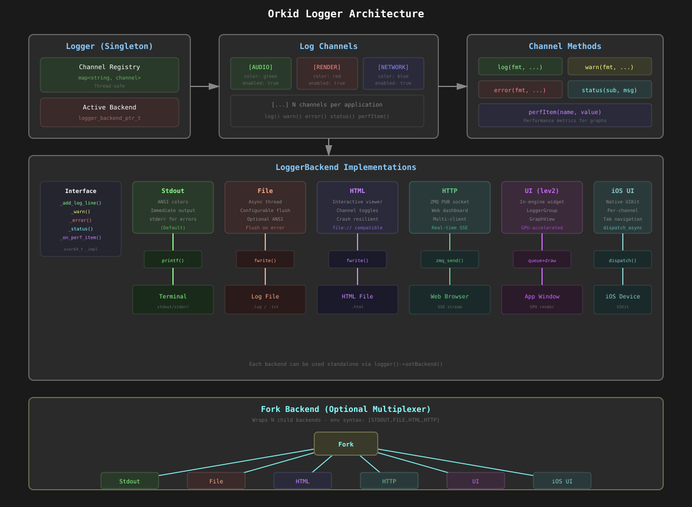
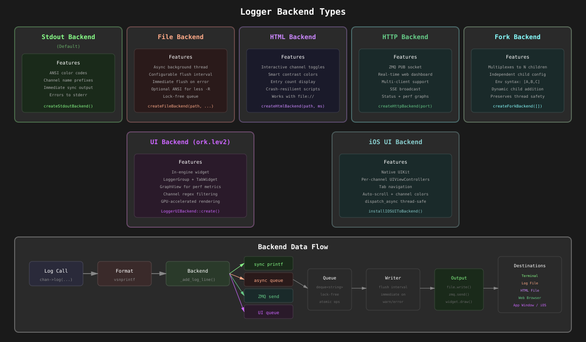
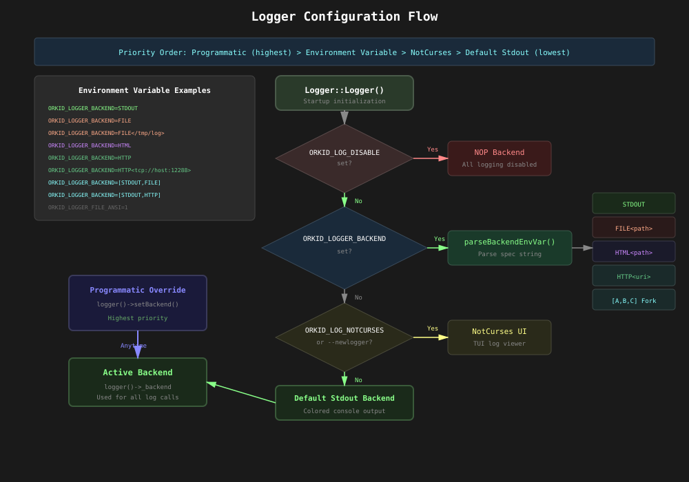
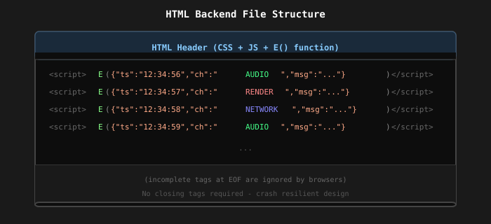
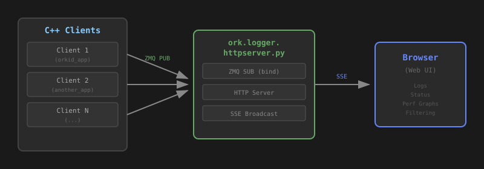
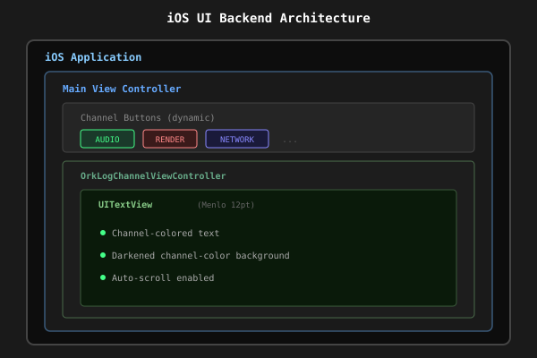

# Orkid Logging System - Technical Design Document

---

## Overview

The Orkid Logging System provides a flexible, multi-backend logging framework with colored output, channel-based filtering, and multiple output targets. It supports stdout, file, interactive HTML, and real-time HTTP backends, with the ability to fork logs to multiple destinations simultaneously.

### What It Does

- **Channel-Based Logging**: Organize logs into named channels with configurable colors
- **Multiple Backends**: Output to stdout, files, or interactive HTML viewers
- **Fork Backend**: Send logs to multiple destinations simultaneously
- **Environment Configuration**: Configure backends via environment variables
- **Thread-Safe**: Safe concurrent logging from multiple threads

### Key Benefits

- **Visual Organization**: Colored channel prefixes for easy log scanning
- **Flexible Output**: Runtime-configurable output destinations
- **Crash Resilient**: HTML backend uses inline scripts for crash-safe logs
- **Interactive Viewing**: HTML logs with channel toggles and filtering
- **Zero Configuration**: Works out of the box with sensible defaults

---

## Basic Concepts

### Logger
The central singleton that manages all log channels and the active backend:
- Maintains registry of named channels
- Holds the active backend for output
- Provides factory methods for channel creation
- Thread-safe channel management

### LogChannel
A named logging endpoint with associated color and enabled state:
- Named identifier (e.g., "AUDIO", "RENDER", "NETWORK")
- RGB color for visual distinction
- Enable/disable toggle
- Methods: `log()`, `warn()`, `error()`, `status()`

### Channel Access Methods

**`configureChannel(name, color, enabled)`** - Producer-side channel creation:
- Creates a new channel if it doesn't exist
- Updates color and enabled state if channel already exists
- Use this when **defining** a channel (typically at module initialization)
- Returns the configured channel

**`getChannel(name)`** - Consumer-side channel lookup:
- Returns existing channel if found
- Creates a **disabled** default channel (white color) if not found
- Use this when **referencing** a channel defined elsewhere
- Safe to call even if the channel hasn't been configured yet

```cpp
// Module A defines the channel
static auto logchan_audio = logger()->configureChannel("AUDIO", fvec3(0,1,0.5), true);

// Module B references the same channel (doesn't need to know color/enabled)
auto audio_chan = logger()->getChannel("AUDIO");
audio_chan->log("Message from module B");
```

This separation allows modules to reference channels without knowing their configuration, while ensuring the defining module controls the channel's appearance and enabled state.

### LoggerBackend
Output handler that receives formatted log messages:
- **Stdout**: Default colored console output
- **File**: Async file writing with optional ANSI colors
- **HTML**: Interactive browser-viewable logs (static file)
- **HTTP**: Real-time streaming to web dashboard via ZMQ
- **UI**: In-engine widget-based log viewer (ork.lev2)
- **iOS UI**: Native iOS log viewer using UIKit
- **Fork**: Multiplexes to multiple child backends

---

## High-Level Architecture



The architecture follows a producer-consumer pattern with channels feeding into a configurable backend system.

---

## Backend Types



### Stdout Backend (Default)
- Colored output to terminal
- ANSI escape codes for colors
- Immediate output, no buffering
- Warnings/errors go to stderr

### File Backend
- Async writing via background thread
- Configurable flush interval (default 100ms)
- Optional ANSI color codes for `less -R`
- Immediate flush on warn/error

### HTML Backend
- Single self-contained HTML file
- Interactive channel toggles
- Smart contrast colors for readability
- Crash-resilient inline script architecture
- Works with `file://` protocol (no server needed)

### HTTP Backend
- Real-time streaming to web-based dashboard
- Uses ZMQ PUB socket for low-latency delivery
- Supports multiple simultaneous client applications
- Features: status dashboard, performance graphs, log filtering
- Server runs separately: `ork.logger.httpserver.py`

### UI Backend (ork.lev2)
- In-engine log viewer using Orkid's UI framework
- Embedded directly in application window
- Tabbed interface per log channel
- Features: status area, scrolling log, performance graphs
- Uses `LoggerGroup` widget with `GraphView` for metrics
- Thread-safe message queuing for UI thread safety

### iOS UI Backend
- Native iOS log viewer using UIKit
- Per-channel UIViewControllers with colored text
- Tab-based navigation between channels
- Monospace font (Menlo) with channel-tinted background
- Auto-scroll to latest entries
- Thread-safe via dispatch_async to main thread

### Fork Backend
- Multiplexes to multiple child backends
- Example: stdout + file + HTML + HTTP simultaneously
- Independent configuration per child

---

## C++ Usage

### Creating and Using Channels

```cpp
#include <ork/util/logger.h>

// Get or create a channel with color
static logchannel_ptr_t logchan_audio = logger()->configureChannel(
    "AUDIO",           // Channel name
    fvec3(0, 1, 0.5),  // Color (RGB 0-1)
    true               // Enabled
);

// Log messages
logchan_audio->log("Initializing audio system");
logchan_audio->log("Sample rate: %d Hz", sample_rate);

// Warnings and errors (always output, even if channel disabled)
logchan_audio->warn("Buffer underrun detected");
logchan_audio->error("Failed to open audio device: %s", error_msg);

// Status messages with subchannel
logchan_audio->status("LATENCY", "Current: %.2f ms", latency_ms);
```

### Multi-line Logging

```cpp
// For messages built incrementally
logchan->log_begin("Processing files: ");
for (const auto& file : files) {
    logchan->log_continue("%s ", file.c_str());
}
// Note: log_begin/log_continue don't add newlines
```

### Programmatic Backend Configuration

```cpp
#include <ork/util/logger.h>

// Set file backend
auto file_backend = createFileBackend(
    "/path/to/log.txt",  // Path
    true,                // Enable ANSI colors
    100.0f,              // Flush interval (ms)
    true                 // Flush on error
);
logger()->setBackend(file_backend);

// Set HTML backend
auto html_backend = createHtmlBackend(
    "/path/to/log.html",  // Path
    100.0f                // Flush interval (ms)
);
logger()->setBackend(html_backend);

// Fork to multiple backends
auto fork_backend = createForkBackend({
    createStdoutBackend(),
    createFileBackend("/path/to/log.txt"),
    createHtmlBackend("/path/to/log.html")
});
logger()->setBackend(fork_backend);

// Or build fork incrementally
auto fork = createForkBackend();
forkBackendAddChild(fork, createStdoutBackend());
forkBackendAddChild(fork, createHtmlBackend("/path/to/log.html"));
logger()->setBackend(fork);

// Set HTTP backend (connects to ork.logger.httpserver.py)
auto http_backend = createHttpBackend("tcp://127.0.0.1:12288");  // ZMQ endpoint
logger()->setBackend(http_backend);

// Connect to remote log server
auto remote_backend = createHttpBackend("tcp://logserver.local:12288");
logger()->setBackend(remote_backend);
```

### Static Channel Declaration Pattern

```cpp
// In your .cpp file (module scope)
namespace ork::lev2::vulkan {

// Channels created at static init time
static logchannel_ptr_t logchan_vkimpl =
    logger()->configureChannel("VKIMPL", fvec3(1, 1, 0));
static logchannel_ptr_t logchan_vkerr =
    logger()->configureChannel("VKERR", fvec3(1, 0, 0), true);

void someFunction() {
    logchan_vkimpl->log("Vulkan instance created");
}

} // namespace
```

---

## Python Usage

### Basic Logging

```python
from orkengine import core

# Get the logger singleton
log = core.logger()

# Configure a channel
audio_chan = log.configureChannel("AUDIO", core.vec3(0, 1, 0.5), True)

# Log messages
audio_chan.log("Initializing audio system")
audio_chan.log("Sample rate: %d Hz" % sample_rate)

# Warnings and errors
audio_chan.warn("Buffer underrun detected")
audio_chan.error("Failed to open device: %s" % error)

# Status with subchannel
audio_chan.status("LATENCY", "%.2f ms" % latency)
```

### Backend Configuration from Python

```python
from orkengine import core

log = core.logger()

# Create and set file backend
file_backend = core.createFileBackend(
    "/path/to/log.txt",  # path
    True,                # enable_ansi
    100.0,               # flush_interval_ms
    True                 # flush_on_error
)
log.setBackend(file_backend)

# Create HTML backend
html_backend = core.createHtmlBackend("/path/to/log.html", 100.0)
log.setBackend(html_backend)

# Fork to multiple backends
fork_backend = core.createForkBackend([
    core.createStdoutBackend(),
    core.createFileBackend("/path/to/log.txt"),
    core.createHtmlBackend("/path/to/log.html")
])
log.setBackend(fork_backend)
```

### Using Existing Channels

```python
from orkengine import core

# Get existing channel by name
audio_chan = core.logchannel("AUDIO")
audio_chan.log("Message from Python")

# Get the error channel
err_chan = core.logerrchannel()
err_chan.error("Something went wrong")
```

---

## Environment Variable Configuration

The logging system can be configured entirely through environment variables, useful for debugging without code changes.

### Backend Selection

```bash
# Single backends
export ORKID_LOGGER_BACKEND=STDOUT              # Console output (default)
export ORKID_LOGGER_BACKEND=FILE                # File at ${OBT_STAGE}/orkid.log
export ORKID_LOGGER_BACKEND=FILE</path/to/log>  # File at custom path
export ORKID_LOGGER_BACKEND=HTML                # HTML at ${OBT_STAGE}/orkid.log.html
export ORKID_LOGGER_BACKEND=HTML</path/to.html> # HTML at custom path
export ORKID_LOGGER_BACKEND=HTTP                              # HTTP backend (localhost:12288)
export ORKID_LOGGER_BACKEND=HTTP<tcp://hostname:12288>        # HTTP backend on remote host
export ORKID_LOGGER_BACKEND=HTTP<tcp://192.168.1.100:5556>    # Custom host and port

# Multiple backends (fork syntax)
export ORKID_LOGGER_BACKEND="[STDOUT,FILE]"
export ORKID_LOGGER_BACKEND="[STDOUT,HTML]"
export ORKID_LOGGER_BACKEND="[STDOUT,HTTP]"
export ORKID_LOGGER_BACKEND="[STDOUT,FILE</tmp/app.log>,HTML</tmp/app.html>,HTTP<tcp://logserver:12288>]"
```

### Backend Options

```bash
# File backend options
export ORKID_LOGGER_FILE_ANSI=1        # Include ANSI colors in file output
export ORKID_LOGGER_FILE_FLUSH_MS=50   # Flush interval in milliseconds

# Applies to both FILE and HTML backends
```

### Logging Control

```bash
# Disable all logging
export ORKID_LOG_DISABLE=1

# Always flush after each log (slow but safe for debugging crashes)
export ORKID_LOG_ALWAYSFLUSH=1

# Per-channel file logging
export ORKID_LOGFILE_AUDIO=/tmp/audio.log  # Channel "AUDIO" also logs to file
export ORKID_LOGFILE_RENDER=/tmp/render.log
```

### NotCurses UI (Optional)

```bash
# Enable ncurses-based log viewer (if compiled with ENABLE_NOTCURSES_UI)
export ORKID_LOG_NOTCURSES=1
# Or use command line flag:
./myapp --newlogger
```

---

## Configuration Flow



The configuration system follows this priority order:
1. **Programmatic**: `logger()->setBackend()` overrides everything
2. **Environment Variable**: `ORKID_LOGGER_BACKEND` parsed at startup
3. **NotCurses**: If `ORKID_LOG_NOTCURSES=1` or `--newlogger` flag
4. **Default**: Stdout backend with colored output

---

## HTML Backend Details

The HTML backend creates an interactive log viewer:

### Features
- **Channel Toggles**: Show/hide logs by channel
- **Smart Colors**: Light colors on dark background, dark on light for low-luminance channels
- **Entry Count**: Shows visible/total entries
- **All/None Buttons**: Quick toggle for all channels
- **Crash Resilient**: Uses inline `<script>` tags, tolerant of incomplete writes

### Architecture



### Viewing Logs
Simply open the HTML file in any browser:
```bash
# After running with HTML backend
open ~/.staging/orkid.log.html      # macOS
xdg-open ~/.staging/orkid.log.html  # Linux
```

---

## HTTP Backend Details

The HTTP backend provides real-time log streaming to a web-based dashboard, supporting multiple simultaneous client applications.

[](images/httplogger.png)
*HTTP Logger Dashboard showing multiple clients with status, performance graphs, and filtered logs*

### Architecture



### Features

- **Multi-Client Support**: View logs from multiple applications simultaneously
- **Real-Time Streaming**: Low-latency log delivery via ZMQ + SSE
- **Status Dashboard**: Collapsible status panels grouped by channel
- **Performance Graphs**: Real-time graphing of `perfItem()` metrics
  - Right-justified display (newest data on right)
  - Auto-scaling min/max with smoothing
  - Current/min/max value labels
- **Channel Filtering**: Toggle channels on/off per client
- **Regex Filtering**: Include/exclude patterns for log messages
- **Resizable Panels**: Drag gutters between panels to resize
- **Heartbeat Monitoring**: Visual indicator pulses with real heartbeats
- **Client Lifecycle**: Dead clients shown with red indicator and remove button
- **Remote Access**: Server binds to 0.0.0.0 for network access

### Usage

```bash
# 1. Start the server (run once, handles multiple clients)
ork.logger.httpserver.py [zmq_port]
# Default: ZMQ on 12288, HTTP on 12289 (ZMQ + 1)

# 2. Configure client applications to use HTTP backend
export ORKID_LOGGER_BACKEND=HTTP                              # localhost
export ORKID_LOGGER_BACKEND=HTTP<tcp://192.168.1.100:12288>   # remote server
export ORKID_LOGGER_BACKEND="[STDOUT,HTTP]"                   # fork with stdout

# 3. Open browser to view logs (HTTP port = ZMQ port + 1)
open http://localhost:12289
```

### Server Output

```
Orkid Log Server
  ZMQ endpoints (for C++ clients):
    tcp://127.0.0.1:12288
    tcp://192.168.1.100:12288
  HTTP endpoints (for browsers):
    http://127.0.0.1:12289
    http://192.168.1.100:12289

  C++ usage: ORKID_LOGGER_BACKEND=HTTP<tcp://hostname:12288>
```

### Message Types

The C++ client sends JSON messages over ZMQ:

| Type | Description |
|------|-------------|
| `register` | Client registration (app name, PID, hostname) |
| `heartbeat` | Keep-alive signal (every 1 second) |
| `disconnect` | Clean shutdown notification |
| `log` | Log entry (channel, message, color, timestamp) |
| `status` | Status update (channel, subchannel, value) |
| `perf` | Performance metric (channel, subchannel, numeric value) |

### Client Timeout

- Heartbeat interval: 1 second (C++ client)
- Server timeout: 5 seconds (marks client as dead)

---

## UI Backend Details

The UI backend provides an in-engine log viewer using Orkid's native UI framework. Unlike the HTTP backend which uses an external browser, the UI backend renders logs directly within the application window.

### Architecture


### Components

- **LoggerGroup**: Main container widget that receives log messages
- **TabWidget**: Organizes channels into selectable tabs
- **TextBox**: Displays status lines and scrolling log messages
- **GraphView**: Renders real-time performance graphs with auto-scaling

### C++ Usage

```cpp
#include <ork/lev2/ui/logger_ui_backend.h>
#include <ork/lev2/ui/logger_group.h>

// Create the UI backend
auto ui_backend = ork::ui::LoggerUIBackend::create();
logger()->setBackend(ui_backend);

// Create a LoggerGroup widget with allowed channels
auto logger_widget = ork::ui::LoggerGroup::create(
    "AppLogs",                          // Widget name
    {"AUDIO", "RENDER", "NETWORK.*"}    // Allowed channels (supports regex)
);

// Register the widget with the backend
ork::ui::LoggerGroup::registerOnBackend(logger_widget, ui_backend);

// Add the widget to your UI hierarchy
my_layout->addChild(logger_widget);

// In your render loop, process queued messages
void onDraw(lev2::Context* ctx) {
    logger_widget->processQueuedMessages(ctx);
    // ... draw UI
}
```

### Channel Filtering

LoggerGroup supports regex patterns for channel matching:

```cpp
// Exact match
{"AUDIO", "RENDER"}

// Wildcard patterns
{"VK.*"}           // Matches VKIMPL, VKERR, VK_DEBUG, etc.
{".*ERR"}          // Matches any channel ending in ERR
{"AUDIO|RENDER"}   // Matches AUDIO or RENDER
```

### Thread Safety

- Log messages are queued from any thread
- `processQueuedMessages()` must be called from the UI thread
- Backend broadcasts to all registered LoggerGroups
- Uses mutex-protected message queue

### Features

- **Dynamic Channel Creation**: Tabs created as channels are encountered
- **Status Updates**: Key-value pairs displayed in status area
- **Performance Graphs**: `perfItem()` values rendered as time-series graphs
- **Tab Selection**: `setActiveTabByName()` to switch active channel
- **Normalized Mode**: `_normalize_series` flag for [0,1] normalization

---

## iOS UI Backend Details

The iOS UI backend provides a native log viewer for iOS applications using UIKit. It creates a tabbed interface where each log channel has its own scrollable text view.

### Architecture



### Components

- **OrkLogChannelViewController**: Per-channel view with UITextView
- **OrkLogChannelManager**: Manages channel view controllers
- **IOSLoggerUI**: C++ bridge to Objective-C logging

### C++ Usage

```cpp
#include <ork/util/logger.h>

// On iOS, install the iOS UI backend
#if defined(ORK_IOS)
extern void installIOSUIToBackend(LoggerBackend* backend);
extern void setIOSUIMainViewController(void* mainVC);

// Install to the default backend
installIOSUIToBackend(logger()->backend().get());

// Set main view controller (from your iOS app delegate)
setIOSUIMainViewController((__bridge void*)myViewController);
#endif
```

### Features

- **Dynamic Channels**: Channel tabs created on first log message
- **Channel Colors**: Text and background use channel's configured color
- **Auto-scroll**: Automatically scrolls to newest log entry
- **Emoji Indicators**: ⚠️ for warnings, ❌ for errors
- **Thread Safety**: All UI updates marshaled to main thread via `dispatch_async`
- **Channel Highlighting**: Active channel button highlighted on new messages

### Message Formatting

| Message Type | Format |
|-------------|--------|
| Log | Plain text |
| Warning | `⚠️ WARNING: message` |
| Error | `❌ ERROR: message` |
| Status | `[subchannel] message` |
| PerfItem | `[PERF:name] value` |

---

## Performance Characteristics

### Stdout Backend
- **Latency**: Immediate (synchronous printf)
- **Throughput**: Limited by terminal I/O
- **Thread Safety**: Via backend mutex

### File Backend
- **Latency**: Async (queued writes)
- **Throughput**: High (background thread)
- **Flush**: Configurable interval + immediate on error
- **Thread Safety**: Lock-free enqueue, single writer thread

### HTML Backend
- **Latency**: Async (same as file)
- **Throughput**: High (background thread)
- **Memory**: Entries stored in browser DOM
- **Thread Safety**: Lock-free enqueue, single writer thread

### HTTP Backend
- **Latency**: Low (ZMQ async send, ~1ms typical)
- **Throughput**: High (background writer thread + ZMQ)
- **Memory**: Server-side per-client entry buffers
- **Thread Safety**: Lock-free enqueue, single writer thread
- **Network**: ZMQ PUB to server, SSE to browsers

### UI Backend
- **Latency**: Frame-rate dependent (processed on UI thread)
- **Throughput**: Limited by UI update rate
- **Memory**: Per-channel log buffers in widgets
- **Thread Safety**: Mutex-protected message queue
- **Rendering**: GPU-accelerated via Orkid's lev2 renderer

### iOS UI Backend
- **Latency**: Frame-rate dependent (dispatch_async to main thread)
- **Throughput**: Limited by UI update rate
- **Memory**: Per-channel log buffers in UITextView
- **Thread Safety**: dispatch_async to main thread
- **Rendering**: Native UIKit text rendering

### Fork Backend
- **Overhead**: Iterates children sequentially
- **Thread Safety**: Each child's safety preserved

---

## Design Principles

### Channel-Based Organization
Logs are organized by subsystem, not severity:
- Each module defines its own channel(s)
- Colors provide visual grouping
- Channels can be enabled/disabled independently

### Backend Abstraction
All backends implement the same interface:
```cpp
struct LoggerBackend {
    log_fn_t _add_log_line;
    log_fn_t _warn;
    log_fn_t _error;
    status_fn_t _status;
    // ...
};
```

### Fork Backend Pattern
The fork backend enables composition:
- Combine any backends without code changes
- Environment variable configurable
- Runtime reconfigurable

### Crash Safety
The HTML backend prioritizes recoverability:
- Header written once at startup
- Each entry is a complete `<script>` tag
- Browsers tolerate incomplete HTML at EOF
- No footer or closing tags required

---

## Common Patterns

### Debug Logging
```cpp
// Conditional compilation
#ifdef DEBUG
static logchannel_ptr_t logchan_debug =
    logger()->configureChannel("DEBUG", fvec3(0.5, 0.5, 0.5), true);
#define DEBUG_LOG(...) logchan_debug->log(__VA_ARGS__)
#else
#define DEBUG_LOG(...) ((void)0)
#endif
```

### Module-Scoped Channels
```cpp
// audio_module.cpp
namespace {
static logchannel_ptr_t _log =
    logger()->configureChannel("AUDIO", fvec3(0, 1, 0.5));
}

void initAudio() {
    _log->log("Initializing...");
}
```

### Error Channel Convention
```cpp
// Use red color for error channels
static logchannel_ptr_t logchan_err =
    logger()->configureChannel("MYMOD-ERR", fvec3(1, 0, 0), true);

// Always enabled, always visible
logchan_err->error("Critical failure: %s", msg);
```

---

## Future Enhancements

### Potential Improvements
- **Log Rotation**: Automatic file rotation by size/time
- **Structured Logging**: JSON output format
- **Log Levels**: Per-channel severity filtering
- **Async Flush API**: Manual flush trigger
- **Layout Persistence**: Save/restore HTTP dashboard panel layouts

### Compatibility
- Current API designed for forward compatibility
- Backend interface allows new implementations
- Environment variable syntax extensible

---

## Conclusion

The Orkid Logging System provides a practical, flexible solution for application logging. Its channel-based organization, multiple backend support, and environment variable configuration make it suitable for both development debugging and production monitoring. The HTML backend's crash-resilient design ensures logs are preserved even in failure scenarios.
