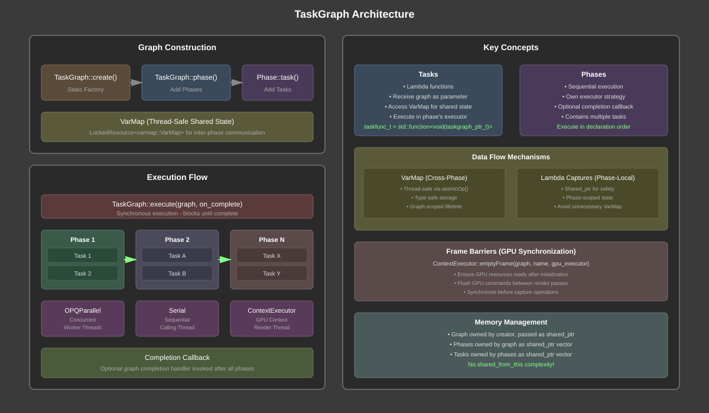
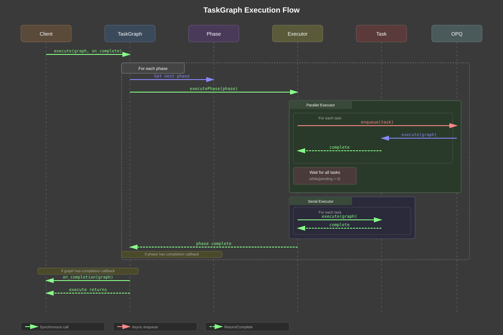
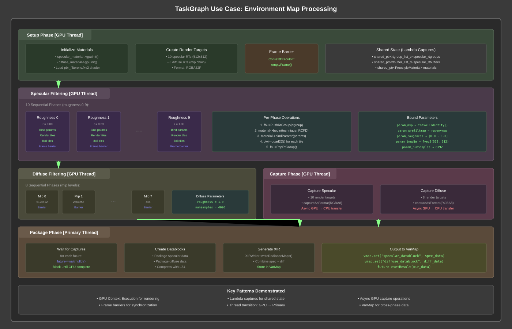

# TaskGraph System - Technical Design Document

---

## Overview

The TaskGraph is a lightweight, phase-based task execution system designed for the Orkid engine. It provides structured coordination of asynchronous operations across different execution contexts (GPU threads, main thread, worker threads) with a clean, composable API.

### What It Does

- **Phase-Based Execution**: Organizes tasks into sequential phases with configurable executors
- **Cross-Thread Coordination**: Manages work across GPU, main, and worker threads
- **Synchronous Completion**: Blocking execute() ensures deterministic completion
- **Static Factory Pattern**: Clean separation between graph construction and execution

### Key Benefits

- **Deterministic**: Sequential phase execution with synchronous completion guarantees
- **Flexible**: Different executors per phase (parallel, serial, GPU context)
- **Composable**: Graphs built from reusable phases and tasks
- **Thread-Safe**: Safe concurrent task execution within parallel phases

---

## Basic Concepts

### Tasks
Individual units of work that receive the graph as context:
- Lambda functions with `taskgraph_ptr_t` parameter
- Can access shared state via graph's VarMap
- Execute within their parent phase's executor context

### Phases
Sequential stages of execution containing one or more tasks:
- Execute in declaration order
- Each phase has its own executor (parallel/serial/GPU)
- Support completion callbacks
- Tasks within a phase may run concurrently (executor-dependent)

### Executors
Strategy objects that determine how tasks within a phase execute:
- **OPQParallel**: Tasks run concurrently on worker threads
- **Serial**: Tasks run sequentially on calling thread
- **ContextExecutor**: Tasks run on specific GPU context thread

### VarMap
Thread-safe key-value store for sharing data between phases:
- Atomic operations via `atomicOp()` lambda pattern
- Type-safe value storage and retrieval
- Scoped to individual graph instance

---

## Core Features

### Essential Capabilities

- **Static Factory Construction**
  - Graph creation separate from execution
  - Clean API via static factory methods
  - No shared_from_this complexity
  - Reusable graph definitions

- **Phase-Based Organization**
  - Sequential phase execution
  - Per-phase executor configuration
  - Optional phase completion callbacks
  - Frame barriers for GPU synchronization

- **Flexible Execution Models**
  - Parallel task execution within phases
  - Serial execution for order-dependent operations
  - GPU context execution for rendering operations
  - Synchronous completion guarantees

- **Data Sharing**
  - Thread-safe VarMap for inter-phase communication
  - Lambda captures for phase-local state
  - Graph parameter passing to all tasks
  - Type-safe value storage

- **GPU Integration**
  - ContextExecutor for GPU-bound operations
  - Frame barriers for GPU command synchronization
  - Render target lifetime management
  - Material and shader state coordination

---

## High-Level Architecture



The architecture provides clean separation between graph definition and execution, with flexible executor strategies per phase.

---

## Execution Flow

The TaskGraph executes phases sequentially, with tasks within each phase running according to the phase's executor strategy.



---

## Phase Dependencies and Barriers

TaskGraph ensures proper ordering through sequential phase execution and explicit barriers:

### Sequential Phase Execution
- Phases execute in the order they are added
- Next phase waits for previous phase completion
- No explicit dependency declaration needed

### Frame Barriers
GPU operations often require frame boundaries for synchronization:

```cpp
// After setup phase, ensure GPU resources are ready
ContextExecutor::emptyFrame(graph, "setup-barrier", gpu_executor);

// After rendering, ensure commands are submitted
ContextExecutor::emptyFrame(graph, "render-barrier", gpu_executor);
```

### Data Dependencies
Phases communicate through VarMap and lambda captures. Data flows sequentially through phases, with each phase able to access results from previous phases through the shared VarMap or lambda captures.

---

## Memory Management

TaskGraph uses modern C++ memory management patterns for safety and efficiency:

### Ownership Model
- **Graph**: Owned by creator, passed as `shared_ptr` to execute()
- **Phases**: Owned by graph, stored as `shared_ptr` vector
- **Tasks**: Owned by phases, stored as `shared_ptr` vector
- **Executors**: Shared ownership via `shared_ptr`

### Lambda Capture Strategy
```cpp
// Shared state across phases - use shared_ptr
auto rtgroups = std::make_shared<rtgroup_list_t>();

// Phase-local state - capture by value
int roughness_level = 5;

phase->task("example", [=](taskgraph_ptr_t g) {
    // Safe access to shared and local state
    (*rtgroups)[roughness_level]->use();
});
```

### Thread Safety
- VarMap uses `LockedResource` for thread-safe access
- Atomic counters for task completion tracking
- No shared mutable state between concurrent tasks

---

## Use Case: Environment Map Processing

The EnvMapProcessor demonstrates TaskGraph's capabilities for complex GPU workflows:



### Key Patterns Demonstrated

1. **GPU Context Execution**: All rendering phases use GPU executor
2. **Frame Barriers**: Between setup and rendering for resource readiness
3. **Parallel Captures**: Specular and diffuse captured concurrently
4. **Thread Transition**: Final packaging on primary thread for XIR generation
5. **Shared State**: Render targets shared across phases via lambda captures

---

## Performance Characteristics

### Execution Overhead
- Minimal: Direct function calls for serial execution
- OPQ overhead for parallel task dispatch
- No polling or busy-waiting

### Synchronization Cost
- Phase barriers: Single condition variable wait
- Frame barriers: GPU command flush overhead
- Atomic counters for task completion

### Memory Usage
- Graph structure: ~100 bytes per task
- VarMap: Depends on stored data
- Lambda captures: Configurable per use case

### Scalability
- Phases: Sequential, O(N) execution time
- Tasks within phase: O(1) with sufficient threads
- No practical limit on graph complexity

---

## Design Principles

### Static Factory Pattern
Graph construction uses static methods to avoid shared_from_this complexity:
```cpp
auto graph = TaskGraph::create();
auto phase = TaskGraph::phase(graph, "name", executor);
```

### Synchronous Execution Model
`execute()` blocks until completion, providing deterministic behavior:
```cpp
TaskGraph::execute(graph, on_complete);
// Graph is fully complete here
```

### Composable Phases
Phases are self-contained units that can be reused:
```cpp
void addRenderingPhases(taskgraph_ptr_t graph, material_ptr_t mtl) {
    auto phase = TaskGraph::phase(graph, "render", gpu_executor);
    // Add standard rendering tasks...
}
```

### Explicit Context Management
Executors explicitly manage execution context:
- GPU work on GPU thread
- I/O on worker threads
- Coordination on primary thread

---

## Future Enhancements

### Potential Improvements
- **DAG Support**: Allow non-sequential phase dependencies
- **Dynamic Graphs**: Modify graph during execution
- **Profiling**: Built-in timing and performance metrics
- **Cancellation**: Abort graph execution mid-flight
- **Nested Graphs**: Compose graphs from sub-graphs

### Compatibility Considerations
- Current API designed for forward compatibility
- Phase dependencies could extend current model
- Executor interface allows new strategies

---

## Conclusion

The TaskGraph system provides a clean, efficient solution for coordinating complex asynchronous workflows in the Orkid engine. Its phase-based design, flexible executor model, and static factory pattern make it both powerful and easy to use, while maintaining thread safety and deterministic execution guarantees.