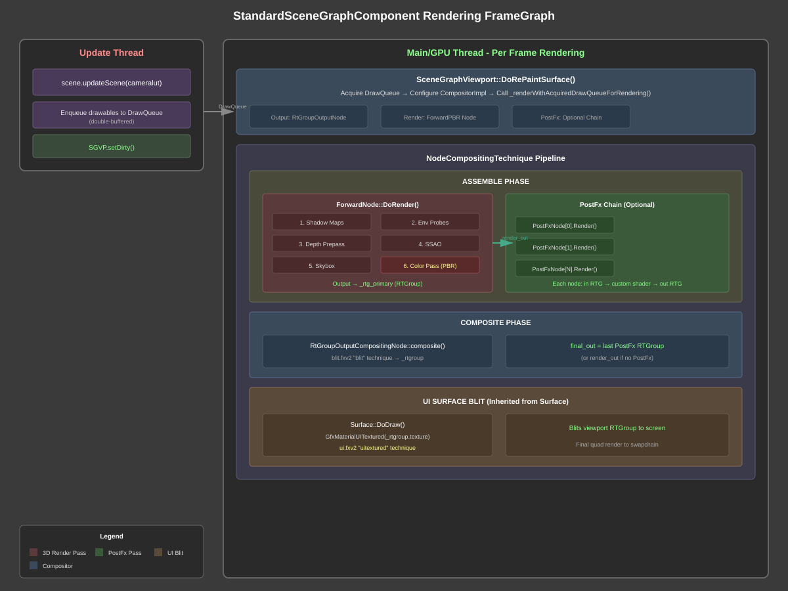
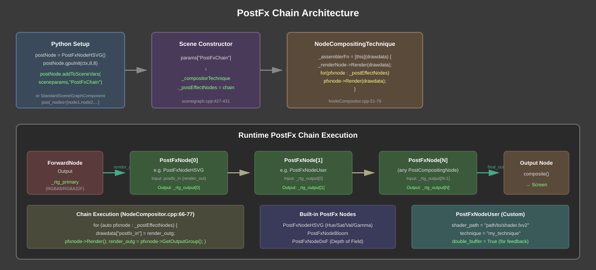
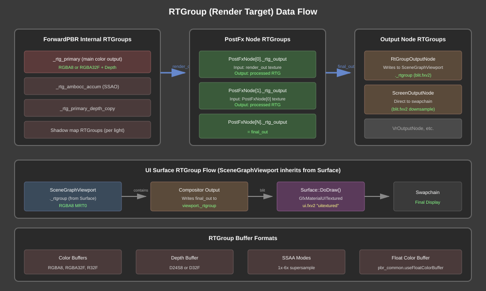

# StandardSceneGraphComponent Rendering FrameGraph

This document describes the complete rendering pipeline used by `StandardSceneGraphComponent`, including the ForwardPBR render node, optional PostFx chain, and final UI surface compositing.

## Architecture Overview



The rendering pipeline consists of three main phases:

1. **Update Thread**: Scene graph traversal and DrawQueue population
2. **Assemble Phase**: 3D rendering (ForwardPBR) + PostFx chain
3. **Composite Phase**: Output node blit + UI surface blit to screen

## Component Hierarchy

```
StandardSceneGraphComponent
    └── SceneGraphViewport (extends Viewport extends Surface)
            └── lev2.scenegraph.Scene
                    ├── CompositingData (presetForwardPBR)
                    ├── CompositorImpl
                    └── NodeCompositingTechnique
                            ├── RenderNode (ForwardNode)
                            ├── PostFxNodes[] (optional chain)
                            └── OutputNode (RtGroupOutputCompositingNode)
```

## Rendering Pipeline

### 1. Update Thread

The update thread runs in parallel with the GPU thread, populating a double-buffered `DrawQueue`:

```python
# StandardSceneGraphComponent._onUpdate()
self.scenegraph.updateScene(self.cameralut)
self.SGVP.widget.setDirty()
```

Key operations:
- Traverse scene graph nodes
- Compute world transforms
- Enqueue drawables to `DrawQueue`
- Mark viewport dirty for redraw

### 2. SceneGraphViewport Rendering

`SceneGraphViewport::DoRePaintSurface()` is the entry point for viewport rendering:

```cpp
// viewport_scenegraph.cpp:72-124
void SceneGraphViewport::DoRePaintSurface(ui::drawevent_constptr_t drwev) {
    // Acquire DrawQueue
    auto acqbuf = drwev->_acqdbuf;

    // Configure compositor output to this viewport's RTGroup
    comptek->_outputNode = _outputnode;  // RtGroupOutputCompositingNode

    // Render!
    _scenegraph->_renderWithAcquiredDrawQueueForRendering(acqbuf);
}
```

### 3. Compositor Pipeline

The `NodeCompositingTechnique` orchestrates the rendering:

```cpp
// NodeCompositor.cpp:51-79
_assemblerFn = [this](CompositorDrawData& drawdata) {
    // 1. Setup output dimensions
    _outputNode->beginAssemble(drawdata);

    // 2. Main 3D rendering (ForwardPBR)
    _renderNode->Render(drawdata);

    _outputNode->endAssemble(drawdata);

    // 3. PostFx chain (if any)
    for (auto pfxnode : _postEffectNodes) {
        drawdata._properties["postfx_in"] = render_outg;
        pfxnode->Render(drawdata);
        render_outg = pfxnode->GetOutputGroup();
    }

    // 4. Set final output
    drawdata._properties["final_out"] = render_out;
};
```

### 4. ForwardPBR Render Passes

The `ForwardNode` (`pbr::ForwardNode`) executes multiple sub-passes:

| Pass | Description | RTGroup |
|------|-------------|---------|
| Shadow Maps | Per-light shadow depth rendering | Light shadow RTGs |
| Environment Probes | IBL probe updates | Cube RTGs |
| Depth Prepass | Optional Z-prepass | _rtg_primary (depth only) |
| SSAO | Screen-space ambient occlusion | _rtg_ambocc_accum |
| Skybox | Environment background | _rtg_primary |
| Color Pass | Main PBR lighting | _rtg_primary |

Key source files:
- `fwdnode_impl_top.cpp:225-356` - Main render orchestration
- `fwdnode_impl_sub.cpp` - Individual pass implementations
- `fwdnode_impl_ssao.cpp` - SSAO pass

### 5. Output to Screen

The final compositing involves two blit operations:

**A. Compositor Output Node** (`RtGroupOutputCompositingNode::composite()`):
```cpp
// Uses blit.fxv2 "blit" technique
// Writes final_out to SceneGraphViewport._rtgroup
```

**B. UI Surface Blit** (`Surface::DoDraw()` - inherited by SceneGraphViewport):
```cpp
// surface.cpp:147-152
static auto texmtl = std::make_shared<GfxMaterialUITextured>(tgt);
texmtl->SetTexture(ETEXDEST_DIFFUSE, _rtgroup->buffer(0)->texture());
// Uses ui.fxv2 "uitextured" technique
// Writes to swapchain via quad render
```

## PostFx Chain



### Setup

PostFx nodes are added via scene parameters:

```python
# Option 1: Direct setup
postNode = lev2.PostFxNodeHSVG()
postNode.gpuInit(ctx, 8, 8)
postNode.addToSceneVars(sceneparams, "PostFxChain")

# Option 2: Via StandardSceneGraphComponent
SGC = StandardSceneGraphComponent(
    post_nodes=[node1, node2, ...]
)
```

### Built-in PostFx Nodes

| Node | Description | Parameters |
|------|-------------|------------|
| `PostFxNodeHSVG` | Hue/Saturation/Value/Gamma | hue, saturation, value, gamma |
| `PostFxNodeBloom` | Bloom/glow effect | threshold, intensity, radius |
| `PostFxNodeDoF` | Depth of field | focusDistance, aperture |
| `PostFxNodeUser` | Custom shader | shader_path, technique, params |

### Custom PostFx (PostFxNodeUser)

For custom effects, use `PostFxNodeUser`:

```python
node = lev2.PostFxNodeUser()
node.shader_path = "/path/to/custom.fxv2"
node.technique = "my_effect"
node.flip_vertical = True  # Vulkan Y-flip

# Shader parameters
node.params.mvp = mtx4()
node.params.custom_param = 1.0

# For feedback effects (temporal)
node.double_buffer = True
node.params.FeedbackMap = other_node.texture_provider
```

### Chain Execution

Each PostFx node:
1. Receives previous stage's RTGroup as input texture
2. Renders fullscreen quad with custom shader
3. Outputs to its own RTGroup
4. Output becomes next node's input

The final node's output becomes `final_out` for the compositor.

## RTGroup Data Flow



### RTGroup Lifecycle

```
ForwardPBR._rtg_primary (RGBA8/RGBA32F)
    ↓ render_out
PostFxNode[0]._rtg_output
    ↓
PostFxNode[N]._rtg_output
    ↓ final_out
RtGroupOutputNode → SceneGraphViewport._rtgroup
    ↓ (blit.fxv2)
Surface::DoDraw() → GfxMaterialUITextured
    ↓ (ui.fxv2 "uitextured")
Swapchain
```

### Buffer Formats

| RTGroup | Format | Purpose |
|---------|--------|---------|
| Primary color | RGBA8 / RGBA32F | Main render output |
| Depth | D24S8 / D32F | Z-buffer |
| SSAO accum | R32F | Ambient occlusion |
| Shadow maps | D32F | Light shadows |
| PostFx outputs | RGBA8 | Effect chain |

Enable float color buffer for HDR rendering:
```python
pbr_common.useFloatColorBuffer = True
```

## Shader Techniques Summary

| Stage | Shader File | Technique |
|-------|-------------|-----------|
| PBR Materials | pbr_*.fxv2 | Various (forward.xxx) |
| Skybox | pbr_common.fxv2 | skybox.forward |
| SSAO | framefx.fxv2 | framefx_ssao_prepass |
| Compositor blit | blit.fxv2 | blit, downsample_2x2..6x6 |
| UI Surface blit | ui.fxv2 | uitextured |
| PostFx HSVG | framefx.fxv2 | hsvg |
| PostFx User | (custom) | (custom) |

## Configuration Options

### Scene Parameters

```python
sg_params = VarMap()
sg_params.preset = "ForwardPBR"           # Compositor preset
sg_params.SkyboxIntensity = 1.0           # IBL skybox intensity
sg_params.DiffuseIntensity = 1.0          # Diffuse lighting scale
sg_params.SpecularIntensity = 1.0         # Specular lighting scale
sg_params.AmbientLevel = vec3(0.125)      # Ambient light color
sg_params.DepthFogDistance = 1e6          # Fog falloff distance
sg_params.SkyboxTexPathStr = "cold"       # Environment map name
sg_params.ssaa = 2                        # Supersample level (0-5)
```

### PBR Common Options

```python
pbr_common.useDepthPrepass = True         # Enable Z-prepass
pbr_common.useFloatColorBuffer = True     # HDR rendering
pbr_common._ssaoNumSamples = 32           # SSAO quality (8+ to enable)
pbr_common._ssaoRadius = 0.5              # SSAO sample radius
pbr_common._ssaoWeight = 1.0              # SSAO strength
pbr_common._enable_skybox = True          # Render skybox
```

## Source File Reference

| Component | File |
|-----------|------|
| StandardSceneGraphComponent | `obt.project/scripts/ork/app/std_scenegraph.py` |
| SceneGraphViewport | `ork.lev2/src/ui/widgets/viewport_scenegraph.cpp` |
| Surface (UI blit) | `ork.lev2/src/ui/widgets/surface.cpp` |
| Scene | `ork.lev2/src/gfx/scenegraph/scenegraph.cpp` |
| Scene render | `ork.lev2/src/gfx/scenegraph/scenegraph_render.cpp` |
| NodeCompositingTechnique | `ork.lev2/src/gfx/renderer/NodeCompositor/NodeCompositor.cpp` |
| ForwardPBR Node | `ork.lev2/src/gfx/renderer/NodeCompositor/forward/fwd_node.cpp` |
| ForwardPBR Impl | `ork.lev2/src/gfx/renderer/NodeCompositor/forward/fwdnode_impl_top.cpp` |
| ScreenOutputNode | `ork.lev2/src/gfx/renderer/NodeCompositor/output/OutputNodeScreen.cpp` |
| RtGroupOutputNode | `ork.lev2/src/gfx/renderer/NodeCompositor/output/OutputNodeRtGroup.cpp` |
| CompositingData presets | `ork.lev2/src/gfx/renderer/compositordata.cpp` |

## Example: Complete PostFx Setup

```python
from orkengine.core import vec3, vec4, mtx4, VarMap
from orkengine import lev2
from ork.app.application import ComponentizedApplication
from ork.app.std_scenegraph import StandardSceneGraphComponent

class MyApp(ComponentizedApplication):
    def __init__(self):
        super().__init__()

        # Create PostFx nodes
        hsvg = lev2.PostFxNodeHSVG()
        hsvg.saturation = 1.2
        hsvg.gamma = 2.2

        custom = lev2.PostFxNodeUser()
        custom.shader_path = "data://shaders/my_effect.fxv2"
        custom.technique = "my_technique"

        # Add to scene graph component
        self.SGC = self.addComponent("SGC",
            StandardSceneGraphComponent,
            eye=vec3(0, 5, 10),
            post_nodes=[hsvg, custom]  # Order matters!
        )

        self.createEzApp(name="PostFxDemo")

    def _onGpuInit(self, ctx):
        # Access post nodes at runtime
        C0 = self.SGC.scenegraph.compositorpostnode(0)  # hsvg
        C1 = self.SGC.scenegraph.compositorpostnode(1)  # custom

        # Setup feedback if needed
        custom.params.PrevFrame = C1.texture_provider

MyApp().ezapp.mainThreadLoop()
```
