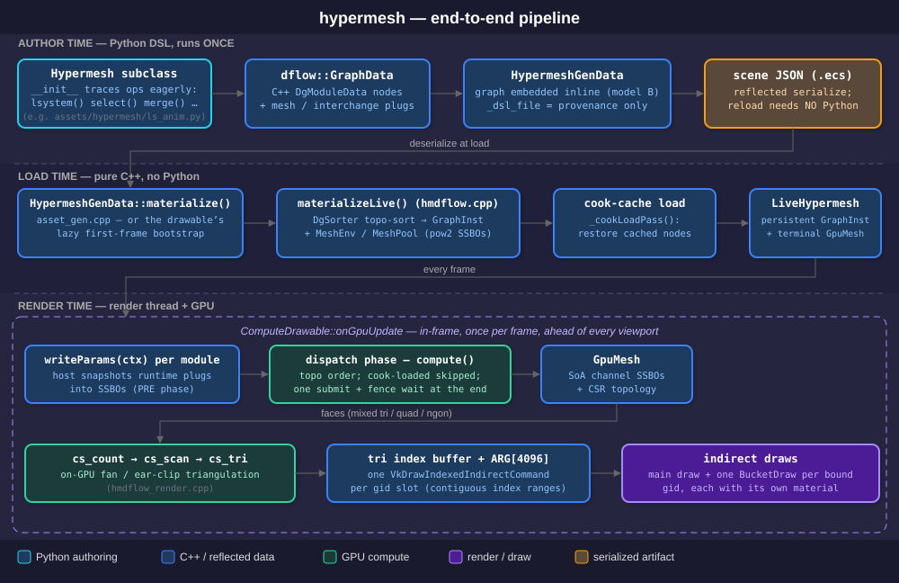
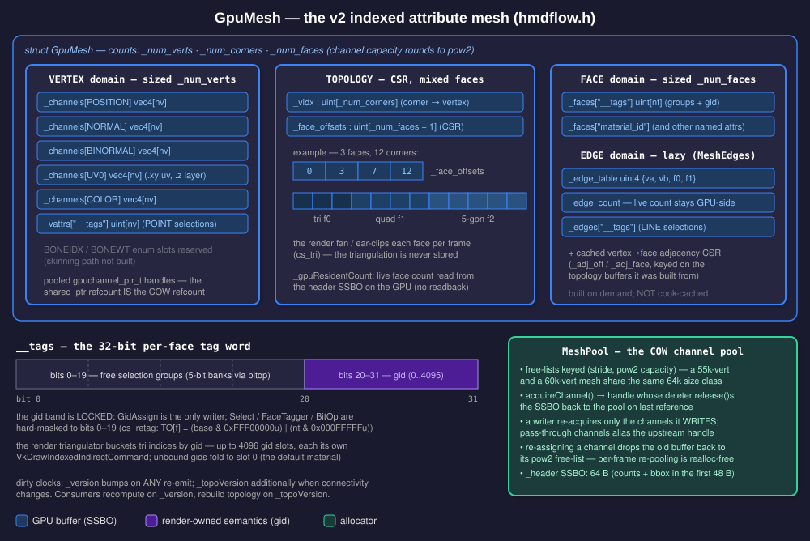
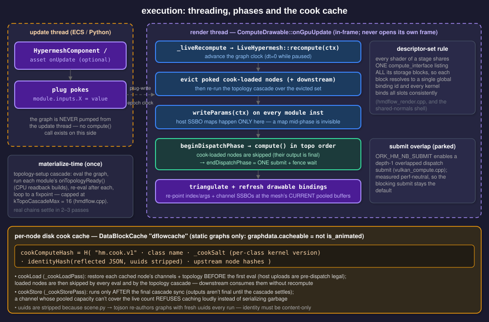
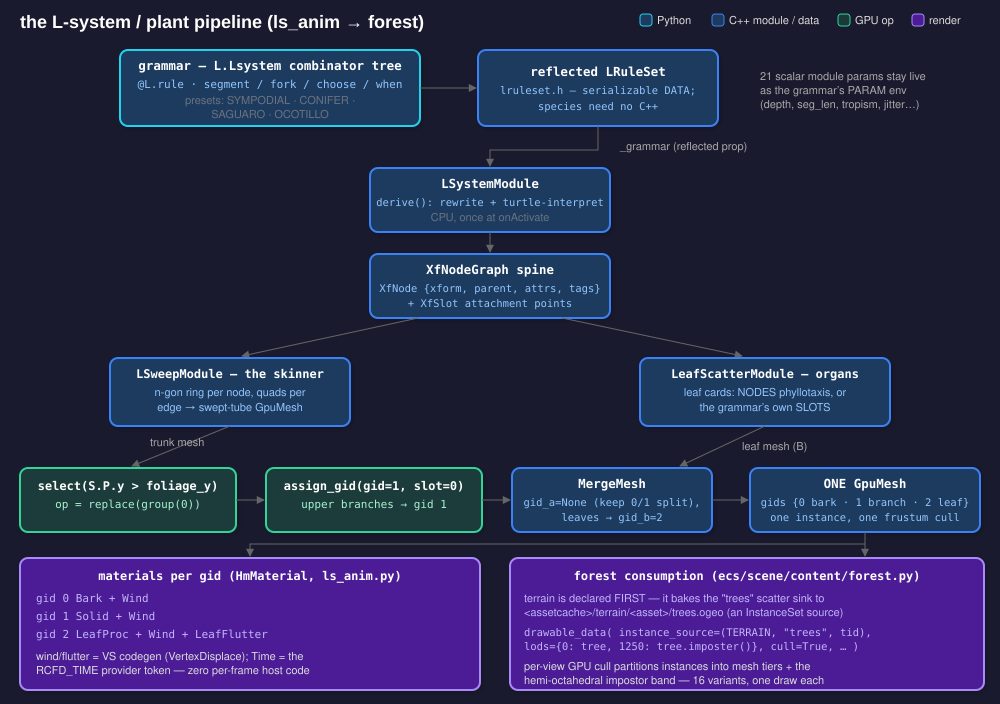
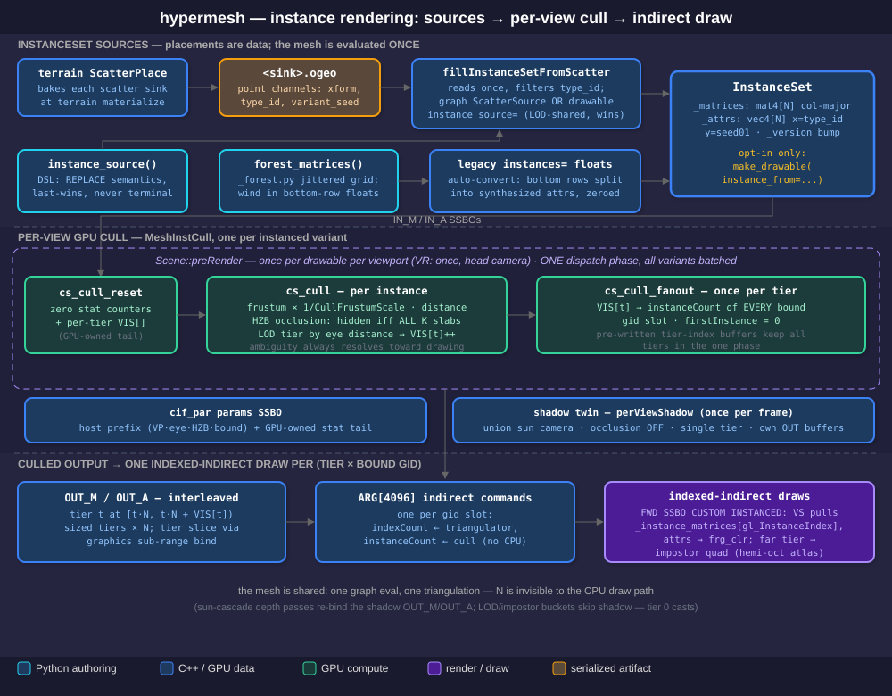
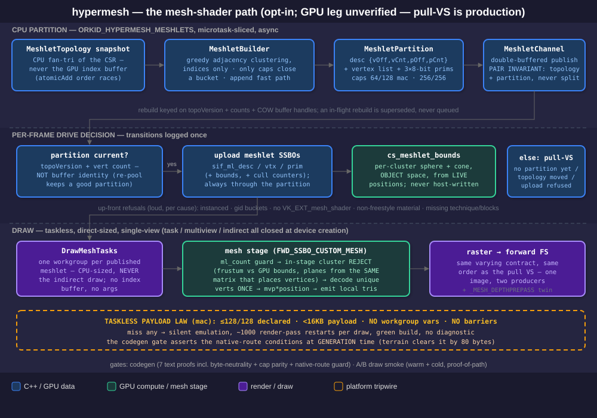

# HYPERMESH — GPU-resident procedural mesh dataflow

> **STATUS (2026-08-01):** the core system described here is **implemented and in daily use** — the
> generator/editor op set, the indexed GpuMesh, the L-system plant pipeline, gid multi-material
> rendering, instancing + LOD/impostor chains, the cook cache and the ECS hosting path all ship and
> are exercised by scenes (`forest.py`, the pueblo/roads content) and by the `llgfx` test battery.
> Honest gaps are listed in §12. Companion docs: `HYPERECS.md` (the authoring-tier model this plugs
> into) and the HyperSyn skill contract (`.claude/skills/hypersyn/`).

---

## 1. What hypermesh is

Hypermesh is orkid's **GPU mesh compute-dataflow** — the HyperSyn `hypermesh` family. A mesh is not a
file of vertices; it is a **graph of C++ compute modules** (an `ork::dataflow::GraphData`) whose
evaluation *builds and edits the mesh entirely on the GPU*. Vertex channels, topology, selections,
extrusions, displacement — all of it lives in SSBOs and is produced by compute dispatches. The same
graph materializes two ways (`hmdflow.h` header comment):

* **BAKE** — run once, read the channels back (`.ogeo` / asset export, `bakeMesh`).
* **LIVE** — keep a persistent `GraphInst` and re-evaluate per frame; the output feeds a
  `ComputeDrawable` and is drawn by indirect draw with no CPU round-trip (`materializeLive`).

Three design commitments shape everything below:

1. **Whole-mesh plugs.** The plug type is the entire mesh (`GpuMesh`), one mesh-in /
   mesh-out per edge — never per-channel wires. Selections are tag *channels riding the mesh*
   (groups), not separate graph edges.
2. **Modules are C++, composition is Python that runs ONCE.** New graphs need no recompile; new or
   changed *modules* do. The Python DSL (`ork.hypergraph.dflow.hypermesh`) traces directly into real
   C++ `DgModuleData` objects at author time; what persists is the traced graph (reflected JSON), and
   reload/playback never runs Python again ("model B", §7).
3. **Copy-on-write pooled GPU memory.** Channels are refcounted handles into a pow2-size-class SSBO
   pool. A module allocates buffers only for the channels it *writes* and aliases the ones it passes
   through — per-frame re-evaluation of an animated graph is realloc-free.

The philosophy is realtime procedural: the on-disk artifact is a compact
procedural graph (kilobytes), and the expensive thing it denotes is reconstructed deterministically —
on the GPU — at load or per frame.

## 2. Architecture overview



The subsystem splits across three homes:

| Layer | Where | What |
|---|---|---|
| Module library | `ork.lev2/inc/ork/lev2/gfx/hypermesh/hmdflow.h`, bodies in `ork.lev2/src/gfx/hypermesh/hmdflow_module_<name>.cpp` | 37 reflected `MeshModuleData` classes + their `MeshComputeInst` instances |
| Shared runtime | `hmdflow.cpp`, `hmdflow_module.h`, `hmdflow_primitives.cpp`, `hmdflow_render.cpp` | plug types, `MeshPool`, bake/live drivers, GPU primitives (scan/sort/edges), render triangulator |
| Authoring DSL | `obt.project/scripts/ork/hypergraph/dflow/hypermesh/` | the `Hypermesh` trace class, `SelExpr`, the L-system grammar DSL, render-source codegen |

**The op roster** (all in `hmdflow.h`; every class is touched in the `GetClassStatic()` block of
`ork.lev2/src/lev2_init.cpp` — see §10 for why that touch is load-bearing):

* *Generators*: `RipplePrimitive`, `Box`, `UvSphere`, `IcoSphere`, `Cone`, plus the regression
  harnesses `SortTest` / `EdgeTest` / `VertTest`.
* *Editors*: `SubdivideModule` (linear + Catmull-Clark, maskable), `SelectData` (SelExpr predicates
  over POLY/POINT/LINE domains), `ExtrudeFacesData` (face/vertex modes, per-face expressions,
  multi-segment), `InsetData`, `BevelData` (edge chamfer), `NormalsData`, `TransformData`,
  `DisplaceByFieldData` (terrain field), `DisplaceBySdfData`, `GpuComputeModuleData` (arbitrary
  shader-text deformer), `TemporalSmoothData`, `DeleteFacesData`, `MirrorData`, `CompactData`,
  `BitOpData` (tag bit-banking), `GidAssignData`, `SectionUnwrapData` (per-gid xatlas UVs),
  `MaterialParamSinkData`, `MergeMeshData`.
* *Plant family*: `LSystemModuleData`, `LSweepModuleData`, `LeafScatterModuleData` (§6).
* *Roads (R-family)*: `RouteSpineModuleData`, `RoadbedMaskModuleData`, `KeepoutMaskModuleData`,
  `ParcelizeModuleData`, `BuildingSeedsModuleData`, `RoadMeshModuleData` — terrain-coupled street
  layout riding the same graph machinery.
* *Instancing*: `ScatterSourceData` — resolves a baked ScatterSet `.ogeo` into a typed `InstanceSet`.

**Interchange plug types.** Cross-family edges carry GPU *resources*, not expressions. The
family-neutral handles live in `ork.lev2/inc/ork/lev2/gfx/dflow/interchange.h`: `GpuComputeImage2D`
(terrain heightfield channels), `InstanceSet` (matrices `mat4[]` + attrs `vec4[]` with
x=type_id/y=seed), `SdfGrid` (dense brick today; NANOVDB enum slot reserved but unbuilt), and
`XfNodeGraph` (the transform-graph spine, §6). The SDF op family itself (`SdfEval`, `Csg`,
`MeshToSdf`, `SdfToMesh`(+Clean), `Redistance`) lives in its own directory `ork.lev2/src/gfx/sdf/`
and couples to hypermesh through the `SdfGrid` plug and `DisplaceBySdf`. Each interchange type needs
its own class touch and its own register pool in the drivers (`bakeMesh` in `hmdflow.cpp` creates
registers for all five).

**Shared GPU primitives** (`hmdflow_module.h`) keep the op bodies small: `MeshScan`
(count→scan→scatter stream compaction, serial + deterministic parallel block-scan paths), `MeshSort`
(stable 1-bit LSB radix over `MeshScan` — deterministic by construction), `MeshEdges` (unique-edge
table with adjacency, fully on-GPU), and `FaceTagger` (generic per-face tag inheritance + partition
MaskOps). Every topology-changing op is the same count/scan/scatter skeleton.

## 3. The GpuMesh data model



`GpuMesh` (`hmdflow.h`) is a **v2 indexed attribute mesh** — a polygon mesh with *mixed* face sizes,
in structure-of-arrays SSBOs:

* **VERTEX domain** — `_channels`: a map from the `MeshChannel` enum (POSITION, NORMAL, BINORMAL,
  UV0, COLOR — all vec4, stride 16 for uniform std430 layout) to pooled `gpuchannel_ptr_t` handles,
  sized `_num_verts`. Named vertex attrs (`_vattrs`, e.g. `__tags` from POINT selects) sit beside
  them. `BONEIDX`/`BONEWT` slots exist in the enum but no skinning path consumes them yet (§12).
* **TOPOLOGY** — `_vidx : uint[_num_corners]` maps each face-corner to a vertex; `_face_offsets :
  uint[_num_faces+1]` is a CSR over corners, so face *f* owns corners `[off[f], off[f+1])`. A face
  may be a tri, quad or ngon in the same mesh. The render-time triangulation is **never stored** —
  `cs_tri` fan/ear-clips per frame (§4).
* **FACE domain** — `_faces`: named per-face channels (`material_id`, `__tags`), sized `_num_faces`.
* **EDGE domain** — lazy. `MeshEdges` builds the unique undirected edge table
  (`{va, vb, f0, f1}`, `f1 = ~0` for boundary) on demand for LINE selection and bevel; the live edge
  count stays GPU-side in `_edge_count` so consumers dispatch to capacity and early-out.
* **Header** — a 64-byte SSBO carrying counts + bbox (48 bytes used, pad zeroed when serialized).
  With `_gpuResidentCount` set, the *live* face count exists only in the header — producers that
  re-size per frame off a GPU scan (e.g. `sdf_to_mesh`) draw exactly their live primitives with no
  CPU sync.
* **Dirty clocks** — `_version` bumps on any re-emit, `_topoVersion` additionally when connectivity
  changes. A consumer recomputes on `_version` and decides *how deep* by `_topoVersion` (full
  topology rebuild vs position-only refresh). `allocMesh` auto-bumps so no module can forget.

**The `__tags` word** is the whole selection/material system in 32 bits per face: bits `[0:20)` are
free selection groups (with a 5-bit bank convention driven by `BitOpData`), bits `[20:32)` are the
**gid band** — the persistent per-face material/semantic-class key (0..4095). The gid band is locked:
`GidAssign` is the *only* verb allowed to write it, and the shared `FaceTagger` shader hard-masks
every other tag write to the free region (`cs_retag` in `hmdflow_module.h`). The render triangulator
buckets triangle indices into contiguous per-gid ranges and emits one `VkDrawIndexedIndirectCommand`
per gid slot (4096 slots, `hmdflow_render.cpp`), which `ComputeDrawable::BucketDraw` entries
(`compute_drawable.h`) consume — one extra indexed-indirect draw per *bound* gid, each with its own
material. Gids with no bound material fold to slot 0 and render with the default material rather
than vanishing.

**COW pooling** (`MeshPool`, `hmdflow.h`): buffers come from free-lists keyed by
`(stride, pow2-capacity)` — a 55,296-vert and a 60,000-vert mesh both round to 65,536 and genuinely
reuse the same buffer. The `shared_ptr` deleter returns a channel to its pool on last reference, so
"drop the handle" *is* the recycle. The pool is owned by the `GraphInst` and persists across live
re-runs.

## 4. Execution model



### Materialization

`materializeLive(graph, ctx, vtx_budget)` (`hmdflow.cpp`) builds the persistent runtime once:
`DgSorter` topo-sorts the graph, `createGraphInst` instantiates it, and a `MeshEnv` (context + pool +
vertex budget + the B.4 clock fields) is stashed on the inst. `bakeMesh` is the one-shot flavor of
the same driver. Both evaluate through a private `_computeSkipping` loop — **never** through the
core `GraphInst::compute`, whose synchronous cached-compute branch would read garbage on a GPU graph.

One evaluation is: a **PRE phase** where every module's `writeParams(ctx)` host-writes its runtime
params from its plugs into SSBOs (the family-neutral `dflowgfx::IPrePhaseParams` hook — host maps
mid-dispatch are invisible, so they are only legal here), then `beginDispatchPhase` →
`compute()` per module in topological order → `endDispatchPhase` (one submit + fence wait).

### The topology cascade

Some ops need a connected mesh's topology *on the CPU* once (subdivide reads back `vidx`/CSR to
build midpoint tables; merge concatenates on the host; extrude precomputes region boundaries). After
the first eval, the driver runs each module's `onTopologyReady(ctx)` and **re-evaluates the graph
after every build**, looping to a fixpoint so chained rebuilds converge — bounded by
`kTopoCascadeMax = 16` (`hmdflow.cpp`; real chains settle in 2–3 passes). Per frame, the analogous
dirty machinery is `_topoVersion`: consumers compare against `_builtSrcTopoV` and rebuild only when
upstream connectivity actually changed.

### Threading

A hypermesh graph computes **on the render thread, in-frame** — `HypermeshComponent.h` states the
contract: the ECS system never pumps `graphinst->compute()` from the update thread. The drawable's
`_liveRecompute` hook (`compute_drawable.h`) runs once per frame in `ComputeDrawable::onGpuUpdate`,
calling `LiveHypermesh::recompute` (writeParams → dispatch phase) and then refreshing the drawable's
SSBO bindings to the mesh's *current* pooled buffers (dynamic-topology ops re-pool). Update-thread
code interacts only by **plug pokes** (`module.inputs.X = value`), which the next frame's
`writeParams` snapshot picks up. Pause is a host concern: the live hook simply stops accumulating
the clock (`LiveHypermesh::_paused`, global `setClockPaused`).

Two rules worth knowing when writing kernels: every stage's shaders share **one
`compute_interface` listing all storage blocks**, so each block resolves to a single global binding
id (`hmdflow_render.cpp`); and `ORK_HM_NB_SUBMIT` (depth-1 overlapped dispatch submits,
`vulkan_compute.cpp`) exists but measured perf-neutral and stays off by default.

### The cook cache

Static graphs (the DSL sets `graphdata.cacheable = not is_animated` at trace close) participate in a
**per-node disk cook cache** (`DataBlockCache` bucket `"dflowcache"`). Node identity is content-only:

```
cookComputeHash = H( "hm.cook.v1"                     // global format epoch
                   · module class name
                   · _cookSalt()                      // per-class kernel version ("v1"…)
                   · hypermeshModuleIdentityHash(mod) // reflected JSON, uuids stripped
                   · upstream node hashes )           // Merkle
```

Uuids are stripped (`hmdflow.cpp`) because the primary workflow re-authors graphs every run
(`scene.py → tojson`), minting fresh uuids — the cache must hit on identical *content*. Model B makes
the hash complete by construction: all authored state is reflected, so a new property cannot dodge
it. `_cookLoadPass` restores cached nodes' full mesh (channels + topology + header) *before* the
first eval; loaded nodes are skipped by every eval and the cascade. `_cookStorePass` runs only after
the final cascade sync, and a channel whose pooled capacity cannot cover its live count **refuses to
cache loudly** rather than serialize garbage. Because "cacheable" is a heuristic, live plug pokes
are defended too: `recompute()` observes the dflow plug-write epoch and **evicts** any still
cook-loaded node that was poked after materialize (plus everything downstream), re-running the
topology cascade over the evicted set. Bump `_cookSalt` whenever an op's kernel logic changes — the
hash cannot see shader text.

### The render path

`setupMeshRender` (`hmdflow.h` / `hmdflow_render.cpp`) installs the render-time triangulator on a
`ComputeDrawableData`. Per frame, entirely on-GPU: `cs_reset` zeroes the 4096 gid histogram + draw
commands, `cs_count` accumulates per-face triangle-index counts into gid bins, `cs_scan` prefix-sums
the bins into `{indexCount, firstIndex}` per draw command, and `cs_tri` writes each face's triangles
into its bucket's contiguous range — exact fans for tris, **Newell-plane ear-clipping** for quads and
ngons up to 60 corners (concave-safe, winding-preserving), corner-0 fan fallback beyond. Output
winding is CCW-outward and the PBR raster state culls back faces, so winding errors are visible as
holes, not shading bugs. Options layer on: wireframe LINE overlay from the true polygon edges (no
triangulation diagonals), per-triangle face-id and `__tags` visualization buffers, depth prepass,
per-view GPU frustum/occlusion cull hooks (`_perViewCompute` + the sun-shadow variant), distance-LOD
tiers and hemi-octahedral impostor tiers (§8).

## 5. The authoring DSL

The Python surface is `ork.hypergraph.dflow.hypermesh` (conventionally `H`). Unlike the terrain
family there is **no document/elaborate split**: `Hypermesh.__init__` opens a trace on a fresh
`GraphData` and every op method *eagerly* constructs the real C++ module and connects plugs — a
Python `for`/`if` simply unrolls into the graph at trace time. This requires an initialized lev2
engine, and it is why authoring runs once: the value of the Python is the graph it leaves behind.

```python
class LsAnim(Hypermesh):                                   # assets/hypermesh/ls_anim.py
  def __init__(self, seed=21, foliage_y=1.8, ...):
    super().__init__()
    trunk = self.lsystem(archetype=archetype, depth=depth, ..., seed=seed)
    trunk = self.select(trunk, S.P.y > foliage_y, op=replace(group(0)))
    trunk = self.assign_gid(trunk, gid=1, slot=0)
    leaves = self.leaves(style=LeafStyle.SINGLE, per_node=leaf_per_node, ...)
    n = self.merge(trunk, leaves, gid_a=None, gid_b=2)
    self.output(n)
```

Key surfaces:

* **Ops are methods on `Hypermesh`**, not a free-function registry. `_add` names modules
  `"%s_%d" % (base, n)` and tracks the terminal; generators return a **`MeshNode`** fluent wrapper so
  chains read `ball.subdivide().smooth_normals()` while staying transparent to the raw module
  (`__getattr__` delegates `.inputs` etc.). `output(node)` pins the terminal explicitly.
* **Cross-family trace.** `__init__` enters the shared `dflow/_trace.py` context, so terrain
  expression ops (`T.fbm(...) * 0.5`) called during composition emit *into the mesh graph* and feed
  `displace(field=...)`; the fluent `self.sdf(...)` builder does the same for SDF chains
  (`conformToSdf`, `displace_by_sdf`, `csg`, `sdf_to_mesh`). `DisplaceByField` is the module that
  stocks the terrain `BakeEnv` on the GraphInst — the generic drivers know nothing about fields.
* **SelExpr** (`selexpr.py`) is the selection-predicate expression tree. Atoms come from the single
  `S` namespace — `S.P`, `S.N`, `S.uv`, `S.id`, `S.area`, `S.length`, `S.angle` (edge dihedral),
  `S.t`/`S.seg` (multi-segment extrude ring), `S.time`, `S.tag(bit)`, `S.gid`, `S.ftag(bit)` — each
  validated per domain (POLY/POINT/LINE). Operators compose: `& | ^ ~` are boolean over 0/1 weights,
  comparisons lower to `step()`, plus arithmetic, `dot`, swizzles and the `sl_*`/`S.*` math helpers.
  Emission is deliberately **flat SSA** (`emit_block`): one op per temp, because shadlang's PEG
  parser recurses per nesting level and a deep expression would blow compilation up. What a Select
  applies is a **MaskOp** — a two-triple bit transform
  `tags = ((tags & AND) | OR) ^ XOR` for matched/unmatched elements, with named constructors
  `add / remove / toggle / isolate / replace(group(n))`.

  ```python
  expr = sel_normal_dir(n=vec3(0,1,0), t=0.55, soft=0.05) & (S.area > 0.02)
  m.select(sph, expr, domain=POLY, op=replace(group(0)))
  ```

* **Runtime params.** `param(name, default)` declares a live-rebindable value; expressions that use
  it compile to `EXPRP[slot]` reads, and the collected params of one `extrude_faces` or
  `gpu_compute` occupy at most **8 vec4 slots** (`kMaxExprParams` — a fixed input-plug set
  `exprp0..exprp7`; exceeding it raises `ValueError` at trace time). `p.set(...)` pokes every module
  that consumed the param. `S.time` is sugar over the same machinery: one shared `__time` param per
  asset whose slot the module itself feeds from the C++ clock (`_time_slot`) — declarative animation
  with zero per-frame Python that serializes with the asset. Note the shared terrain/particles
  `ParamPack` (`dflow/_parampack.py`) is *not* used here.
* **Persistence.** `save(path)` serializes the traced graph to JSON — the ratified artifact is the
  trace *output* (post-trace GLSL predicates plus their canonical ExprIR trees, baked matrices, flat
  mask/param vectors), never the Python recipe; `load_graphdata` + `materialize_live_graph` replays
  it with no DSL. Serialized predicates are an ABI against the op shader shells, versioned by
  `kPredicateABIVersion` (`hmdflow.h`) so a stale asset fails loudly instead of mis-compiling.
* **Instancing from the DSL.** `instance_source(scatter_asset=, sink=, type_id=)` adds a
  `ScatterSource` with **replace semantics** — one InstanceSet per graph, a second call silently
  updates the first (the live driver's discovery is by plug type and last-wins). It is deliberately
  not `_add`ed so it can never become the mesh terminal. On the render side,
  `make_drawable(instance_from=...)` requires the caller to *opt in* to a graph-carried set — a road
  ribbon sharing a graph with parcel seeds must not tile by the parcel transforms. The full
  pipeline is §8.
* **Render-side vertex animation is not dflow.** `VertexDisplace` primitives (`Wind`,
  `LeafFlutter`) are generated into the pull VS by `GpuMeshRenderSource` — pure codegen, with all
  values as uniforms. The `Time` param's default is the `RCFD_TIME` provider token, fed per frame by
  the engine's named-param providers: a swaying forest costs zero per-frame host Python, and the
  mesh itself stays static and cook-cacheable.

## 6. The L-system / plant pipeline



Plants are the flagship of the **structural-spine** design: one generator produces a family-neutral
transform graph, and skinners/organ-placers consume it.

* **Grammar.** A species is *data*: a reflected `LRuleSet` (`lruleset.h`), authored by the Python
  combinator DSL in `ork.hypergraph.dflow.lsystem`. Rule bodies are **serializable combinator
  trees** — `L.segment / pitch / yaw / roll / taper / slot / spines / bloom / choose / fork /
  branch / when` under `@L.rule(Symbol, when=/until=)` — and this is enforced, not advisory: the
  bake-time `Expr` algebra raises `LSystemAuthorError` from `__bool__`/`__iter__`/`__len__`, so a
  stray Python `if S.gen > 3:` inside a production fails loudly at trace time, naming the rule.
  (Note the inversion: the *op layer* encourages Python control flow because it unrolls into the
  graph; a *grammar body* forbids it because the grammar itself is the serialized artifact.) A
  turtle-string dual form (`+ - & ^ / [ ]` tokens) lowers to the same OpSpec tree. Four stock growth
  models ship as preset emitters (`lsystem/presets.py`): SYMPODIAL, CONIFER, SAGUARO, OCOTILLO, with
  per-archetype chaos-channel defaults in `PRESET_JIT`.

  ```python
  class CaneCholla(L.Lsystem):
    def grammar(self):
      Shoot = self.symbol("Shoot", len=0.16, rad=0.020, gen=0)
      @L.rule(Shoot, until=Shoot.gen >= 11)
      def grow(S):
        return [ L.segment(len=S.len, rad=S.rad, gid="cane"),
                 L.choose((0.5, Shoot(len=S.len*0.96, gen=S.gen+1)), (0.5, L.bloom())) ]
      self.axiom(Shoot()); self.iterate(depth=11, segment_budget=700)
  ```

* **Spine.** `LSystemModule` derives the grammar (rewrite + turtle-interpret,
  `hmdflow_lruleset.cpp`) once at activation into an **`XfNodeGraph`** (`interchange.h`): SoA
  nodes `{mat4 xform, parent, vec4 attrs, tags}` plus named `XfSlot` attachment points. The module's
  ~21 reflected scalars (depth, seg_len, branch_angle, tropism, jitter channels, …) stay live as the
  grammar's PARAM environment — numbers flow through params, never folded into the grammar.
* **Skin + organs.** `LSweepModule` skins the spine into a swept-tube GpuMesh (one n-gon ring per
  node, quads per parent→child edge, rounded caps). `LeafScatterModule` reads the *same* spine and
  emits a separate leaf-card mesh — placements from `NODES` (golden-angle phyllotaxis on
  high-generation nodes) or `SLOTS` (the grammar's own attachment points); UV0 is the card chart,
  COLOR.x a flutter weight, COLOR.y a per-leaf hash. The DSL's `lsystem()` verb builds the
  LSystem→LSweep pair and stashes the skeleton so `leaves()` can branch off it.
* **One mesh, many materials.** `ls_anim.py` (§5 snippet) selects the upper trunk
  (`S.P.y > foliage_y`), assigns it gid 1, and `merge()` concatenates trunk + leaves while
  *preserving* the trunk's gid split (`gid_a=None`) and stamping the cards gid 2 — three materials,
  one instanceable mesh, one frustum cull. The materials attach `Wind` to all three gids and layer
  `LeafFlutter` on the leaves only (safe because the leaf cards share no verts with the trunk —
  gid faces that *do* share verts must match the main displace or the boundary tears).
* **A forest** (`ecs/scene/content/forest.py`): the terrain asset is declared **first** because it
  bakes the `"trees"` scatter sink; 16 tree variants (2 species × 8 seeds, each an `LsAnim`
  subclass) then bind that sink at the *drawable* level:

  ```python
  tree.drawable_data(material=bark, materials={1: branch, 2: leaf},
                     instance_source=(TERRAIN, "trees", tid),
                     lods={0.0: tree, 1250.0: tree.imposter()},
                     cull=True, cull_distance=8000.0, cull_slabs=4)
  ```

  Do not confuse this with `assets/hypermesh/_forest.py::forest_matrices()` — a second, unrelated
  mechanism (hash-jittered grid with wind phase in the matrix free floats) used by the standalone
  `ls_anim_inst` demo.

## 7. ECS integration

* **`HypermeshGenData`** (`ork.lev2/inc/ork/lev2/gfx/asset_gen.h`) is the asset form: the graph
  serializes **inline** (model B — owned, not a cross-asset reference), `_dsl_file` is provenance
  only and never re-run, and `materialize(ctx)` is one line: `materializeLive(_graph_data, ctx,
  _vtx_budget)`. The scene-side wrapper (`ork.hypergraph.ecs.scene.assets.Hypermesh`) runs the DSL
  class once at authoring and embeds the result; `fork(**overrides)` re-runs the same DSL with
  merged kwargs to derive LOD meshes, and `imposter(grid=, tile=, ssaa=, msaa=)` marks a billboard
  tier.
* **`HypermeshDrawableData`** (`hm_drawable.h`) is the reflected render description — graph, material
  asset *names*, gid material map, viz flags, instance source, LOD chain, cull config, section-bake
  config. `createDrawable()` returns a `ComputeDrawable` that bootstraps **lazily on its first
  `onGpuUpdate`** (the first moment a render-thread Context exists). Materials resolve **by name**
  through host-installed resolver callbacks, retried each frame until the artifact registry yields —
  until then the drawable skips frames with one loud log.
* **`HypermeshComponent`** (`ork.ecs/.../HypermeshComponent.h`) clones the ParticlesComponent stage
  contract — component owns a drawable data, `_onStage` creates the scenegraph node and wires the
  resolvers — with the clock delta noted in §4: compute happens in-frame on the render thread, and
  pause maps to `LiveHypermesh::_paused`.
* **Instancing + LOD.** The end-to-end instancing model — sources, the typed `InstanceSet`, the
  per-view GPU cull, LOD/impostor tiers and the indirect draw — is §8. `SectionUnwrap` + the
  section-bake driver (`prepareSectionBake*`, `hmdflow.h`) supports the stored-mode alternative:
  per-gid xatlas charts baked into one `sampler2DArray` layer per section, sampled at
  `layer = uv0.z`.

## 8. Instance rendering



Instancing is a **draw-time concept, not a geometry-time copy**: one `GpuMesh` is evaluated once
(one graph eval, one triangulation) and drawn N times by indexed-indirect draws whose
`instanceCount` a GPU cull wrote — the CPU never sees the visible count, and the vertex shader
places each copy by a per-instance matrix it pulls from an SSBO. Everything between "a set of
placements exists" and "N copies rasterize" is this section.

**The typed handle.** `InstanceSet` (`ork.lev2/inc/ork/lev2/gfx/dflow/interchange.h`) is the
family-neutral interchange type for placements: `_matrices` = `mat4[count]` (column-major, the
ScatterSet xform layout) and `_attrs` = `vec4[count]` of per-instance data — x = type_id,
y = variant seed 0..1, z/w free. `_version` bumps when a producer refills; consumers re-bind on
advance (the `GpuMesh::_version` convention). The attrs SSBO is the typed replacement for the
retired matrix-bottom-row smuggle, and the legacy flat-float `instanceMatrices` handout is
auto-converted at `setupMeshRender` (`hmdflow.h`): the buffers are created there, the matrix bottom
rows are split out into a *synthesized* attrs SSBO and zeroed on upload — so the instanced VS
**always** reads per-instance data from `storage_inst_attr`, whichever door the matrices came in.

**Three sources, one handle** (keep them distinct):

* *Baked scatter — the production path.* Terrain's ScatterPlace bakes each sink to a ScatterSet
  `.ogeo` (point channels `xform` / `type_id` / `variant_seed`; the artifact is `OGEO.md`).
  `fillInstanceSetFromScatter` (`hmdflow_module_scattersource.cpp`) reads it once, filters by
  type_id (−1 = whole set), and fills the InstanceSet — and both entry points share that one
  resolver: the graph-carried `ScatterSource` module (resolves at `onActivate`; a static set, v1 —
  nothing per-frame) and the **drawable-level** source
  (`drawable_data(instance_source=(TERRAIN, "trees", tid))` →
  `_instance_scatter_asset/_sink/_type_id` on `HypermeshDrawableData`), which resolves once at the
  drawable, decoupled from the geometry graph — one resolved set routes to all of a variant's LOD
  meshes, and it overrides any graph-carried source. A missing `.ogeo` logs the declaration-order
  cause loudly and emits a legitimately-empty set: 0 instances draw, because the count rides the
  indirect args.
* *The `_forest.py` grid — an unrelated mechanism.* `forest_matrices()`
  (`assets/hypermesh/_forest.py`) is a pure-Python placement generator: a grid×grid layout with
  deterministic hash jitter (position/rotation/tilt/scale) plus per-tree wind
  (phase, amp_delta, freq_delta) packed into the matrix bottom-row free floats. Standalone
  instanced assets (`ls_anim_inst.py`) feed it to `make_drawable(instances=<N×16 floats>)`, i.e.
  through the legacy conversion above — the wind triple lands in the synthesized attrs SSBO and the
  generated `Wind` displace reads `_instance_attrs.xyz`. No `.ogeo`, no types, no terrain: do not
  confuse it with scatter.
* *Graph-carried DSL source.* `instance_source(scatter_asset=, sink=, type_id=)`
  (`dflow/hypermesh/__init__.py`) with **replace semantics**: one InstanceSet per graph. The live
  driver discovers the set by plug type and **last one wins** (`hmdflow.cpp`), so a second source
  would silently shadow the first — re-calling therefore *updates* the existing module (which is
  how a shared asset re-filters per type between materialize calls). Deliberately not `_add`ed, so
  it can never become the mesh terminal.

**The explicit-scoping law.** A graph-carried InstanceSet is **never auto-applied**.
`make_drawable(instance_from=...)` requires the caller to opt the drawable in (pass the live
graph / the set); the default and `instance_from=None` render un-instanced even when the graph
carries a set — a road ribbon sharing one graph with building-seed lots must not tile by the lot
transforms. Never a graph-wide any-InstanceSet sniff; passing both `instance_from` and
`instances=` floats raises.

**The per-view GPU cull** (`MeshInstCull`, `hmdflow_render.cpp`) — one per instanced variant
(scn_forest = 16), hooked as `ComputeDrawable::_perViewCompute` and fanned out by
`Scene::preRender` once per drawable per viewport (deduped across layers; all variants batch into
one submit). Three shaders, one dispatch phase:

* `cs_cull_reset` zeroes the stat counters + per-tier `VIS[]`. The params buffer (`cif_par`) has a
  host-written prefix — VP, bound sphere, eye + cull_distance, count, tighten, HZB dims/mode, the
  occludee count, box scale — and a **GPU-owned tail** (visible/occluded/frustum): the host must
  never write the tail, or the host-visible-buffer readback shadows the GPU's atomics.
* `cs_cull`, per instance: sphere-vs-frustum with `u_tighten = 1/CullFrustumScale` (the one
  frame-global aggressiveness knob, stamped on the RCFD in `Scene::preRender`;
  `ORKID_DISABLE_FRUSTUM_CULL` stamps a pass-all sentinel), a radial distance cull, then HZB
  occlusion: the instance is hidden iff **all K** of its object-space occludee boxes
  (`cull_slabs` — a tree's thin trunk / wide canopy slabs occlude independently) are behind last
  frame's depth pyramid. Every ambiguity resolves toward drawing — a near-plane-crossing corner is
  never occluded, K=0 never culls, and the shadow cull below runs occlusion-free: over-culling is
  a correctness bug, under-culling only a missed saving. Survivors are binned by eye distance into
  up to 4 LOD tiers and compacted into **tier-interleaved** outputs sized tiers×count:
  `OUT_M[tier*count + slot]` / `OUT_A[...]`, counted by `VIS[tier]`.
* `cs_cull_fanout`, once per tier, stamps `VIS[t]` into the `instanceCount` of **every bound gid
  slot's** indirect command (slot 0 always bound) and leaves `firstInstance` 0 — the tier's OUT_M
  slice reaches the VS via the graphics *sub-range bind* at the tier byte offset, so
  `gl_InstanceIndex` starts at 0 per tier. Each fanout binds its own pre-written one-uint tier
  buffer, which is what lets all tiers ride the single dispatch phase (the old
  phase-per-tier submit+wait was a fixed ~5.5 ms, independent of instance count).

In VR the cull runs **once per composited frame against the exact head (center) camera**
(`scenegraph_render.cpp`) — the both-eyes + head-turn slack is CullFrustumScale (VR presets default
1.3), *not* a projection widen (doing both would double-widen). For sun shadows, `perViewShadow`
runs the same reset/cull/fanout into a **twin buffer set** once per frame (`Scene::shadowCull`,
union sun camera): occlusion OFF (the eye HZB is meaningless in light space), no distance cull (a
far caster still shadows), no narrowing (the union frustum is already conservative), single tier.
The per-gid `indexCount`s are buffer-copied from the eye args and only `instanceCount` is
overwritten; the eye set is never touched, so eye-view color stays byte-identical. Sun-cascade
depth passes re-bind `storage_inst_mtx/attr` to the shadow OUT_M/OUT_A
(`_shadowStorageOverrides`).

**LOD tiers + impostors.** Authored at the drawable: `lods={0.0: tree, 1250.0: tree.imposter()}` —
`fork(**overrides)` re-runs the DSL for coarser *mesh* tiers, each with its own triangulator +
args and a `BucketDraw` per (tier × gid) binding the shared culled buffers at its tier offset. An
**impostor tier** has no mesh: the cull routes that distance band to one camera-facing quad per
instance (`FWD_SSBO_CUSTOM_IMPOSTOR`, RCID `_isImpostor`), sampling a hemi-octahedral atlas baked
**in-frame, once per variant** from the real materials' capture techniques (`prepareImpostorBake`;
multiple impostor tiers chain their one-shot bakes). LOD/impostor buckets are skipped in shadow
passes — the full tier-0 mesh casts the shadow. The camera-independent partition invariant
`sum(VIS[t]) == visible` is assertable per frame (`ORKID_DEBUG_LOD`).

**The shader side.** `FWD_SSBO_CUSTOM_INSTANCED` (generated per material by the ptex3d template):
the pull VS decodes vertex i from the channel SSBOs exactly as the un-instanced path does, then
`mat4 _IM = _instance_matrices[gl_InstanceIndex]` places it — position/normal/binormal through the
affine 4×3 part only — and `vtxcolor = _instance_attrs[gl_InstanceIndex]` carries type_id/seed to
the surface as `frg_clr`. The depth twin `FWD_SSBO_CUSTOM_INSTANCED_DEPTHPREPASS` shares the exact
position math (no z-fight), and `HypermeshComponent::_onStage` hard-adds the node to the
`depth_prepass` layer, so instanced hypermesh gets early-z and casts cascade shadows. The
matrices-only sibling for *conventional* vertex-buffer drawables is `FWD_CT_NM_IM_NI_MO`
(`fwdnode_pipeline.cpp`) — same per-instance-matrix pull, stock vertex attributes.

**Known edge (open).** *System-scope* instanced drawable groups — a future non-hypermesh scatter
system — do not auto-join the depth-prepass layer the way generic component visuals and hypermesh
scatter do, so such a system would silently cast no shadows; fail-loud vs auto-join awaits a
ruling.

## 9. The mesh-shader path



An opt-in alternative to the pull-VS fill draw: the mesh is partitioned into **meshlets** on the
CPU and drawn by one mesh-stage workgroup per meshlet — no index buffer, no indirect args for the
fill (the wireframe overlay stays a pull-VS line draw). Status honesty up front: the path is wired
end-to-end behind its toggles, but §12's framing stands — the CPU and codegen gates are green and
**the GPU execution leg is unverified**; the pull-VS path is production.

**The partitioner** (`MeshletBuilder`, `ork.lev2/inc/ork/lev2/gfx/hypermesh/meshlet.h`, bodies in
`hm_meshlet.cpp`) is resumable greedy adjacency clustering under four contracts stated in the
header:

* *Adjacency from indices only.* Two triangles are neighbours iff they share a vertex **index** —
  never a position weld (`Vector3::hash` is 21-bit and aliases past ~±524 m, which would silently
  fuse unrelated shells).
* *Pair invariant.* A partition is only meaningful against the exact triangle list it was built
  from, so `MeshletPartition` owns its `MeshletTopology` snapshot and publication is a single
  shared_ptr swap through the double-buffered `MeshletChannel` — no API can hand out a mismatched
  pair. The snapshot fan-triangulates the CSR on the CPU itself, deliberately *not* consuming the
  render triangulator's GPU index buffer (its triangle order comes from atomicAdd races and is not
  reproducible frame to frame).
* *Append fast path.* Growth whose new triangle list has the old one as an exact prefix carries
  every prior bucket byte-identical and clusters only the tail; any prefix edit rebuilds.
* *Microtaskable.* `step(budget)` bounds a slice by the caller's budget; `MeshletHost` trickles
  rebuilds through the GPU microtask scheduler, and a new request supersedes the in-flight one.

The greedy rule is deterministic (auditable): seed the lowest-numbered unclustered triangle, insert
the frontier candidate sharing the most bucket vertices (ties → lowest id), and **only the caps
close a bucket** — when a frontier runs dry the next island seeds into the *same* bucket, because
organic content is many small adjacency islands and closing per island leaves every bucket a
fraction full. A meshlet is `{vertexOffset, vertexCount, primOffset, primCount}` into a flat
global-vertex-id list plus one uint per triangle of packed 3×8-bit local indices. The caps are a
**mesh-output memory budget**, not a preference: on mac the mesh stage's declared output payload
lives in threadgroup memory (32 KB) and the ptex3d varying set costs ~176 bytes/vertex, so the caps
derive to 64 verts / 128 prims; elsewhere the taskless-tier 256/256 stands. `kMeshletMaxVerts/
Prims` (C++) and `MESHLET_MAX_VERTS/PRIMS` (`dflow/hypermesh/gpu_meshlet.py`, which *derives* them
from the budget) must agree — the codegen gate pins them.

**The toggles** (`meshlet.h`, env read once, mirrored by the Python codegen so ONE env decides both
sides):

* `ORKID_HYPERMESH_MESHLETS` — build partitions for live meshes (or implied by the draw being on);
  off by default because without a consumer the CPU snapshot readback is pure cost.
* `ORKID_HYPERMESH_MESHSHADER` — 0/absent = pull-VS; 1 = the mesh draw, *and* the ptex3d codegen
  emits the `FWD_SSBO_CUSTOM_MESH` / `_MESH_DEPTHPREPASS` technique pair (emitted **only** then:
  shader modules are created for every stage at load, so a device without `VK_EXT_mesh_shader`
  must never be handed a mesh stage).
* `ORKID_HYPERMESH_MESHCULL_STATS` — emit the cluster-reject counters. A codegen-time switch on
  purpose: off, the generated text is byte-identical to the counter-free shader, and on, the
  content-addressed digest changes so a stats run can never collide with a cached silent build.

**The stage** (`gpu_meshlet.py` — `MeshletMeshSource`, the mesh-stage half of
`GpuMeshRenderSource`): one workgroup = one meshlet — read the descriptor, decode each *unique*
vertex once from the same channel SSBOs the pull VS reads (the decode text is handed in *by* the
pull-VS source, so both paths decode a vertex identically — one contract, never two copies), then
unpack the local triangles. `gl_Position` is always `mvp * position` (a direct SSBO-sourced clip
position mis-rasterizes on the mac translation layer; the transform is what makes the two paths one
image), and the `ml_count` guard makes an over-dispatch emit nothing instead of reading a stale
descriptor.

**Why culling rejects in-stage.** Device creation chains the **taskless-only** feature shape:
`taskShader`, `multiviewMeshShader`, shading-rate and query bits are all forced FALSE
(`vulkan_ctx.cpp` — chaining a feature the device reports false fails device creation; taskless is
the only shape the engine emits and the only shape the mac layer supports, and forcing multiview
off means per-eye passes simply re-run the path). And the hypermesh dispatch is **always
direct-sized** from the published partition (`_meshGroups[0] = meshletCount` — "NEVER the indirect
draw"): no GPU-written count ever sizes it. With no task stage and no indirect sizing, there is
nowhere to compact a draw list *ahead* of the draw — so the cull is a whole-meshlet frustum REJECT
inside the mesh stage (`SetMeshOutputsEXT(0,0)`), testing a per-cluster bound against planes pulled
from the *same* matrix the body places vertices with, so a cascade pass tests the cascade's frustum
and the eye pass the eye's, and the test can never disagree with what would have rasterized. The
bounds (sphere + normal cone per cluster) are **GPU-derived** next to the triangulate from the live
positions (`cs_meshlet_bounds`) — a build-time bound goes stale the moment positions move under an
unchanged partition — and are never host-written (a host write to a host-visible buffer shadows GPU
writes). The cone is stored but *untested*: the stage has no per-pass-authoritative object-space
eye, and a wrong backface test would over-cull. Bounds are emitted only for non-displacing mesh
stages (a stored-position bound cannot contain a shader-side displacement); absent bounds = "reject
OFF, draw every cluster", logged with its discriminator. Reject counters are monotonic and never
reset — the host reports frame deltas, wrap-correct from any starting value.

**The taskless payload law (mac).** The translation layer compiles a mesh pipeline down one of two
routes; the NATIVE taskless route requires ≤128/128 declared outputs, an estimated payload under
16 KB, **no workgroup variables and no barriers**. Miss any and it silently falls back to an
emulation whose schedule restarts the platform render pass on the order of a thousand times per
draw — the build stays green, no validation fires, the frame collapses. The margin is thin
(terrain's modelled footprint clears the threshold by **eighty bytes**), so the codegen gate
asserts the native-route conditions at generation time (`native_route_limits()`; printed
not-applicable on platforms with no such route) — one added varying fails loudly at generation
instead of silently at runtime. This is also why the in-stage reject computes its six planes
redundantly per lane (cheaper than any shared variable) and why the stats counters are plain SSBO
atomics.

**Per-frame drive decision** (`hmdflow_render.cpp`): the drawable switches onto the mesh draw only
while a published partition matches the live topology — currency is `topoVersion` + vertex count,
*not* buffer identity (a re-pool that leaves connectivity alone must not retire a good partition).
No partition yet / topology moved / upload refused each fall back to pull-VS and log once, on
transitions. `_resolveMeshletDraw` refuses loudly per cause up front: instanced (the mesh stage
places no per-instance matrix), gid buckets (the partition covers the whole mesh — both paths
would double-draw), no `VK_EXT_mesh_shader`, a non-freestyle material, a missing technique (with
the stale-artifact discriminator), missing meshlet blocks.

**What the gates prove.** `test_hypermesh_meshshader_codegen.py` is pure text, green anywhere:
byte-neutrality of the mesh-OFF material (golden sha1 — the shared-decode refactor moved nothing),
no mesh-stage leak when off, OFF→ON is exactly one contiguous insertion, the body is the meshlet
consumer it claims (through `mvp * position`), cap parity with the C++ builder, instanced refusal,
and the native-route guard. `test_hypermesh_meshshader_draw.py` is the two-process A/B smoke (the
env is read once per process): both paths render a non-degenerate frame, the mesh run *proves* it
took the mesh path (the "driving N meshlets" line exists only once a partition is bound — a silent
step-down fails the gate), a cold-compile leg survives, and the frame difference is reported, not
asserted tight. Tri-only on purpose: quad/ngon assets pick different diagonals per path.

## 10. Invariants, self-defense and traps

These are the enforced rules — each has a defense that fires, not a convention:

* **The class touch.** Every new module class *must* be added to the `GetClassStatic()` list in
  `lev2_init.cpp` (the hypermesh block). A missed touch does not crash: reflection silently sees an
  empty class, which corrupts the cook-cache identity hash and round-tripping. The reflection
  round-trip gates and skew tests exist to catch this.
* **Deserialize skew fails loud.** A serialized plug whose name mismatches the module's plug layout,
  or an edge whose module no longer resolves, aborts with a named error rather than silently
  scrambling (`test_hypermesh_skewgates.py` proves both in subprocesses).
* **The 64k edge-key gate.** `MeshEdges` packs an undirected edge key as `(min<<16)|max`; at
  ≥65,536 verts the key aliases, so `buildRaw` **refuses loudly** (`hmdflow_primitives.cpp`) instead
  of corrupting dedup — re-gated inside subdivide's level cascade. Widening to 64-bit keys is slated
  with the parallel-sort work.
* **Cook-cache capacity refusal** — §4: an undersized channel is surfaced, never serialized.
* **pre/postcheck.** Every op inherits `_precheck`/`_postcheck` flags and the `meshcheck` library
  (`hmdflow_module.h`): `windingFlips`, `coplanarOverlaps`, `edgeHealth` (boundary/non-manifold,
  position-welded so split seams don't read as holes), `degenerateFaces`, `coincidentVerts`. Checks
  cost a GPU readback, default ON, and assert with the *measured* defect + the op's contract.
* **Channel-table convention.** Topology ops process vertex channels by iterating a per-op channel
  table (`kCh[]`), never by naming channels in op logic or shader text — so adding BONEIDX/BONEWT or
  named customs later never re-touches an op (`hmdflow.h` B.5b comment).
* **One mesh plug type, four interchange types** — anything else on an edge is a design error, and
  new interchange types need their own class touch *and* driver register pool.
* **gid discipline** — `GidAssign` is the sole gid writer; the FaceTagger mask makes violation
  impossible from tag ops (§3).
* **Ops self-defend or refuse.** Examples of the house style: `ScatterSource` resolves a missing
  `.ogeo` to a loud log naming the declaration-order cause plus a legitimately-empty set (0
  instances draw — the count rides the indirect args); `TemporalSmooth` re-primes to a pass-through on a
  topology change instead of blending unrelated verts; `RoadMesh` auto-grows junction setbacks and
  refuses zero-length edges loudly; unbound gids fold to the default material instead of vanishing.
* **Trap: shadlang keywords in generated GLSL** — `pass` is a technique-block keyword and must never
  be used as an identifier in emitted shader text (see the `cs_tri` comment).
* **Trap: predicate ABI** — renaming a shell local (`_sel`, `fP`, `EXPRP`, …) requires bumping
  `kPredicateABIVersion` so old serialized predicates fail loudly.

## 11. Tools and testing

* **`ork.hypermesh.viewer.py`** (`obt.project/bin`) — the interactive asset viewer: loads an asset by
  name from `assets/hypermesh/` (or `-i path`, seeding a stock cube template for a new file),
  live-reloads on save behind an offscreen validation pass.
* **`_ork.hypermesh.validate.py`** — headless validation: renders the asset, optionally dumps
  `-o out.obj` / `out.png`, and runs the OBJ through **meshvet** (structural + self-intersection +
  winding parity + sliver/fan-fold checks + per-asset `VET` expectations + golden baselines,
  `--bless` to re-bless). Protocol note: the *last* result token in stdout wins, so a geometry FAIL
  overrides an earlier render-tier PASS and blocks the viewer's live-reload.
* **Tests** — `ork.lev2/pyext/tests/llgfx/`: 25 `test_hypermesh_*.py` (foundation counts, oracles
  for scan/sort/subdivide/inset/extrude, triangulation, cook cache, poke-eviction, gid, roundtrip,
  skew gates, meshlet CPU + meshshader codegen/draw) plus 5 `test_lsystem_*.py` and two visual
  `renderer/primitives/test_hypermesh_*.py`. In-engine self-tests `hypermeshFoundationSelfTest` and
  `hypermeshTriangulationSelfTest` (`hmdflow.h`) back the foundation gate.
* **Perf** — `HmPerf` (`hmdflow.h`) accumulates per-class module wall time and full-graph eval time
  (including the GPU fence wait) on the yellow HYPERMESH log channel every 5s; module-sum ≪ graph
  time reads as GPU-bound. The player perf HUD displays the same block.

## 12. Current status / WIP (honest)

* **Meshlet / mesh-shader draw path (§9): wired, GPU-unverified.** The CPU partitioner (`meshlet.h` —
  pair-invariant topology snapshots, append fast path, microtask-sliced) and the
  `FWD_SSBO_CUSTOM_MESH` codegen + drawable wiring exist behind `ORKID_HYPERMESH_MESHLETS` /
  `ORKID_HYPERMESH_MESHSHADER`, with loud per-cause refusals (instanced, gid-bucketed, no
  `VK_EXT_mesh_shader`, non-freestyle material). The commit trail is explicit that **all GPU
  execution is unverified** — CPU gates and codegen gates are green; the draw itself has not been
  proven on hardware. Treat the pull-VS path as the production path.
* **Procedural rigging/skinning: unbuilt.** `BONEIDX`/`BONEWT` channel slots and the
  skeleton-as-`XfNodeGraph` design exist; the `XgmSkeleton` flattener, weight compute, and a skinned
  `FWD_SSBO_CUSTOM` variant with a bone-matrix SSBO do not. The authoring sketch in the HyperSyn
  skill doc is a target shape, not an API.
* **Winding suspicion, unresolved.** Suspected winding flips in the `UvSphere` south-pole cap
  triangles and the `Cone` base n-gon (which would render as back-face-culled holes) were flagged by
  one review and disputed by another; box/ripple/icosphere are confirmed consistent CCW. Needs a
  visual check before anyone "fixes" it — winding handedness is easy to misread.
* **Other known edges**: `Compact` packs vertices only (face compaction is a follow-up); the region
  ("vertex"-mode) extrude's non-planar walls can still fold at extreme lift (face mode is the
  default for a reason); SDF NANOVDB is a reserved enum, DENSE is the only real representation;
  foreign-family nodes riding a mesh graph (terrain fields) always recompute — they are outside the
  cook cache; `IcoSphereData`'s header comment lags the code (subdivisions are implemented as a
  runtime int plug).
