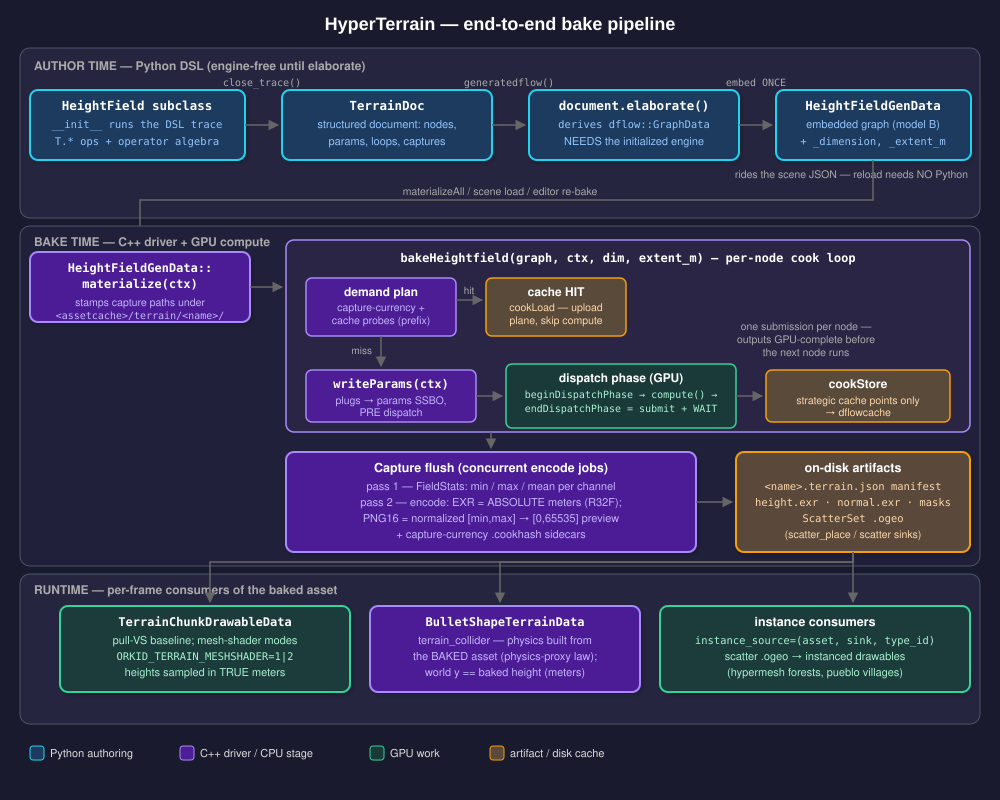
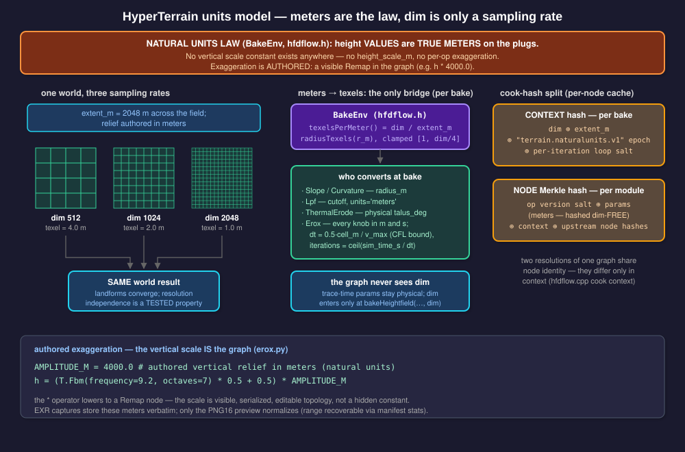
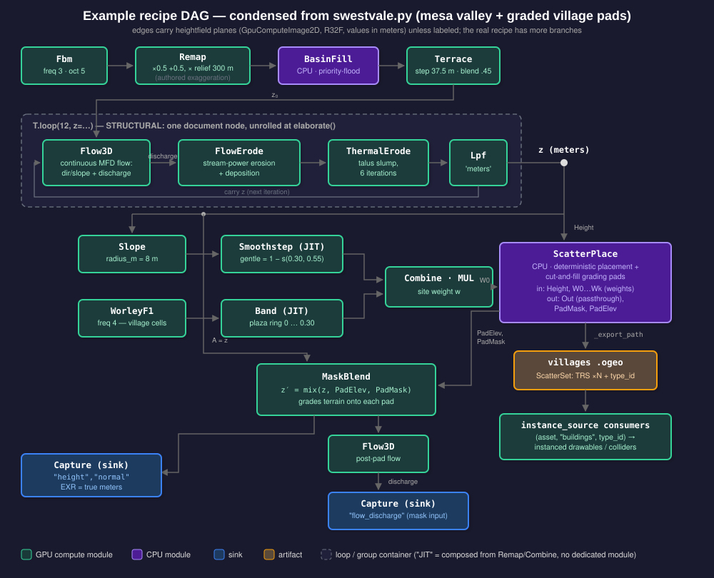
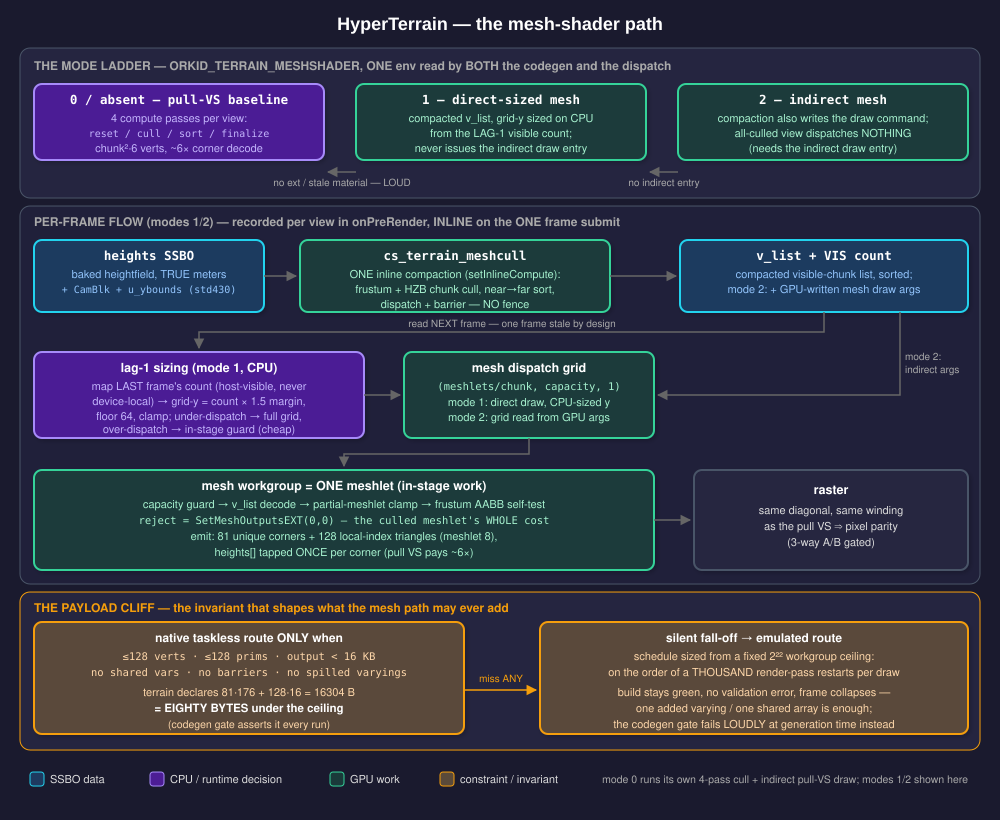

# HyperTerrain — the HyperSyn heightfield terrain family

Design document for the terrain subsystem: an expression-first Python DSL that authors a
GPU compute-dataflow graph, a C++ bake driver that cooks that graph into heightfield
channel images, and the ECS/render/physics consumers of the baked artifact. Written for
an engineer or technical artist new to the subsystem.

Primary source anchors:

| layer | where |
|---|---|
| C++ modules + bake driver | `ork.lev2/inc/ork/lev2/gfx/terrain/dflow/hfdflow.h`, `ork.lev2/src/gfx/terrain/dflow/hfdflow.cpp`, `hfdflow_module.h`, one `hfdflow_module_<name>.cpp` per module |
| Python bindings | `ork.lev2/pyext/src/pyext_gfx_terrain.cpp` (modules from line 35; `bake_heightfield` at 372) |
| DSL | `obt.project/scripts/ork/hypergraph/dflow/terrain/` (`base.py`, `_node.py`, `ops.py`, `doc.py`, `manifest.py`, …) |
| Example recipes | `obt.project/scripts/ork/hypergraph/assets/terrain/` (24 files: `erox.py`, `warp.py`, `swestvale.py`, `hamletvale.py`, `flow3d.py`, `scatterdemo.py`, …) |
| Asset / ECS integration | `ork.lev2/inc/ork/lev2/gfx/asset_gen.h` (`HeightFieldGenData`, :433), `obt.project/scripts/ork/hypergraph/ecs/scene/assets.py` (:1562), `_terrain.py` |
| Rendering | `ork.lev2/src/gfx/terrain/terrain_chunk_drawable.cpp` |
| Tools | `obt.project/bin/ork.terrain.*.py` |
| Tests | `ork.lev2/pyext/tests/llgfx/test_terrain_*.py` (43 suites + `test_terrain_battery.py`) |


## 1. What this is, and the philosophy

Terrain in orkid is **baked, not simulated at runtime**. A terrain is authored as a
Python class whose `__init__` *traces* a directed acyclic graph of field operations —
noise generators, filters, masks, erosion solvers, placement sinks — and that graph is
cooked once (per edit, cook-cache-amortized) by dispatching one compute shader per node
over a `dim × dim` R32F field. The products are ordinary images (EXR/PNG16) plus a JSON
manifest and, for placement sinks, a `.ogeo` point set. Everything downstream — the
chunk renderer, the physics collider, instanced villages and forests — consumes those
baked artifacts, never the graph.

Three design commitments shape everything else:

1. **Expression-first, DAG not chain.** The DSL hands you `TerrainNode` handles that
   carry algebra: `h * 0.5 + 0.5` creates real graph nodes. An output fans out to any
   number of consumers; joins (`Combine`, `MaskBlend`, `FlowErode`) take multiple field
   inputs. There is no implicit "current layer" the way chain-style terrain tools have —
   masks are just more fields, and masking is composition (`mix`, `masked_by`), not a
   stateful mode.

2. **The serialized graph is the canonical, Python-decoupled artifact.** The DSL runs
   ONCE at authoring. What persists is a `dflow::GraphData` embedded inline in
   `HeightFieldGenData` ("model B" — contrast particles, which store a DSL filename and
   re-run Python at load). A scene reload deserializes the graph and bakes it with **no
   Python and no DSL file** (`asset_gen.h:421-431`). Upstream of the GraphData sits a
   second document layer (`TerrainDoc`, `doc.py`): the structured form that preserves
   loops/groups/switches for the editor and the `.py` writer; the flat GraphData is
   *derived* from it by `document.elaborate()`.

3. **GPU compute dataflow with per-node synchronization.** Each module dispatches
   compute shaders against SSBO-backed `GpuComputeImage2D` planes (`buf[y*W+x]`,
   std430). The bake driver submits and *waits* per node, which is what makes CPU
   modules (basin filling, scatter placement) and the per-node cook cache legal at all.

The family lives inside HyperSyn (see `.claude/skills/hypersyn`): it shares the core
`ork::dataflow` substrate with particles/hypermesh, the ptex3d expression IR (via
`ExprModule`), and the cross-family `GpuComputeImage2D` interchange plug type
(`gfx/dflow/interchange.h`) so a heightfield channel can feed a hypermesh field input.


## 2. Architecture overview



Author time (Python): a `HeightField` subclass's `__init__` opens a trace; `T.*` calls
and operators record into the `TerrainDoc`; `capture(node, channel)` records sinks.
`close_trace()` completes the *document* without touching the engine;
`generatedflow()` additionally runs `document.elaborate()` — the sole constructor of the
flat `dflow::GraphData` — which **requires an initialized engine** (the composite-module
reshape builds real boundary plugs; `base.py:356-378`). The graph embeds into
`HeightFieldGenData` together with `_dimension`, `_extent_m`, the material contract and
reflected scatter sinks, and rides the scene JSON.

Bake time (C++): `HeightFieldGenData::materialize(ctx)` (`asset_gen.h:465-472`) stamps
machine-local output paths onto the graph's `CaptureModule`s (paths are deliberately
NOT reflected — not portable), runs `bakeHeightfield(graph, ctx, dim, extent_m)`, and
writes the `.terrain.json` manifest. Section 5 details the cook loop.

Runtime: consumers read the manifest + channel images. `TerrainChunkDrawableData`
renders; `BulletShapeTerrainData` collides; `instance_source` consumers instance the
scatter `.ogeo`s. Section 8.


## 3. The units model — the family's central law



This is the one section to internalize before touching anything.

**World size is `extent_m`; `dim` is purely a sampling rate.** Every terrain declares
its horizontal world span in meters (`HeightField.EXTENT_M`, `base.py:79`; carried per
asset as `HeightFieldGenData::_extent_m`). The bake resolution `dim` says how finely
that fixed world is sampled — nothing else. Baking the same graph at 512, 1024 and 2048
must produce the same landforms at the same world coordinates; this is a **tested
property** (`test_terrain_dim_rebake.py`), not an aspiration.

**NATURAL UNITS: heights are true meters on the plugs.** From `hfdflow.h:115-119`
(BakeEnv):

> world units (make the graph resolution-independent): spatial op params are in meters
> and converted to texels here per-bake. NATURAL UNITS: height VALUES are true meters
> on the plugs — there is NO vertical scale constant anywhere (no height_scale_m, no
> per-op exaggeration; exaggeration is AUTHORED via remap nodes).

Concretely: a generator's amplitude *is* meters. `erox.py` authors 4 km of relief as
visible topology:

```python
AMPLITUDE_M = 4000.0   # authored vertical relief in meters (natural units)
h = (T.Fbm(frequency=9.2, octaves=7) * 0.5 + 0.5) * AMPLITUDE_M
```

The `* AMPLITUDE_M` lowers to a `Remap` node — serialized, visible in the editor,
hashable. There is no hidden exaggeration knob for it to fight with. Erosion carves
real meters; `Slope` measures real rise/run; the manifest's semantic for the height
channel is literally `"height_meters"` (`assets.py:1686`).

**meters → texels happens exactly once, at bake.** `BakeEnv` (`hfdflow.h:132-142`)
owns the only bridge:

```cpp
float texelsPerMeter() const { return (_extent_m > 0.0f) ? (float(_w) / _extent_m) : 1.0f; }
int radiusTexels(float radius_m) const;   // rounds, clamps to [1, dim/4]
```

Modules that think spatially take meters and convert per-bake: `Slope`/`Curvature`
(`radius_m`, baked scalars, `hfdflow.h:388,412`), `Lpf` (`cutoff` with a reflected
`CutoffUnits` texels|meters enum — texels is the resolution-*dependent* escape hatch,
`hfdflow.h:617-627`), and the erosion solvers, which go further: `Erox` takes every
knob in physical m and s (`sim_time_s`, `rain_mps`, `evaporation_per_s`, …) and derives
its iteration count per bake from a CFL bound (`dt = 0.5·cell_m/flow_speed_max_mps`,
`iterations = ceil(sim_time_s/dt)`), so more resolution buys more steps of the *same
physical duration* rather than a different landform (`ops.py:454-486`,
`hfdflow_module_erox.cpp:13-23`).

**What the capture writes.** EXR channels are the raw plug values — absolute meters,
no auto-exposure, no clamp (`hfdflow.cpp:1309-1312, 1391-1394`). Only the PNG16 preview
normalizes (`[min,max] → [0,65535]`), and the range rides the manifest/sidecar stats so
a consumer can re-expand it.

**Why the hash architecture depends on this.** Because node params are physical and
dim-free, a node's cook hash is independent of resolution; the per-bake
`(dim, extent_m)` pair lives in a separate *context* hash. Two resolutions of one graph
share node identity and differ only in context (section 7).


## 4. Module catalog

Every module is a `TerrainModuleData` subclass declared in `hfdflow.h`, implemented in
its own `hfdflow_module_<name>.cpp`, bound to Python in `pyext_gfx_terrain.cpp`.
Modules exchange `GpuComputeImage2D` planes (R32F, or RGBA32F for the few multi-channel
outputs); scalar/vec2 parameters are dataflow plugs (runtime, live-pokeable via the
params-SSBO `writeParams` mechanism) unless noted as *baked* (structural — changing them
re-JITs the shader or re-elaborates).

**Generators** synthesize a field from nothing but uv/world position: `Fbm` (value-noise
fBm; `frequency`/`amplitude` plugs, `_octaves` a baked loop bound, `_seed` runtime via
the params SSBO so reseeding never rebuilds the shader), `Noise` (one module, four baked basis
primitives: perlin / simplex / worley-F1 / voronoi, exposed as four DSL verbs),
`Const`, `Gradient` (ramp along a vec2 `dir` plug), and `Expr` — the unified-substrate
generator that runs a ptex3d `SurfNode` expression over the grid (`_shadertext` baked,
`_expr_tree` canonical IR; backs `self.hfbake`/`hfmask`/`hfdisplacement`). Fbm/Noise
share the fused domain-warp inputs: `offset` (vec2 pan/reseed), `offset_vel` (env-clock
pan; a bake is the t=0 snapshot) and `warp=(wx, wy)` — two wired scalar fields that
displace the sample domain analytically (`ops.py:47-146`). There is **no standalone
`T.warp` module**; warping is a generator input. An anti-degeneracy domain offset
(11.7, 31.3) is built into both generators (`hfdflow_module_fbm.cpp:145-146`,
`hfdflow_module_noise.cpp:227`).

**Filters / elementwise ops** transform fields: `Remap` (affine + clamp — also the
lowering target of all scalar operators), `Normalize` (GPU min/max reduce + rescale;
the *explicit* renorm now that the flush no longer auto-exposes), `Terrace`, `Combine`
(ADD/SUB/MUL/MIN/MAX/MIX with a baked op enum and a scalar `t` plug), `Lpf` (separable
Gaussian; texels|meters cutoff), `RelaxUv` (equal-area UV relaxation — fixes texture
stretch on steep faces; RGBA outputs feeding the chunk VS's uv + tangent frame).

**Masks.** A mask is just a `[0,1]` field on the same plug type — no special type
(`hfdflow.h:378-380`). Feature masks are real modules: `Slope` (pre-blurred
difference-of-box gradient with Reinhard rolloff) and `Curvature` (DoB band-pass;
convex/concave/magnitude modes). Value masks are DSL-composed with **no dedicated
C++**: `smoothstep`, `band`, `clamp`, `pow` build from Remap/Combine at trace time
(`ops.py:381-421`). Application is `MaskBlend` — `Out = mix(A, B, M)` per texel, THE
masking primitive — or the `blend=` kwarg most filters accept (scalar → cheap runtime
param; field → routed through a post-filter MaskBlend).

**Erosion & hydrology:** `ThermalErode` (talus/angle-of-repose relaxation, ping-pong
gather, mass-conserving), `Erox` (Mei et al. virtual-pipes hydraulic solver; fully
physical units; OPEN boundaries so water drains off-map and channelizes —
`hfdflow_module_erox.cpp:111` — the single biggest realism fix), `Pha` (single-pass
analytic "phacelle" gully filter — cheap, deterministic, speckle-free; after Rune Skovbo
Johansen, MPL-2.0), `BasinFill` (Priority-Flood depression fill; the first CPU module),
`Flow3D` (continuous MFD flow: RGBA direction/slope field + mono drainage discharge —
deliberately *not* D8; erosion advects along a continuous flow field, the D8 tree is
only a solver constraint elsewhere), `FlowErode` (stream-power erosion + deposition
driven by a discharge input; unconditionally bounded per step), `FillClosedBasins`
(union-find watershed merge with a `min_depth` persistence knob; map edge is an outlet).

**Composite:** `TerrainSubGraphModule` / `TerrainLoopModule` (`hfdflow.h:760-772`) are
thin subclasses of the core dflow `SubGraphModuleData`/`LoopModuleData` that only attach
the HfImage boundary-plug typing; the generic composite runtime lives in core dflow.

**Sinks & placement:** `Capture` (readback + encode; `_channel` reflected, `_path`
machine-local, `_cache` opt-out, `_visual_update_mode` for progressive display) and
`ScatterPlace` — an in-graph deterministic CPU placer that reads its wired weight
fields + height back to host, runs the shared `scatterPlaceCore` (parity-pinned against
the Python placer), rasterizes cut-and-fill *grading pads* (`PadMask`/`PadElev`), and
exports the ScatterSet `.ogeo` itself. Placement happens against the PRE-flatten
height, and a stock `MaskBlend` grades the terrain onto the pads before the captures —
so placement can never drift from its own pads (`hfdflow.h:448-527`).

| module | kind | GPU/CPU | notable params (± = baked) |
|---|---|---|---|
| Fbm | generator | GPU | frequency, amplitude, offset, warp; ±octaves, seed |
| Noise | generator | GPU | as Fbm; ±basis (perlin/simplex/worleyF1/voronoi) |
| Const / Gradient | generator | GPU | level; dir(vec2), scale, bias |
| Expr | generator | GPU | ±ptex3d expression (`_expr_tree` IR) |
| Remap | filter | GPU | scale, bias, lo, hi |
| Normalize | filter | GPU | out_lo, out_hi |
| Terrace | filter | GPU | steps, sharpness |
| Combine | join | GPU | t; ±op (ADD/SUB/MUL/MIN/MAX/MIX) |
| Lpf | filter | GPU | cutoff; ±units (texels\|meters) |
| RelaxUv | filter | GPU | ±strength, iterations; RGBA uv + binormal outputs |
| Slope / Curvature | mask | GPU | scale; ±radius_m, ±mode |
| MaskBlend | join | GPU | A, B, M (all fields) |
| ThermalErode | erosion | GPU | talus_deg, rate; ±iterations |
| Erox | erosion | GPU | all physical (m, s); iterations CFL-derived |
| Pha | erosion | GPU | strength, gully_weight, scale, …; ±octaves |
| BasinFill | hydrology | CPU | epsilon |
| Flow3D | hydrology | GPU | ±exponent, iterations, scales; 3 outputs |
| FlowErode | erosion | GPU | ±niter, k_erode, k_deposit, m, n, clamp_frac; blend runtime |
| FillClosedBasins | hydrology | CPU | min_depth; Basin/CenterPit RGBA outputs |
| TerrainSubGraph / TerrainLoop | composite | — | wraps core dflow composites |
| Capture | sink | CPU | ±channel, cache, visual_update_mode |
| ScatterPlace | sink/placement | CPU | density/count, seed, footprints, colliders, lattice, cluster_pads, apron_m |


## 5. The bake driver and execution model

`bakeHeightfield(graph, ctx, dim, extent_m)` (`hfdflow.h:779-783`, impl `hfdflow.cpp`)
stocks a `BakeEnv` on the GraphInst (`_w/_h = dim`, `_extent_m`, the gfx `Context`, the
buffer arena), topo-sorts, then runs the per-node cook loop:

1. **Plan once** (`hfdflow.cpp:463+`): compute the context hash + per-node Merkle
   hashes, classify every node sink / cache-hit / miss via ~256-byte *prefix* probes of
   the disk cache (never whole planes — the 33 GB warm-plan lesson), check
   capture-currency sidecars (a fully-current bake computes zero nodes), then walk
   demand backwards: a hit never reads its inputs, so an undemanded node is skipped
   outright — no buffer, no disk read.
2. **Per needed node** (`hfdflow.cpp:768-865`): acquire buffers from the size-classed
   pool (WS4 frontier mode — peak VRAM is the live frontier, not the whole graph), then

```cpp
if (auto pp = std::dynamic_pointer_cast<dflowgfx::IPrePhaseParams>(inst))
  pp->writeParams(ctx);                    // plugs -> params SSBO, PRE dispatch
ci->beginDispatchPhase();
inst->compute(ginst.get(), updata);
ci->endDispatchPhase();                    // submit + WAIT -> output now valid
```

   One submission per dispatch phase, waited, per node ("the
   one-descriptor-set-per-pipeline rule", named at `hfdflow_module_erox.cpp:24`). That
   per-op sync is load-bearing: it is what makes mid-graph CPU readback modules, pool
   reuse of buffers, and `cookStore` reads valid. `writeParams` doubles as the live
   edit path — the editor pokes plugs and the next eval re-reads them, no recompile.
3. **Cache store** at strategic cache points only (section 7).
4. **Capture flush** (`hfdflow.cpp:1149+`): per capture request, pass 1 computes
   `FieldStats` (min/max/mean — keyed by *channel name*, never index; the returned
   flush order is topo, callers' order is declaration), pass 2 encodes on the
   concurrent queue: `.exr` = absolute meters (R32F, or RGBA32F passthrough for
   multi-channel fields — multi-channel is EXR-only), `.png` = normalized R16UI
   preview; a `"normal"` channel is synthesized CPU-side as a Scharr gradient of the
   true-meter heights. Capture-currency `.cookhash` sidecars let the next unchanged
   bake skip the file entirely.

`BakeEnv` also carries capability flags (`_per_op_sync`, `_flushes_captures`): a
cross-family host (e.g. a hypermesh graph evaluating a terrain subgraph in one dispatch
phase) leaves them false, and modules that require a capability assert loudly instead
of mis-running.

Two sibling drivers reuse the same loop: `enqueueSlicedBake` (`hfdflow.h:786-817`)
cooks one node per frame slice so a live editor window stays responsive (byte-identity
against the burst bake is oracle-gated — `test_terrain_mt3_oracle.py`, MANDATORY), and
the S4 progressive path publishes completed viewable planes to a `LiveFieldBuffer` so a
renderer can morph while the bake runs (`_visual_update_mode="on_checkpoint"`).


## 6. The DSL



A recipe is a `HeightField` subclass (`obt.project/scripts/ork/hypergraph/dflow/terrain/base.py`):

```python
from ork.hypergraph.dflow.terrain import HeightField
from ork.hypergraph.dflow import terrain as T

class RollingHills(HeightField):
    def __init__(self, octaves=5, steps=6):
        super().__init__()                                   # opens the trace
        h = T.Fbm(frequency=3.0, octaves=octaves) * 0.5 + 0.5
        self.capture(T.Terrace(h, steps=steps), "height")
```

**Operator lowering** (`_node.py:110-161`): `TerrainNode` overloads Python operators
into real modules —

```
node * k  /  k * node  /  node / k   ->  Remap (affine, no clamp: bounds ±1e9)
node + k  /  node - k  /  k - node   ->  Remap
a * b  /  a + b  /  a - b  (nodes)   ->  Combine(MUL/ADD/SUB)
```

Scalar operands of the named joins auto-wrap as `Const` fields, so
`T.Max(h, 0.0)` reads naturally.

**Mix routing** (`ops.py:902-908`) — the scalar-vs-field dispatch in one place:

```python
def mix(a, b, t=0.5, name=None):
    if isinstance(t, TerrainNode):
        return make_maskblend(a, b, t, name=name)      # per-texel field mask
    return make_combine(a, b, OP_MIX, t=t, name=name)  # uniform scalar blend
```

The same convention runs through every filter's `blend=` kwarg and
`base.masked_by(other, mask)`.

**Structure that round-trips.** Raw Python `for`/`if` is legal graph metaprogramming —
it unrolls at trace time into flat topology (with a printed flatten notice,
`base.py:391-406`). The explicit constructs capture structure into the document
instead: `with T.loop(N, carry=init) as L:` (carries read/written via `L.<name>`,
`L.i` for per-iteration scalar arithmetic, LOUD orphan detection for body nodes that
feed no carry — `doc.py:1739-1762`), `@T.group` (args become promoted plugs), and
`T.switch`. `swestvale.py` uses the loop for its erosion passes:

```python
with T.loop(int(iters), z=z) as L:
    flow = T.flow3d(L.z)
    zz   = T.flow_erode(L.z, flow.discharge, ...)
    zz   = T.erode_thermal(zz, iterations=6, blend=1.0)
    L.z  = T.lpf(zz, cutoff=filt, units='meters', blend=1.0)
```

**Engine-init contract.** `close_trace()` finishes the *document* and is engine-free —
the editor loads and binds docs before engine init. `generatedflow()` /
`document.elaborate()` construct real modules and **require the initialized engine**
(`base.py:356-378`). Get this backwards and you get the pybind assert, not a graph.

**Naming convention** (`__init__.py`): CamelCase aliases are *constructs* (each call
instantiates a module or sub-DAG: `Fbm`, `Terrace`, `Slope`); lowercase aliases are
*verbs* for ops that read like processes (`fbm`, `erox`, `lpf`, `basin_fill`). Most ops
have both; `Min`/`Max` are CamelCase-only (lowercase would shadow the builtins).

**The unified substrate.** `self.hfbake(expr, channel)` bakes a ptex3d expression to a
field via `ExprModule`; `hfmask` saturates it; `hfdisplacement` lets the expression
*read* the current height (so one `strata(ctx)` function can both shade a material and
displace the terrain to matching bands). `warp.py` is the compact demonstration: an
analytically ring-warped worley height authored entirely as a ptex3d expression, no new
C++.


## 7. The cook cache

Content-addressed per-node caching over `DataBlockCache` (namespace `dflowcache`).
Identity is split in two:

- **Context hash** — per bake, everything *outside* the graph that changes an output
  (`hfdflow.cpp:473-490`): `dim ⊕ extent_m ⊕ "terrain.naturalunits.v1"` (the units
  migration epoch) `⊕` a per-iteration salt for nested loop runs. Nothing else — in
  particular no vertical scale, because none exists.
- **Node Merkle hash** — per module: its version salt + its params (physical, dim-free)
  + the context hash + its upstream node hashes (`_mixTail`, `hfdflow_module.h:284-288`).
  Changing one knob invalidates exactly the affected subgraph.

Cache entries store *all* output plugs at true size under a format magic
`kCookFmt = 0x7c0d0004` (`hfdflow_module.h:81`), with an opt-in fp16 plane encoding
that quantizes at production so warm loads are bit-identical (heights stay fp32 by
owner rule).

**Strategic cache points** (`hfdflow_module.h:90-104`): only classes whose recompute
costs more than a ~0.1 s blob load default to disk-caching — `Flow3D`,
`FillClosedBasins`, `BasinFill`, `RelaxUv`, `ThermalErode`, `Erox` override
`cookCacheDefault() -> true`. Everything else recomputes on warm bakes; the demand
planner resumes each fork from its deepest clean cached cut. Per-node override: the
reflected `cachepoint` property (−1 class default / 0 never / 1 always).
`ORKID_COOK_CACHE_ALL=1` restores cache-everything (cross-machine blob audits).
`ScatterPlace` is never cached — its `.ogeo` export is a side effect that requires the
compute to run. A `capture(..., cache=False)` disables the disk cache for the whole
bake (the cache is whole-bake, per-node) while the per-op-synced compute still runs —
which is why `erox.py` pointedly passes `cache=True`.

Above the node cache sits **capture-currency**: a sink whose on-disk file carries a
sidecar matching its current producer-hash key does not run and pulls nothing upstream.
A fully-current bake computes zero nodes, reads zero blobs, writes zero files.

Debug: `ORKID_COOK_DEBUG=1` prints the plan (node → hash, and why each dispatching node
missed); `ORKID_TERRAIN_DIMLOG=1` traces per-node buffer dims.


## 8. ECS integration, rendering, physics, scatter

**Asset layer.** The Python `HeightField` asset wrapper
(`obt.project/scripts/ork/hypergraph/ecs/scene/assets.py:1562-1699`) resolves + runs
the DSL once, embeds the graph into a `HeightFieldGenData`, and reflects the scatter
sinks. `build()` defers to the C++ materializer (`HeightFieldGenData::materialize`,
bound at `pyext_gfx_asset_gen.cpp:524-534`) which derives per-channel paths under
`<assetcache>/terrain/<name>/`, bakes, and writes the **`.terrain.json` manifest** —
the authoritative scale contract (`manifest.py`): `extent_m`, `dim`,
per-channel file/semantic/min/max/mean, the locked uv convention
(`uv = xz/extent_m + 0.5`, texel-center). Consumers read the manifest instead of
hardcoding scale. A retained Python reference materializer exists behind
`ORK_HM_PYMAT=1`.

**Scene layer.** `self.terrain(name, ...)` (`_terrain.py:67+`) reads the DSL class's
own `EXTENT_M`/`MATERIAL`/`MATERIAL_PARAMS` (the terrain owns its physical scale and
look; `_terrain.py:113`) and declares the render entity.

**Rendering** is `TerrainChunkDrawableData` (`_terrain.py:108,218`;
`terrain_chunk_drawable.cpp`) — a chunked, GPU-culled grid whose vertex path pulls
true-meter heights from SSBOs. *Not* GeoClipMap — that was an older sketch that never
became this path. `ORKID_TERRAIN_MESHSHADER` selects the draw pipeline — baseline
pull-VS, or one of two mesh-shader modes; section 9 is the full story of that path.

**Physics** follows the physics-proxy law — colliders come from the *generating data*,
here the baked asset, never the render mesh. `self.terrain_collider(hf_asset, ...)`
(`_terrain.py:270-318`) builds a `BulletShapeTerrainData` from the baked heightfield:
scale from the manifest, heights in true meters (the shape wraps Bullet's centered
heightfield in a compound whose child offset restores absolute meters, so world y ==
baked height), optional downsample to the render grid so physics matches the visible
mesh, plus the W·M surface-response friction leg (`surface_weights`/`friction_rows`).

**Scatter → instances.** Both scatter paths (post-bake `self.scatter(...)` sinks and
in-graph `T.scatter_place`) emit a ScatterSet `.ogeo`: per-point world TRS matrices +
an attribute table (`type_id`, …), mesh-agnostic by design. Consumers bind meshes
separately: `scatter_consumer.py` shards by `type_id` into instanced drawables, and at
scene level `drawable_data(instance_source=(asset, sink, type_id))` routes one sink's
points to per-type renderables — this is how the forest scenes instance 16 hypermesh
tree variants from one "trees" sink (`ecs/scene/content/forest.py:166-168`) and how
`scn_swest` binds pueblo building meshes to `("buildings", type_id)`. Per-type collider
proxies (`sphere/capsule/box/cone/ring`) ride the ScatterSet data
(`hfdflow.h:518-521`), so `BulletShapeScatter` hardcodes nothing.


## 9. The mesh-shader path



The chunk renderer's second draw path. Instead of the pull VS's four cull compute
passes plus a non-indexed indirect draw that decodes every interior corner ~6× (chunk²·6
vertices, one `heights[]` tap each), a mesh workgroup owns one *meshlet* — an n × n quad
patch inside a chunk — frustum-tests it in-stage, and either emits nothing or emits its
(n+1)² unique corners ONCE plus 2n² local-index triangles. Same vertex decode, same
diagonal, same winding as the pull VS (`gpu_chunk.py` shares `_vertex_decode` verbatim
between `vs_body` and `mesh_body`), so the paths must — and, gate-enforced, do —
rasterize the same image.

**The mode ladder.** `ORKID_TERRAIN_MESHSHADER` is an INT env, read once per process by
*both* consumers: the C++ drawable at path selection
(`terrain_chunk_drawable.cpp:934-1027`) and the codegen at materialize
(`gpu_chunk.py:_meshmode`). The same env gates both on purpose — a toggle-on run
materializes a material that actually carries the mesh stage, and a toggle-off material
keeps the drawable's fallback honest (and emits no mesh SPIR-V, since shader modules are
created for every stage at load time and a device without `VK_EXT_mesh_shader` must
never be handed one).

- **`0`/absent — baseline pull-VS.** Four compute passes per view —
  `cs_terrain_reset` / `cs_terrain_cull` / `cs_terrain_sort` / `cs_terrain_finalize`
  (`:1040-1065`) — fill the visible-chunk list `v_list` plus an indirect draw command;
  sort is near-to-far for early-Z.
- **`1` — direct-sized mesh.** ONE compaction dispatch (`cs_terrain_meshcull`, the
  chunk-level half of `cs_terrain_cull`) replaces all four; the mesh draw is a *direct*
  dispatch over the compacted list whose grid-y capacity the CPU sizes per frame from a
  lag-1 visible count (below). The original mode 1 — a dense fixed grid, no compaction —
  is REMOVED from the env-derived path (it survives only hand-built inside the A/B gate);
  a material lacking the compaction steps down loudly rather than running slower.
- **`2` — indirect mesh.** The same compaction also writes the mesh draw command
  (`{x=meshlets/chunk, y=visible, z=1}`) into the args slot, and the draw reads its grid
  from there — an all-culled view dispatches literally nothing. Needs the indirect draw
  entry; the capability *is* the loaded function pointer (`vulkan_ctx.cpp:214`), and its
  absence falls back to the mode-1 direct-sized grid over the identical material.

Anything missing — device extension, `FWD_SSBO_CUSTOM_MESH` technique, its
`_DEPTHPREPASS` twin, the compaction shader — logs one named line and steps DOWN one
mode; the worst case is the baseline, byte-untouched. Both modes sort the compacted list
near-to-far (thread 0 of the compaction), so chunk draw order matches the pull path's
and early-Z holds on every path.

**Meshlet size** comes from one answer serving two consumers: `terrainMeshletDim()`
(`terrain_chunk_drawable.cpp:581`, default `kTerrainDefaultMeshletDim = 8`, diagnostic
override `ORKID_TERRAIN_MESHLET`, hard range 1..11) sizes the dispatch grid, and
`gpu_chunk.DEFAULT_MESHLET_DIM` sizes the generated payload — the two defaults are
asserted equal by the MSAA-policy gate, because a split default dispatches a grid the
shader does not agree with. Python asks the engine via `terrain.meshlet_dim()`
(`pyext_gfx_terrain.cpp:496`) instead of re-deriving it. Deployment fact: the darwin
seats reach `VK_EXT_mesh_shader` through the project's patched build of the
Vulkan-translation layer carried in the staging environments (taskless tier only — the
task stage is deliberately not enabled at device creation, `vulkan_ctx.cpp:552`), so the
mode env works everywhere; the mode itself stays an explicit per-process opt-in
(e.g. `ork.frametime.harness.py --mesh` sets `=1`).

**Per-frame flow (modes 1/2).** The compaction is registered with `setInlineCompute`
(`terrain_chunk_drawable.cpp:1066-1077`) and recorded per view in
`ComputeDrawable::onPreRender` (`drawable_compute.cpp:138-150`) — INLINE onto the
frame's primary command buffer, dispatch + producer→consumer barrier, riding the ONE
frame submit. That is the point: the pull path's four passes run as their own dispatch
phase, submit + fence-WAIT, per view (`:152-168`) — a per-frame cost the whole
mesh path exists to shed. The compaction reads the same CamBlk the compute cull does
(frustum + HZB occlusion when the pyramid is available), so chunk-level occlusion is
retained; the mesh draw sees `v_list` + count through the inline barrier, never a fence.

Mode 1's grid sizing is the one place a CPU number enters the loop, and it is
deliberately one frame stale (`drawable_compute.cpp:170-224`): at the pre-render frame
boundary the drawable maps the VIS header the inline compaction wrote LAST frame —
host-visible map, never a device-local mid-graph readback — and sizes this frame's
grid-y capacity as `count × margin` (default 1.5, `ORKID_TERRAIN_MESHSIZE_MARGIN`),
floored (64, `ORKID_TERRAIN_MESHSIZE_FLOOR`), clamped to the full grid. Lag-1 is safe by
construction from both sides: an *over*-dispatched workgroup hits the in-stage capacity
guard (`gl_WorkGroupID.y >= v_count → SetMeshOutputsEXT(0,0)`) — cheap, never wrong; an
*under*-dispatch (visibility grew past the margin in one frame) is detected next frame
(`count > last capacity`) and recovered with a full-grid dispatch, logged once. The
first frame, with no history, takes the full grid. Sun-cascade passes always take the
full grid — the lag-1 count is the eye view's, and an under-dispatched cascade would
drop casters silently; the guard keeps the surplus workgroups cheap.

**What the mesh stage emits** (`gpu_chunk.py:mesh_interface/mesh_body`). At the shipped
meshlet 8: 81 unique corners (`max_vertices`) and 128 triangles (`max_primitives`) per
workgroup; the taskless tier caps 2n² ≤ 256, so n ≤ 11. The workgroup is flat-1D at
`min(corners, 128)` invocations — 128 because that is the portable
`maxMeshWorkGroupInvocations` floor, and exceeding it is not diagnosed but crashes a
driver's pipeline compiler — with both emission loops strided so a meshlet with more
corners than invocations is covered in passes. In-stage rejection happens before any
vertex work: decode the owned chunk (dense grid or `v_list` slot), clamp partial
meshlets at chunk/grid remainders (never emitted, shared corners of valid cells stay
intact), then frustum-test an AABB — the workgroup's own meshlet span by default, or the
parent chunk's under `ORKID_TERRAIN_MESHCULL=chunk` (baked structurally into the
material, apples-to-apples with the baseline's granularity) — against the conservative
global `u_ybounds` vertical box. A rejected meshlet's entire cost is
`SetMeshOutputsEXT(0,0)`. The in-stage test is frustum-only; occlusion lives one level
up in the compaction. Surviving corners pay the `heights[]` tap once each (plus four
neighbor taps for the analytic normal) — the ~6× decode of the pull path is the
bandwidth this stage exists to reclaim.

**The payload cliff — the governing invariant.** On darwin the translation layer
compiles a mesh pipeline down one of two routes, and the fast one is conditional: the
NATIVE taskless route is taken only when the stage declares ≤128 vertices, ≤128
primitives, spills no varyings, uses NO workgroup-shared variables (hence no barriers),
and its estimated output payload stays under 16 KB. Miss ANY of those and it silently
falls back to an emulation whose batched schedule is sized from a fixed 2²² workgroup
ceiling — on this payload, on the order of a thousand render-pass restarts *per draw*.
The build stays green, no validation layer complains, and the frame time collapses (the
same layer's *indirect* draw entry carries a per-call stall of the same species —
measured ~90 ms/call in `ork.dox/gfx/DRAFT_moltenvk_mesh_indirect_ssbo.md` — which is
why mode 1 never issues it and mode 2 is effectively a discrete-GPU mode). Terrain's
declared stage against the full forward varying contract models out to
81·176 + 128·16 = 16304 bytes — **eighty bytes under the ceiling**
(`gpu_meshlet.py:65-88`, mirrored constants; asserted every run by
`test_hypermesh_meshshader_codegen.py`, which also greps the generated text for `shared`
declarations and `barrier()` calls). Treat this as a design invariant, not a tuning
note: one added varying, one scratch `shared` array, one sync point craters the mesh
path with nothing anywhere to point at. The codegen gate exists so that addition fails
loudly at generation time instead.

**MSAA policy** (`terrainMeshMsaaStepDown`, `terrain_chunk_drawable.cpp:599-634`). On
darwin, tile memory is shared between the multisampled attachment set and the mesh
stage's output payload, so the mesh path's MSAA cost is a function of the *payload* —
and it falls off its own cliff between meshlet 9 and 8 (measured 2026-07-26: at the old
meshlet 11 mesh lost to the pull VS at 2×/4×; at the shipped 8 it WINS even at 4× —
130.5 vs 120.3 fps in the real forward pass; the discrete-GPU platforms are payload-flat
across the same range). The step-down is therefore payload-conditioned, not
platform-conditioned: it fires only on darwin, only into a multisampled forward target
(sample count from the same resolver the forward node sizes its render targets with),
and only *above* the shipped meshlet — i.e. it is DORMANT in the default build, and arms
only when a fatter payload is selected. `ORKID_TERRAIN_MESH_FORCE=1` bypasses it for
measurement runs, loudly.

**Current constraint — no mesh + multiview.** Device creation deliberately leaves
`multiviewMeshShader` off (`vulkan_ctx.cpp:557` — chaining a feature the device reports
false fails device creation outright), and the darwin translation layer reports a mesh
multiview view count of 1. So the stereo/VR compositor path renders terrain through the
pull-VS baseline today; the mesh modes are single-view. A factual boundary of the
current tree, stated so nobody discovers it inside a headset.

**Test coverage** (all in `ork.lev2/pyext/tests/llgfx/`):

- `test_terrain_meshshader_ab` — the three-way A/B: pull-VS vs direct vs indirect mesh
  over one SSBO and one procedural heightfield; pixel parity against the baseline for
  every mesh path, compaction agreement chunk-for-chunk, the all-culled view dispatching
  literally nothing, plus a GPU-honest per-frame perf half.
- `test_terrain_meshshader_template` — the same parity through the PRODUCTION assembly
  (the ptex3d template a real scene materializes), plus byte-stability: mesh-off output
  is byte-identical to the pre-mesh generators, mesh-on differs by exactly one
  contiguous insertion — which is what keeps every existing material's cached shader and
  every content-addressed bake where it was.
- `test_terrain_mesh_msaa_policy` — the step-down decision table over every
  (platform, sample count, payload, force) combination; asserts the C++ and codegen
  meshlet defaults are ONE, that the sample-count input is the live device-clamped
  value, and that the policy's log line names the payload (and stays silent when dormant).


## 10. Tools and testing

All in `obt.project/bin/` (run bare on PATH, via the ork.python environment):

- **`ork.terrain.viewer2.py`** — the terrain viewer: thin ECS-hosted wrapper over the
  shared TerrainRuntime. `-d/--dim`, `-x/--extent` (defaults to the DSL's `EXTENT_M`),
  `--chunk`, `-p/--param k=v` (parameterized recipes), `--offscreen`,
  `-S/--snapshot PATH`, `--list`. There is no `--png` and no `--height-scale` — there
  is nothing for the latter to mean.
- **`ork.terrain.sweep.py`** — bake a param sweep in one process into a labeled
  contact sheet (params ride the SSBO, so a sweep re-dispatches without recompiling).
  Carries a known bug — see section 11.
- **`ork.terrain.imgview.py`** — bake a DSL and open the resulting EXR(s).
- **`ork.terrain.edit.py`** — the terrain graph editor: every edit mutates the
  document, re-elaborates, re-bakes (sliced, cache-backed).
- **`ork.terrain.uvmesh.py`** — debug-dump a `relaxed_uv` channel as an OBJ of the
  relaxed parameterization.
- **`ork.terrain.summarize.py`** — spectral/structural/physical characterization of a
  baked heightfield (reads the manifest; reports real-world slope, speckle, stability).
- **`ork.terrain.dr_sweep.py`** — headless drainage-routing diagnostic sweep.

**Tests**: 43 `test_terrain_*.py` suites in `ork.lev2/pyext/tests/llgfx/`, plus
`test_terrain_battery.py`, which runs the factored suites against ONE engine init
(each exposes `run(ez, ctx)`). Rough buckets:

- *core bake/ops*: `_bake`, `_ops`, `_cache`, `_hfbake`, `_lpf_cutoff_oracle`,
  `_dim_rebake` (resolution independence), `_scatter_parity` (C++ placer pinned
  byte-equal to the numpy reference), `_mt3_oracle` (sliced-vs-burst byte identity —
  MANDATORY);
- *DSL/document*: `_doc`, `_constructs` (loop/group/switch), `_pywriter`/`_resugar`
  (document → .py codegen round-trip), `_topology_honesty`, `_typed_literals`,
  `_kwargs`/`_kwarg_guard`;
- *live/editor UX*: `_editor_smoke`/`_offscreen`/`_keys`, `_display_*`, `_undo`,
  `_add`, `_s4_progressive`, `_gpuupdate`;
- *rendering*: `_meshshader_ab` (3-way A/B), `_meshshader_template`,
  `_mesh_msaa_policy`, `_shadow_caster_gate`, `_snapshot`, `_camera`, `_flags`;
- *asset/pipeline*: `_asset`, `_asset_wrapper`, `_texbake_cachekey`, `_friction_wm`,
  `_runtime`.


## 11. Status, known issues, lineage

Honest state as of this writing (2026-08):

- **Known bug — `ork.terrain.sweep.py`** still defines `--height-scale` and forwards a
  dead `height_scale_m=` kwarg to its bake call (`sweep.py:45,117`). Natural units
  removed that parameter everywhere else; the tool needs the flag deleted. Filed.
- **Stale comments** predating the natural-units migration: the `EroxModule` block
  comment in `hfdflow.h` (:553-559) still says `height_scale_m` bridges the grid and
  that `(dim, extent, height_scale)` lives in the context hash — the context hash is
  `dim + extent_m + epoch` only (`hfdflow.cpp:476-487`). Similarly the flush header
  comment at `hfdflow.cpp:1157-1159` claims "BOTH paths are normalized"; the code (and
  the corrected comment at :1309-1312) normalizes only the PNG16 preview — EXR is
  verbatim meters.
- **Lineage — dead names you may find in old notes, not in the tree:** the stochastic
  droplet erosion module ("Droplet"), the "Wtf" experiment, and `erode_hydro` are gone,
  superseded by `Erox` (deterministic physical virtual-pipes), `Pha` (analytic gully
  filter) and `Flow3D`+`FlowErode` (continuous MFD flow erosion). Don't hunt for them;
  greps come back empty by design (remove, don't deprecate).
- Vulkan storage-image binding for compute is still unimplemented; `GpuComputeImage2D`
  remains the documented std430 float-SSBO backing (`hfdflow.h:15-18`). It has proven
  sufficient — treat it as the working design, not a placeholder apology.
- Erox is at "Milestone A": single hydraulic layer, single Height output. The data
  model is deliberately materials-ready (bedrock/regolith split, per-cell erodibility,
  Flow/Sediment output plugs slot in additively — `hfdflow.h:562-576`).
