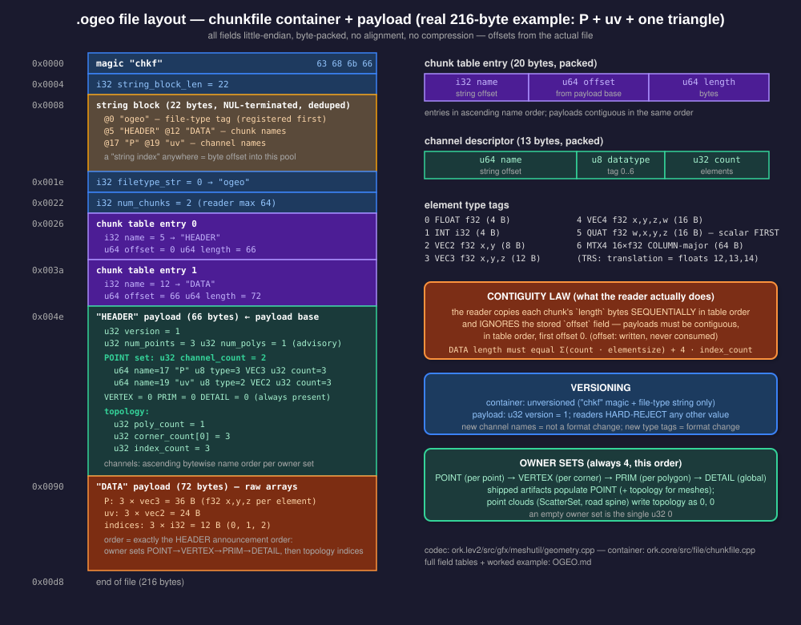
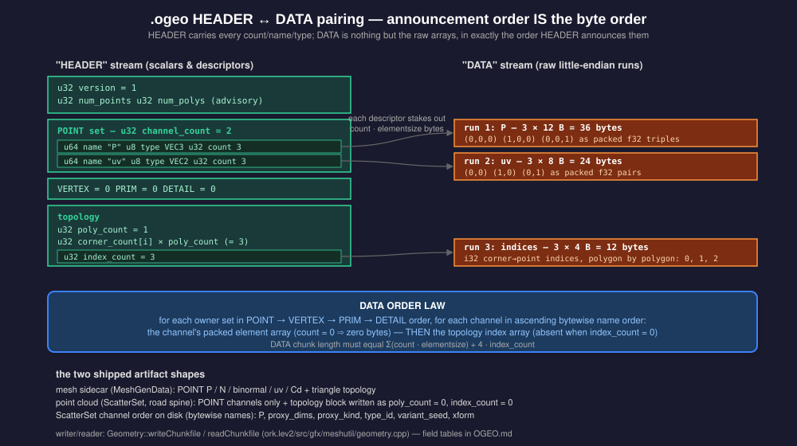

# OGEO — the `.ogeo` geometry artifact format

Byte-level specification of the on-disk form of `ork::meshutil::Geometry`, the engine's
standalone attribute-based geometry container. Payload format version **1**. This document is
sufficient to write an independent reader or writer; every claim is taken from the
implementing serialization code (see [Provenance](#8-provenance)) and validated against
engine-written files.

---

## 1. Purpose and role in the pipeline

A `Geometry` is a set of named, typed **channels** (attribute arrays) scoped by an **owner
class** (point / vertex / primitive / detail), plus arbitrary-valence polygon topology. It is
the interchange and intermediate-cache form of the dataflow geometry system: geometry is
**never inlined** into reflected scene JSON — a scene references an `.ogeo` file by path, and
the artifact round-trips through `Geometry::writeChunkfile` / `Geometry::readChunkfile`.

Producers (all funnel through the single writer `Geometry::writeChunkfile`):

| producer | artifact | content shape |
|---|---|---|
| Python mesh authoring (`build_geometry` → `write_geometry`) | `<staging>/geocache/<asset>.ogeo`, referenced by a `MeshGenData` | triangle mesh: point channels + topology |
| terrain post-bake scatter sinks (`HeightFieldGenData::materialize`) | `<assetcache>/terrain/<asset>/<sink>.ogeo` | ScatterSet point cloud (no topology) |
| in-graph `ScatterPlaceModule` (terrain bake graph) | same `<assetcache>/terrain/...` namespace | ScatterSet point cloud |
| `RouteSpineModule` (road graph, `export_name` set) | `<assetcache>/roads/<asset>/street_spine.ogeo` | spine point cloud (no topology) |
| Python `Geometry.write(path)` / `lev2.terrain.scatter_place_ogeo(...)` | caller-chosen path | anything the container supports |

Consumers (all funnel through the single reader `Geometry::readChunkfile`):

| consumer | reads | uses |
|---|---|---|
| `materializeMeshGen` (`MeshGenData` sidecar → drawable) | `P`,`N`,`binormal`,`uv`,`Cd` + topology | render mesh |
| `fillInstanceSetFromScatter` (hypermesh instancing; graph module and drawable paths) | `xform`,`type_id`,`variant_seed` | per-instance matrices + attrs |
| `BulletShapeScatterData` (physics colliders for scattered items) | `xform`,`proxy_kind`,`proxy_dims` | per-item collider proxies |
| `BulletShapeSpineData` (road collider) | `P`,`width`,`parent` | collider ribbon from generating data |
| mesh → distance-field voxelizer (`asset_gen_vdb`) | `P` + topology | level-set build |
| Python `Geometry.read(path)` | anything | authoring / tests / parity gates |

`.ogeo` rides the engine's generic **chunkfile** container (`ork::chunkfile`, magic `chkf`),
shared with other engine filetypes. The container framing is part of the byte format and is
specified first.



---

## 2. Container layer — the chunkfile framing

### 2.1 Global conventions

- **Endianness**: all multi-byte integers and floats are **little-endian**. There is no
  endianness marker in the file. (The writer emits raw host-order bytes and the reader does
  raw copies with no swapping; every supported platform is little-endian. See §7.6.)
- **Alignment / padding**: none, anywhere. Every field and payload byte is packed
  back-to-back. Field offsets are defined purely by the sum of preceding field sizes.
- **Compression / checksums**: none. The file is the raw byte stream described here.
- **Integer types**: `u8`, `u32`, `i32`, `u64` denote unsigned/signed little-endian integers
  of that width. `f32` is a 4-byte IEEE-754 binary32 float. The container's offset/length
  fields are written as the host `size_t` — 8 bytes on every supported (64-bit) platform;
  a conforming parser reads them as `u64`.

### 2.2 File-level layout

A chunkfile is: a fixed header, a string block, a chunk table, then the concatenated chunk
payloads. With `SBL` = string-block length and `NC` = chunk count:

| offset | size | type | field | value / meaning |
|---|---|---|---|---|
| 0 | 4 | char[4] | magic | bytes `63 68 6B 66` = ASCII `chkf`. Not NUL-terminated. |
| 4 | 4 | i32 | string_block_len | `SBL`, byte length of the string block |
| 8 | SBL | bytes | string_block | concatenated NUL-terminated strings (§2.3) |
| 8+SBL | 4 | i32 | filetype_str | string-block offset of the file-type tag. For `.ogeo` this string is `"ogeo"`, and because the writer registers the file type before anything else, the value is **0** in every engine-written file. A parser must resolve the offset, not assume 0. |
| 12+SBL | 4 | i32 | num_chunks | `NC`, number of chunks (streams). The reader supports at most **64**. |
| 16+SBL | 20·NC | entries | chunk_table | `NC` packed 20-byte entries (§2.4) |
| 16+SBL+20·NC | — | bytes | payloads | the chunk payloads, concatenated in table order |

The **payload base** is the file offset immediately after the chunk table
(`16 + SBL + 20*NC`); chunk offsets are relative to it.

### 2.3 String block

The string block is a byte pool of NUL-terminated strings. A "string index" anywhere in the
format is a **byte offset** into this pool; the string runs from that offset to the next NUL.

- Strings are deduplicated: registering the same string twice yields the same offset.
- Registration order (which fixes the offsets) is first-use order during writing: the
  file-type tag first (offset 0), then stream names in `AddStream` call order, then payload
  strings (channel names) in the order the payload emits them.
- Bytes are stored exactly as authored, no length prefix, no padding. Engine-written names
  are ASCII; a parser should treat the pool as UTF-8-compatible byte strings.
- The offsets stored in the file may point anywhere inside the pool; parsers must not assume
  the referenced strings are in ascending order or non-overlapping (in practice they are
  whole, ordered strings).

### 2.4 Chunk table entry

Each of the `NC` entries is 20 bytes, packed:

| offset in entry | size | type | field | meaning |
|---|---|---|---|---|
| 0 | 4 | i32 | name | string-block offset of the chunk (stream) name |
| 4 | 8 | u64 | offset | payload start, relative to the payload base |
| 12 | 8 | u64 | length | payload length in bytes (0 = empty chunk) |

Entries are emitted in **ascending `name` order** (the writer keys its stream map by the
string-block offset), and offsets are assigned cumulatively in that same order — so payloads
are contiguous, in table order, with `entry[i+1].offset == entry[i].offset + entry[i].length`
and the first offset 0.

> **Reader behavior (normative for writers)**: the engine reader takes the payload region as
> a sequential stream — it reads each table entry's `length` and copies that many bytes in
> table order, **ignoring the stored `offset` field**. A conforming file must therefore keep
> payloads contiguous and in table order exactly as described; the `offset` field is
> redundant (written, never consumed — see §7.1) but must still be written correctly.

The reader also verifies the resolved file-type string against the type it was asked to load
(`"ogeo"`) and fails the load on a magic mismatch.

### 2.5 In-stream primitive encodings

Chunk payloads are themselves flat byte streams. The `.ogeo` payload uses only these
primitives (all packed, little-endian):

| primitive | size | encoding |
|---|---|---|
| `u8` | 1 | raw byte |
| `u32` | 4 | little-endian |
| `u64` | 8 | little-endian |
| indexed string | 8 | a `u64` string-block byte offset (§2.3) |
| raw run | n | n bytes copied verbatim (channel/topology arrays, §4.2) |

(The container layer defines additional item codecs for other engine filetypes — scalar
overloads, vector/matrix items, a key-value map codec. None of them appear in an `.ogeo`
payload and they are out of scope here.)

---

## 3. The `.ogeo` payload

File-type tag: `"ogeo"`. Exactly **two** chunks, named `HEADER` and `DATA`. In every
engine-written file the string block starts `ogeo\0HEADER\0DATA\0...`, so the `HEADER` chunk
has name offset 5 and `DATA` name offset 12, and the table lists `HEADER` first (ascending
name order) — `HEADER`'s payload precedes `DATA`'s. Parsers must resolve chunks **by name**,
not by fixed offsets.

- `HEADER` carries all scalars, counts, names and type tags.
- `DATA` carries the raw array payloads, in exactly the order `HEADER` announces them.



### 3.1 `HEADER` stream

Sequential fields, no padding:

| # | field | type | meaning |
|---|---|---|---|
| 1 | version | u32 | payload format version. Currently **1**. Readers hard-reject any other value (§5). |
| 2 | num_points | u32 | advisory point count (§7.2). Derived at write time from the `P` point channel, else the largest point channel. |
| 3 | num_polys | u32 | advisory polygon count (§7.2) |
| 4 | attribute set: POINT | block | §3.2 |
| 5 | attribute set: VERTEX | block | §3.2 |
| 6 | attribute set: PRIM | block | §3.2 |
| 7 | attribute set: DETAIL | block | §3.2 |
| 8 | topology | block | §3.3 |

The four attribute sets always appear, in exactly this owner order, even when empty
(an empty set is the single `u32` 0).

### 3.2 Attribute-set block

One block per owner class:

| field | type | meaning |
|---|---|---|
| channel_count | u32 | number of channels `n` in this owner set |
| channel descriptor × n | — | see below |

Channel descriptor (13 bytes, packed):

| offset | size | type | field | meaning |
|---|---|---|---|---|
| 0 | 8 | u64 | name | string-block byte offset of the channel name |
| 8 | 1 | u8 | datatype | element type tag (§4.1) |
| 9 | 4 | u32 | count | element count of this channel |

Descriptors are emitted in **ascending bytewise-lexicographic channel-name order** within
each owner set (the in-memory container is a name-keyed ordered map; e.g. `N` < `P` <
`binormal` < `uv` by byte value). Readers must not rely on any particular order — channels
are identified by name — but writers aiming for byte-identical output must reproduce it.
Each descriptor also stakes out `count × elementsize(datatype)` bytes in the `DATA` stream
(§3.4). Channel names are unique per owner set; the same name may recur across owner sets.

### 3.3 Topology block

Polygons are variable-valence: each polygon is an ordered list of **point indices** (indices
into the point-owner channels; all point channels of a geometry describe the same points).
The vertex (corner) count of the geometry is the total number of indices.

| field | type | meaning |
|---|---|---|
| poly_count | u32 | number of polygons `m` (0 for point clouds) |
| corner_count × m | u32 each | per-polygon corner (vertex) counts, polygon order |
| index_count | u32 | total corner→point indices = Σ corner_count |
| *(indices live in `DATA`, §3.4)* | | |

`poly_count` here is the authoritative polygon count (field 3 of §3.1 is advisory). Readers
rebuild the polygon offset table by prefix-summing the corner counts.

### 3.4 `DATA` stream

A single concatenation of raw little-endian arrays, in **exactly the announcement order** of
`HEADER`:

1. For each owner set in POINT, VERTEX, PRIM, DETAIL order, for each channel in descriptor
   order: `count × elementsize` bytes of packed elements (§4.2). A channel with `count == 0`
   contributes **no** bytes.
2. The topology index array: `index_count × 4` bytes of `i32` point indices, polygon by
   polygon (polygon *i*'s indices are the next `corner_count[i]` entries). Absent when
   `index_count == 0`.

Validation rule: the `DATA` chunk length must equal
`Σ(count·elementsize)` over all channels `+ 4·index_count`.

---

## 4. Attribute and channel encoding

### 4.1 Element type tags

The `datatype` byte is a `GeomChannelType` value:

| tag | name | element size | element byte layout |
|---|---|---|---|
| 0 | FLOAT | 4 | one f32 |
| 1 | INT | 4 | one i32 (two's complement) |
| 2 | VEC2 | 8 | f32 x, y |
| 3 | VEC3 | 12 | f32 x, y, z |
| 4 | VEC4 | 16 | f32 x, y, z, w |
| 5 | QUAT | 16 | f32 **w, x, y, z** (scalar part first) |
| 6 | MTX4 | 64 | 16 × f32, **column-major**: column 0 (x,y,z,w), column 1, column 2, column 3 |

Any other tag value is malformed; the engine reader aborts on it.

Notes:

- The in-memory element structs are tightly packed (compile-time asserted in
  `geometry.cpp`), so the disk bytes are exactly the in-memory array — arrays are written
  and read with single raw copies.
- **QUAT** order is scalar-first because the underlying math type stores `w` first; an
  identity quaternion serializes as `1.0f, 0, 0, 0`. (Defined and codec-supported, but no
  shipping producer emits QUAT channels today — §7.3.)
- **MTX4** is column-major; for a TRS transform (the ScatterSet `xform` convention:
  translate · align · yaw · uniform-scale, right-handed, +Y up) the basis vectors are
  columns 0/1/2 scaled by the uniform scale, and the translation sits in floats 12, 13, 14
  with float 15 = 1.0.

### 4.2 Owner classes and element-count law

| owner | order in file | elements represent | expected count |
|---|---|---|---|
| POINT | 1st | one element per point | shared by all point channels |
| VERTEX | 2nd | one element per polygon corner | `index_count` (§3.3) |
| PRIM | 3rd | one element per polygon | `poly_count` |
| DETAIL | 4th | global values | 1 |

The format does **not** enforce these counts — each channel carries its own `count`, and the
reader accepts whatever is stored (consumers defensively clamp). Writers must keep sibling
point channels the same length; the point count of a geometry is defined as the count of the
`P` point channel, falling back to the largest point channel when no `P` exists (§7.4).

### 4.3 Well-known channels

The format itself imposes no channel vocabulary; these are the names shipped producers write
and shipped consumers resolve (all point-owner):

**Mesh artifacts** (`MeshGenData` sidecars; topology present, triangles):

| name | type | meaning |
|---|---|---|
| `P` | VEC3 | position (meters). Required by every mesh consumer. |
| `N` | VEC3 | normal (optional; consumer default (0,1,0)) |
| `binormal` | VEC3 | binormal/tangent field (optional; consumer default (1,0,0)) |
| `uv` | VEC2 | texture coordinate (optional; default (0,0)) |
| `Cd` | VEC4 | color (optional; default (1,1,1,1)) |

**ScatterSet artifacts** (terrain scatter placement; point cloud, `poly_count == 0`):

| name | type | meaning |
|---|---|---|
| `P` | VEC3 | world position, meters (y = sampled ground/pad elevation) |
| `xform` | MTX4 | full per-instance TRS (§4.1 MTX4 note) |
| `type_id` | INT | scatter type index (declaration order; consumers map → mesh/collider) |
| `variant_seed` | INT | per-instance variation seed, 30-bit non-negative, exact across the C++/reference implementations |
| `proxy_kind` | INT | physics proxy shape: −1 none, 0 sphere(d0), 1 capsule(d0=radius, d1=height), 2 box(d0,d1,d2 half-extents), 3 cone(d0=radius, d1=height), 4 ring(d0=mid radius, d1=half height, d2=thickness) |
| `proxy_dims` | VEC3 | (d0, d1, d2) for `proxy_kind` |

Point order in a ScatterSet is ascending placement-grid cell order (deterministic; part of
the placement contract, not of this format).

**Road-spine artifacts** (`street_spine.ogeo`; point cloud):

| name | type | meaning |
|---|---|---|
| `P` | VEC3 | node position (x, road elevation, z), meters |
| `width` | FLOAT | road width at the node, meters |
| `parent` | INT | parent node index (−1 = root) — segment topology as data, not polygons |

---

## 5. Versioning and compatibility

- **Container**: unversioned. Identified by the `chkf` magic plus the file-type string.
  A reader must reject a file whose magic or resolved file-type string doesn't match.
- **Payload**: the leading `u32` version, currently **1** (`kOrkGeoVersion`). The engine
  reader asserts `version == 1`; there is no cross-version negotiation, no minor/patch
  split, and no back-compat shims (deliberate pre-1.0 policy: fail loud, regenerate the
  artifact). Independent readers must reject unknown versions; writers must write 1.
- **Forward evolution**: any layout change implies bumping the payload version. Because
  channels are name+type+count self-describing, *vocabulary* growth (new channel names, new
  producers) is **not** a format change — readers ignore channels they don't resolve.
  Growth of the type-tag enum **is** a format change (old readers abort on unknown tags).

---

## 6. Worked example

A real engine-written file: 3 points with `P` (VEC3) and `uv` (VEC2) point channels and one
triangle. Produced by:

```python
import numpy as np
from orkengine import core, lev2
g = lev2.Geometry()
g.point["P"]  = np.array([[0,0,0],[1,0,0],[0,0,1]], dtype=np.float32)
g.point["uv"] = np.array([[0,0],[1,0],[0,1]],       dtype=np.float32)
g.addPolys(np.array([0,1,2], dtype=np.int32), sides=3)
g.write("tri.ogeo")
```

216 bytes; complete annotated dump:

```
── container header ─────────────────────────────────────────────────────────
0000  63 68 6b 66                                      magic "chkf"
0004  16 00 00 00                                      i32 string_block_len = 22
0008  6f 67 65 6f 00                                   str @0  "ogeo"   (file type)
000d  48 45 41 44 45 52 00                             str @5  "HEADER" (chunk name)
0014  44 41 54 41 00                                   str @12 "DATA"   (chunk name)
0019  50 00                                            str @17 "P"      (channel name)
001b  75 76 00                                         str @19 "uv"     (channel name)
001e  00 00 00 00                                      i32 filetype_str = 0 → "ogeo"
0022  02 00 00 00                                      i32 num_chunks = 2
── chunk table (ascending name offset; payload base = 0x4e) ─────────────────
0026  05 00 00 00                                      name = 5 → "HEADER"
002a  00 00 00 00 00 00 00 00                          offset = 0
0032  42 00 00 00 00 00 00 00                          length = 66
003a  0c 00 00 00                                      name = 12 → "DATA"
003e  42 00 00 00 00 00 00 00                          offset = 66
0046  48 00 00 00 00 00 00 00                          length = 72
── HEADER payload (file 0x4e..0x8f) ─────────────────────────────────────────
004e  01 00 00 00                                      u32 version   = 1
0052  03 00 00 00                                      u32 num_points = 3 (advisory)
0056  01 00 00 00                                      u32 num_polys  = 1 (advisory)
005a  02 00 00 00                                      POINT: channel_count = 2
005e  11 00 00 00 00 00 00 00                            name = 17 → "P"
0066  03                                                 datatype = 3 (VEC3)
0067  03 00 00 00                                        count = 3        (→ 36 B in DATA)
006b  13 00 00 00 00 00 00 00                            name = 19 → "uv"
0073  02                                                 datatype = 2 (VEC2)
0074  03 00 00 00                                        count = 3        (→ 24 B in DATA)
0078  00 00 00 00                                      VERTEX: channel_count = 0
007c  00 00 00 00                                      PRIM:   channel_count = 0
0080  00 00 00 00                                      DETAIL: channel_count = 0
0084  01 00 00 00                                      topology: poly_count = 1
0088  03 00 00 00                                        corner_count[0] = 3
008c  03 00 00 00                                        index_count = 3  (→ 12 B in DATA)
── DATA payload (file 0x90..0xd7; 36+24+12 = 72 bytes) ──────────────────────
0090  00 00 00 00  00 00 00 00  00 00 00 00            P[0] = (0, 0, 0)
009c  00 00 80 3f  00 00 00 00  00 00 00 00            P[1] = (1, 0, 0)
00a8  00 00 00 00  00 00 00 00  00 00 80 3f            P[2] = (0, 0, 1)
00b4  00 00 00 00  00 00 00 00                         uv[0] = (0, 0)
00bc  00 00 80 3f  00 00 00 00                         uv[1] = (1, 0)
00c4  00 00 00 00  00 00 80 3f                         uv[2] = (0, 1)
00cc  00 00 00 00  01 00 00 00  02 00 00 00            indices = 0, 1, 2
```

Read-back through the engine reproduces the arrays exactly (raw-copy round trip).

A ScatterSet file differs only in content: six point channels
(`P`,`proxy_dims`,`proxy_kind`,`type_id`,`variant_seed`,`xform` — that bytewise name order),
empty VERTEX/PRIM/DETAIL sets, and a `0, 0` topology block (no corner counts, no index
bytes).

---

## 7. Edge cases, advisory and unconsumed fields

1. **Chunk-table `offset` is written but never read.** The engine reader consumes payloads
   sequentially in table order and trusts `length` alone (§2.4). The field is real and must
   be correct (external tooling may use it), but contiguity-in-table-order is the actual
   invariant.
2. **`HEADER` `num_points` / `num_polys` are advisory.** The reader reads and discards both;
   points are re-derived from the channels, polygons from the topology block. A file whose
   advisory counts disagree with the real data will load per the real data.
3. **QUAT (tag 5) has no shipping producer.** The codec, the type tag and the script-side
   bindings all support it; no current artifact contains one. Byte order per §4.1 is
   nevertheless pinned (scalar-first) and test-verified.
4. **Point count fallback.** With no `P` channel, the advisory point count is the largest
   point-channel count; with no point channels at all it is 0. Only the advisory field and
   in-memory queries use this — nothing else in the format depends on it.
5. **Empty owner sets and empty channels.** All four owner sets are always present in
   `HEADER`; shipped artifacts currently populate only POINT (plus topology for meshes) —
   VERTEX and PRIM channels have no producer today, DETAIL only synthetic/test producers.
   The format supports all four identically. A `count == 0` channel contributes a descriptor
   but zero `DATA` bytes.
6. **Endianness is implicit.** No marker exists; files are little-endian as produced on
   every supported platform. The container layer has legacy byte-swap hooks for some scalar
   codecs, but the `.ogeo` write path does not engage them (its scalar writes are raw), and
   the read path never swaps — a big-endian port would be a format event, not a flag flip.
7. **Reader stream cap.** The engine reader handles at most 64 chunks per container;
   `.ogeo` always has exactly 2. Duplicate stream names are not producible by the writer
   (dedup + one stream per name, enforced).
8. **String indices are wide in streams, narrow in the container header.** Channel names in
   `HEADER` are `u64` offsets; the container's file-type and chunk-name fields are `i32`.
   Both index the same string block.
9. **Identity checks on load.** The reader fails softly (null geometry) on a missing file or
   bad magic, and hard-aborts on: file-type mismatch, version ≠ 1, unknown datatype tag, or
   a missing `HEADER`/`DATA` stream. Scalar/descriptor reads are bounds-asserted against the
   chunk length; the **bulk array copies are not** — a `DATA` chunk shorter than the §3.4
   length equation reads out of bounds rather than failing cleanly, so independent parsers
   should validate the equation before copying.
10. **Path conventions are not format.** The deterministic artifact paths in §1
    (`<assetcache>/terrain/<asset>/<sink>.ogeo`, `<assetcache>/roads/<asset>/street_spine.ogeo`,
    `<staging>/geocache/<asset>.ogeo`) are consumer-resolution conventions; the format is
    path-agnostic.

---

## 8. Provenance

Implementing code (all paths relative to the repo root):

| file | role |
|---|---|
| `ork.lev2/inc/ork/lev2/gfx/meshutil/geometry.h` | `Geometry`, `GeomAttributes`, `GeomChannel<T>`, `GeomChannelType`, `GeomOwner` — the serialized model |
| `ork.lev2/src/gfx/meshutil/geometry.cpp` | **the `.ogeo` payload codec**: `Geometry::writeChunkfile` / `readChunkfile`, `writeAttributes` / `readAttributes`, `kOrkGeoFileType` = `"ogeo"`, `kOrkGeoVersion` = 1, packed-element static asserts |
| `ork.core/inc/ork/file/chunkfile.h`, `chunkfile.inl`, `ork.core/src/file/chunkfile.cpp` | the container layer: `chunkfile::Writer` (`writeHeaderToDataBlock` emits magic/string block/file type/chunk table; `appendStreamToDataBlock` payloads), `chunkfile::Reader` (`readFromDataBlock`), `OutputStream` / `InputStream` item codecs, `AddIndexedString` / `ReadIndexedString`, `ChunkFileHeaderOnly`, `kmaxstreams` = 64 |
| `ork.core/src/kernel/string/StringBlock.cpp`, `inc/ork/kernel/string/StringBlock.h`, `BlockString` | string block: dedup, offset-as-index (`BlockString::Index`) |
| `ork.core/inc/ork/kernel/tempstring.h`, `src/kernel/tempstring.cpp` | `Char4` — the 4-byte magic encoding |
| `ork.core/inc/ork/kernel/datablock.h` | `DataBlock::addItem` / `DataBlockInputStream::getItem` — raw packed container-header I/O |
| `ork.core/inc/ork/util/endian.h` | the (unengaged-on-this-path) byte-swap machinery behind §7.6 |
| `ork.core/inc/ork/math/quaternion.h`, `cmatrix4.h`, `math_types.h` | element memory layouts: quaternion scalar-first storage (`asArray` at `&w`), matrix column-major |
| `ork.lev2/src/gfx/terrain/dflow/hfdflow_scatter.cpp`, `hfdflow_scatter.h` | ScatterSet producer (`scatterPlace` / `scatterPlaceCore`): channel set, proxy parse, determinism contract |
| `ork.lev2/src/gfx/terrain/dflow/hfdflow_module_scatterplace.cpp` | in-graph ScatterPlace producer + pad rasterization consumer of the same channels |
| `ork.lev2/src/gfx/asset_gen.cpp` | post-bake scatter-sink `.ogeo` export in `HeightFieldGenData::materialize`; export-path stamping |
| `ork.lev2/src/gfx/asset_gen_vdb.cpp` | `materializeMeshGen` — mesh-sidecar reader (channel vocabulary + defaults); voxelizer reader |
| `ork.ecs/src/scenegraph/AssetSystem.cpp` | `MeshGenData` → sidecar dispatch at scene materialization |
| `ork.lev2/src/gfx/hypermesh/hmdflow_module_scattersource.cpp` | `fillInstanceSetFromScatter` — ScatterSet → InstanceSet reader |
| `ork.lev2/src/gfx/hypermesh/hm_drawable.cpp` | drawable-level instance-source reader (same resolver) |
| `ork.lev2/src/gfx/hypermesh/hmdflow_module_routespine.cpp` | road-spine producer (`P`/`width`/`parent`) |
| `ork.ecs/src/physics/BulletScatter.cpp` | scatter collider-proxy reader; `proxy_kind` vocabulary incl. ring = 4 |
| `ork.ecs/src/physics/BulletShapeMesh.cpp` | road-spine collider reader (`BulletShapeSpineData`) |
| `ork.lev2/pyext/src/pyext_gfx_primitives_rigid.cpp` | script bindings: `Geometry.write` / `Geometry.read`, channel classes, buffer-protocol views, `GeomChannelType` enum |
| `ork.lev2/pyext/src/pyext_gfx_terrain.cpp` | `scatter_place_ogeo` binding |
| `ork.lev2/pyext/src/pyext_gfx_asset_gen.cpp` | `MeshGenData` binding (sidecar-by-path contract) |
| `obt.project/scripts/ork/hypergraph/assets/mesh/_common.py` | Python mesh authoring writer (`build_geometry` / `write_geometry`) and rebuild-from-sidecar path |
| `obt.project/scripts/ork/hypergraph/dflow/terrain/scatter.py` | ScatterSet channel/determinism reference (parity implementation) |

Byte-level claims were additionally validated against engine-written files (the §6 file plus
QUAT- and MTX4-channel probes) produced and re-read through the bindings above.
