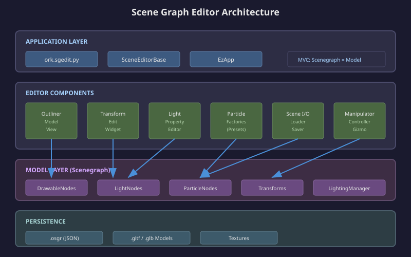
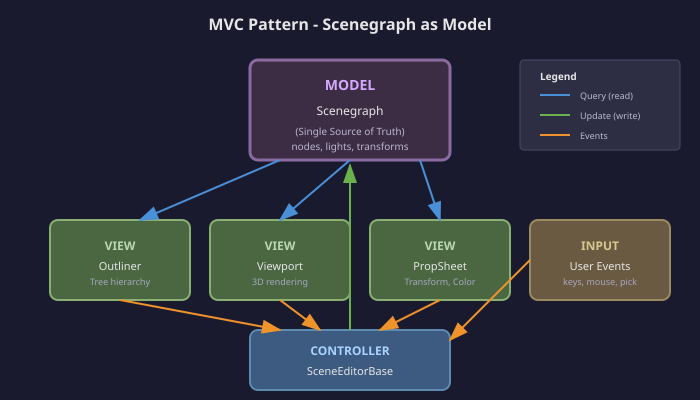
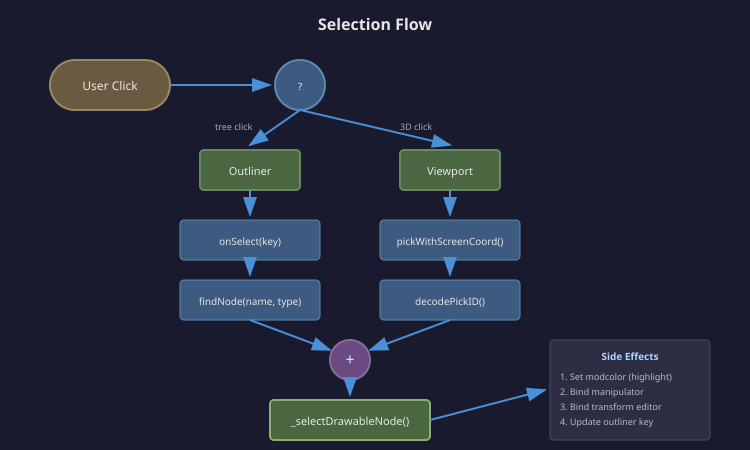
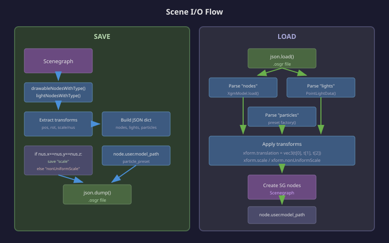
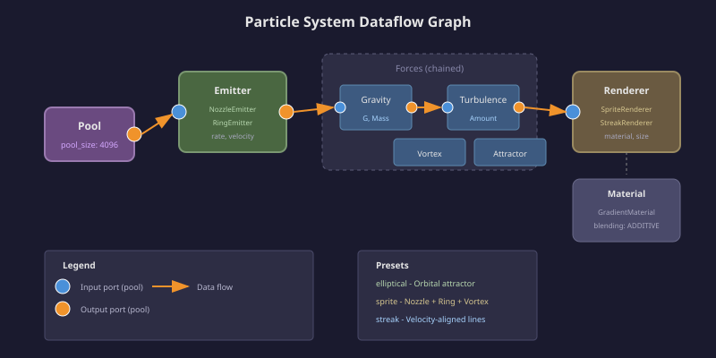

# Scene Graph Editor (sgedit) - Technical Design Document

## Overview

### What It Does

The Scene Graph Editor (sgedit) provides an interactive 3D scene editing environment for the Orkid engine. It enables creation, manipulation, and persistence of scene objects including:

### Key Benefits

- **MVC Architecture** - Scenegraph serves as the single source of truth; UI reflects live scene state
- **Extensible Base Class** - `SceneEditorBase` provides common functionality; subclasses customize node types
- **Direct Manipulation** - 3D gizmo with translate/rotate/scale modes and world/local space toggle
- **Pick-to-Select** - GPU-accelerated object picking from viewport
- **Portable Scene Format** - `.osgr` JSON format supports both uniform and non-uniform transforms



---

## Architecture

### Component Overview

The scene editor follows an MVC pattern where the scenegraph is the model:

| Component | Role | Location |
|-----------|------|----------|
| `SceneEditorBase` | Base class with common UI/manipulation | `ork/editor/scene_editor_base.py` |
| `SceneOutlinerModel` | Outliner adapter for scenegraph queries | `ork/editor/outliner_model.py` |
| `SceneLoader` / `SceneSaver` | File I/O for `.osgr` format | `ork/editor/scene_io.py` |
| `LightPropertyEditor` | MVC controller for light color/intensity | `ork/editor/light_editor.py` |
| `TransformEdit` | Transform property widget | `ork/ui/transform_edit.py` |
| Particle Factories | Preset-based particle system creation | `ork/editor/ptc_factories.py` |



### Class Hierarchy

```
SceneEditorBase (abstract)
├── onGpuInit()          # GPU resource initialization
├── onUpdate()           # Per-frame update
├── getNodeTypes()       # Abstract: define node type registry
├── findNode()           # Abstract: lookup by name/type
├── createNode()         # Abstract: factory method
├── deleteNode()         # Abstract: removal
├── renameNode()         # Abstract: rename
└── onSelectionChanged() # Hook: selection callback

SceneOutlinerModel (lev2.ui.OutlinerModel)
├── getChildren()        # Query scenegraph for nodes
├── createItem()         # Delegate to editor.createNode()
├── renameItem()         # Delegate to editor.renameNode()
└── removeItem()         # Delegate to editor.deleteNode()
```

---

## UI Layout

The editor uses a guide-based layout system with three primary panels:

```
┌─────────────────────────────────────────────────────────────┐
│ ┌─────────────┐ ┌─────────────────────────────────────────┐ │
│ │ Left Dock   │ │                                         │ │
│ │ ───────────-│ │                                         │ │
│ │ [LOAD][SAVE]│ │                                         │ │
│ │ ▸ Pick Debug│ │            Viewport                     │ │
│ │ ▾ Nodes     │ │         (SceneGraphViewport)            │ │
│ │   └ node0   │ │                                         │ │
│ │   └ node1   │ │                                         │ │
│ │ ▾ Lights    │ │                                         │ │
│ │   └ pl0     │ │                                         │ │
│ │ ▾ Particles │ │                                         │ │
│ │   └ ptc0    │ │                                         │ │
│ ├─────────────┤ │                                         │ │
│ │ Propsheet   │ │                                         │ │
│ │ ───────────-│ │                                         │ │
│ │ ▾ Transform │ │                                         │ │
│ │  Pos [x,y,z]│ │                                         │ │
│ │  Rot [x,y,z]│ │                                         │ │
│ │  Scl [x,y,z]│ │                                         │ │
│ │ ▸ Light Clr │ │                                         │ │
│ └─────────────┘ └─────────────────────────────────────────┘ │
└─────────────────────────────────────────────────────────────┘
```

### Configuration

Layout proportions are configurable via constructor parameters:

```python
class MyEditor(SceneEditorBase):
    def __init__(self):
        super().__init__(
            left_dock_proportion=0.25,   # 25% width for outliner
            propsheet_proportion=0.6,    # 60% of left dock for propsheet
            file_extension=".osgr",
            home_dir="/path/to/scenes"
        )
```

---

## Selection System

### Selection Flow



Selection can occur from two sources:

1. **Outliner Click** - User clicks node in hierarchy tree
2. **Viewport Pick** - User clicks object in 3D viewport

Both paths converge on the same selection methods:

```python
def _selectDrawableNode(self, node):
    # Clear previous selection highlight
    if self.selected_node is not None:
        self.selected_node.modcolor = vec4(1, 1, 1, 1)

    # Set new selection
    self.selected_node = node
    node.modcolor = vec4(1, 0.3, 0.3, 1)  # Red highlight

    # Bind transform editor
    xform = node.worldTransform
    self.manip_interface = lev2.DecompTransformManipulator(xform)
    self.manip_controller.target = self.manip_interface
    self.xform_editor.transform = xform
```

### Visual Feedback

Selected nodes display an animated highlight using `modcolor`:

```python
def onUpdate(self, updinfo):
    if self.selected_node is not None:
        t = math.sin(updinfo.absolutetime * 8.0) * 0.5 + 0.5
        self.selected_node.modcolor = vec4(1, t, t, 1)  # Pulsing red
```

---

## Transform Manipulation

### Gizmo Modes

The manipulator supports three modes, toggled via keyboard:

| Key | Mode | Description |
|-----|------|-------------|
| `T` | Translate | Move along axes; toggles world/local space |
| `R` | Rotate | Rotate around axes (disabled for lights) |
| `S` | Scale | Uniform/non-uniform scale (disabled for lights) |
| `ESC` | Clear | Disable manipulator or clear selection |

### Transform Synchronization

The `TransformEdit` widget provides bidirectional sync with the scenegraph node:

```python
# In onUpdate()
if self.selected_node is not None:
    self.xform_editor.sync()  # UI ↔ Node transform
```

The sync handles both uniform and non-uniform scale modes:

```python
# TransformEdit internally tracks:
self._transform.scale           # Uniform scale (float)
self._transform.nonUniformScale # Non-uniform scale (vec3)
```

---

## Scene I/O

### .osgr File Format

The `.osgr` format is a JSON structure with three top-level sections:

```json
{
  "nodes": {
    "node0": {
      "model_path": "data://models/cube.gltf",
      "translation": [0, 1, 0],
      "orientation": [0, 0, 0, 1],
      "scale": 1.0
    },
    "node1": {
      "model_path": "data://models/sphere.gltf",
      "translation": [2, 0, 0],
      "orientation": [0, 0.707, 0, 0.707],
      "nonUniformScale": [1, 2, 1]
    }
  },
  "lights": {
    "pl0": {
      "translation": [0, 5, 0],
      "color": [100, 100, 100]
    }
  },
  "particles": {
    "ptc0": {
      "translation": [0, 2, 0],
      "orientation": [0, 0, 0, 1],
      "scale": 1.0,
      "preset": "elliptical"
    }
  }
}
```

### Scale Handling

The saver distinguishes uniform vs non-uniform scale:

```python
# In SceneSaver.save()
nus = xform.nonUniformScale
if nus.x == nus.y == nus.z:
    node_data["scale"] = s          # Save uniform scale
else:
    node_data["nonUniformScale"] = [nus.x, nus.y, nus.z]
```



### Standalone Loader

The `SceneLoader` can be used independently of the editor:

```python
from ork.editor import SceneLoader, PARTICLE_PRESETS

# In a demo script
result = SceneLoader.load(
    "myscene.osgr",
    scenegraph,
    layer,
    particle_presets=PARTICLE_PRESETS
)

for node in result['nodes']:
    print(f"Loaded: {node.name}")
```

---

## Particle Systems

### Dataflow Architecture

Particle systems use a dataflow graph architecture:



### Preset Factory Pattern

The editor uses preset factories to create pre-configured particle systems:

```python
# ptc_factories.py
PARTICLE_PRESETS = {
    "elliptical": createEllipticalSystem,  # Orbital attractor
    "sprite": createSpriteSystem,          # Nozzle + ring emitters
    "streak": createStreakSystem,          # Velocity-aligned streaks
}
```

Each factory follows the signature:

```python
def createPresetSystem(scenegraph, layer, name) -> SGNode:
    graphdata = dataflow.GraphData.createShared()

    # Create modules
    pool = graphdata.create("POOL", particles.Pool)
    emitter = graphdata.create("EMIT", particles.NozzleEmitter)
    renderer = graphdata.create("SPRT", particles.SpriteRenderer)

    # Connect dataflow
    graphdata.connect(emitter.inputs.pool, pool.outputs.pool)
    graphdata.connect(renderer.inputs.pool, emitter.outputs.pool)

    # Configure parameters
    pool.pool_size = 4096
    emitter.inputs.EmissionRate = 100

    # Create drawable and node
    drawable_data = ParticlesDrawableData()
    drawable_data.graphdata = graphdata
    ptc_drawable = drawable_data.createSGDrawable(scenegraph)
    sg_node = layer.createDrawableNode(name, ptc_drawable)

    # Store preset metadata for save/load
    sg_node.user.particle_preset = "preset_name"
    sg_node.user.graphdata = graphdata

    return sg_node
```

### Preset Cycling

Option-P cycles through available presets on a selected particle node:

```python
def onCycleParticlePreset(self, node):
    presets = list(PARTICLE_PRESETS.keys())
    current = node.user.particle_preset
    idx = presets.index(current)
    next_preset = presets[(idx + 1) % len(presets)]
    self._setParticlePreset(node, next_preset)
```

---

## Keyboard Shortcuts

### Global Shortcuts

| Shortcut | Action |
|----------|--------|
| `T` | Translate mode (toggle world/local space) |
| `R` | Rotate mode |
| `S` | Scale mode |
| `ESC` | Clear manipulator or selection |
| `F` | Focus camera on object under cursor |
| `Cmd-N` | New scene |

### Creation Shortcuts

| Shortcut | Action |
|----------|--------|
| `Shift-N` | Create new model node |
| `Shift-L` | Create new point light |
| `Shift-P` | Create new particle system |
| `Option-P` | Cycle particle preset |

### Custom Shortcuts

Subclasses can add custom shortcuts:

```python
def getExtraKeyboardShortcuts(self):
    return {
        ord("D"): (self._duplicateNode, True, False),
        # (handler, requires_selection, allowed_for_lights)
    }
```

---

## Node Type Registry

Subclasses define their node types via `getNodeTypes()`:

```python
def getNodeTypes(self):
    return [
        {
            "key": "Nodes",
            "item_type": "node",
            "display_name": "Node",
            "drawable_type": tokens.model,
            "default_name": lambda n: f"node{n}"
        },
        {
            "key": "Lights",
            "item_type": "light",
            "display_name": "Point Light",
            "light_type": tokens.pointlight,
            "default_name": lambda n: f"pl{n}"
        },
        {
            "key": "Particles",
            "item_type": "particle",
            "display_name": "Particle System",
            "drawable_type": tokens.particles,
            "default_name": lambda n: f"ptc{n}"
        }
    ]
```

The `drawable_type` and `light_type` tokens correspond to `_drawable_type` CrcString values set in C++:

```cpp
// In sgnode_particles.cpp createDrawable()
auto rval = std::make_shared<CallbackDrawable>(nullptr);
rval->_drawable_type = "particles"_crcu;
```

---

## GPU Initialization

The `onGpuInit()` method sets up rendering infrastructure:

```python
def onGpuInit(self, ctx):
    # 1. Theme engine
    self.uicontext = self.ezapp.uicontext
    self.base_db = lev2.ui.createDefaultStyleDatabase()
    self.uicontext.theme_engine = lev2.ui.ThemeEngine(self.base_db)

    # 2. Scenegraph with PBR preset
    sg_params = VarMap()
    sg_params.preset = "ForwardPBR"
    self.scenegraph = lev2.scenegraph.Scene(sg_params)
    self.layer = self.scenegraph.createLayer("std_forward")
    self.scenegraph.enablePickHud()

    # 3. Grid reference plane
    self.grid_data = createGridData()
    self.grid_node = self.layer.createDrawableNodeFromData("grid", self.grid_data)

    # 4. Manipulator gizmo
    self.manip_controller = lev2.ManipController()
    self.gizmo_data = lev2.ManipGizmoDrawableData()
    self.gizmo_data.controller = self.manip_controller

    # 5. Camera
    self.camera, self.uicam = setupUiCameraX(...)

    # 6. Pick visualization shader
    self.pickid_viz_mtl = lev2.FreestyleMaterial()
    self.pickid_viz_mtl.gpuInit(ctx, "orkshader://ui_pickid_viz")
```

---

## Source Files

| File | Description |
|------|-------------|
| `obt.project/scripts/ork/editor/scene_editor_base.py` | Base class implementation |
| `obt.project/scripts/ork/editor/outliner_model.py` | Outliner adapter |
| `obt.project/scripts/ork/editor/scene_io.py` | Load/save functionality |
| `obt.project/scripts/ork/editor/light_editor.py` | Light property MVC controller |
| `obt.project/scripts/ork/editor/ptc_factories.py` | Particle preset factories |
| `obt.project/scripts/ork/editor/__init__.py` | Module exports |
| `obt.project/scripts/ork/ui/transform_edit.py` | Transform editing widget |
| `obt.project/bin/ork.sgedit.py` | Concrete editor implementation |
| `ork.lev2/src/gfx/scenegraph/sgnode_particles.cpp` | Particle drawable C++ |

---

## Future Enhancements

### Phase 2 - Particle Editor
- In-place parameter editing without preset cycling
- Dataflow graph visualization
- Module add/remove/connect

### Phase 3 - Advanced Features
- Undo/redo stack
- Multi-selection
- Copy/paste
- Scene hierarchy (parenting)
- ECS Editor
