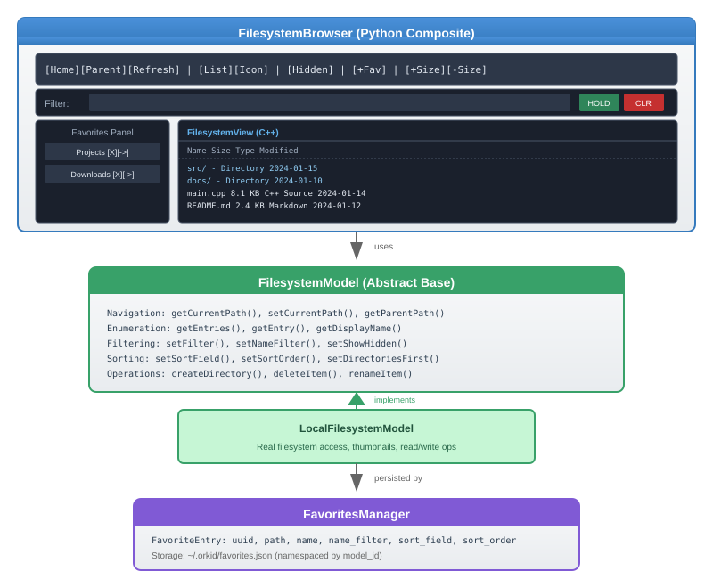
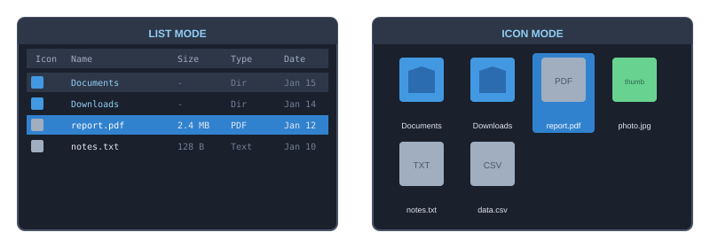
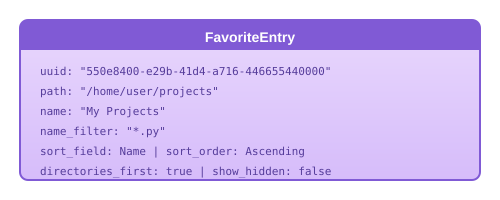
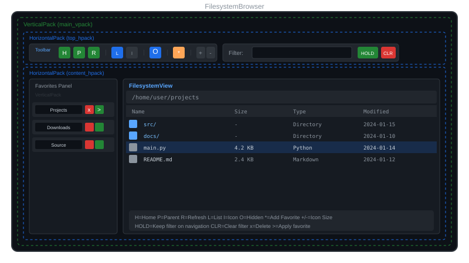
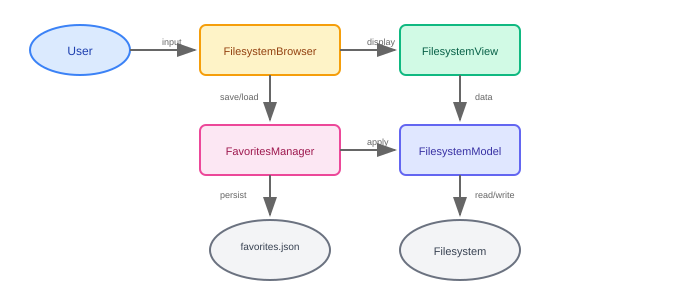

# Filesystem UI Widgets

This document covers the filesystem browsing widgets in Orkid's UI system, including the model-view architecture, favorites management, and the composite FilesystemBrowser widget.

## Architecture Overview



## Component Details

---

## FilesystemModel

Abstract base class defining the data interface for filesystem browsing. Models can be subclassed in C++ or Python to support different backends (local filesystem, S3, FTP, etc.).

### Class Hierarchy


### FilesystemEntry Structure

Each filesystem item is represented by a `FilesystemEntry`:

| Field | Type | Description |
|-------|------|-------------|
| `path` | string | Full path to the item |
| `name` | string | Display name (filename only) |
| `type` | FileType | `Unknown`, `File`, `Directory`, or `Symlink` |
| `size` | size_t | File size in bytes |
| `modified_time` | time_t | Last modification timestamp |
| `mime_type` | string | MIME type (e.g., "image/png") |
| `extension` | string | Lowercase extension without dot |
| `is_hidden` | bool | True if hidden (starts with `.` on Unix) |
| `is_readable` | bool | Read permission |
| `is_writable` | bool | Write permission |

### Core API

#### Navigation

```python
# Get current directory
path = model.getCurrentPath()

# Navigate to a path
success = model.setCurrentPath("/home/user/projects")

# Get parent path (empty if at root)
parent = model.getParentPath()

# Check if path exists
if model.exists("/some/path"):
    ...

# Check if path is a directory
if model.isDirectory("/some/path"):
    ...
```

#### Enumeration

```python
# Get all entries in current directory (respects filter settings)
entries = model.getEntries()

# Get metadata for a specific path
entry = model.getEntry("/path/to/file.txt")

# Get display name for a path
name = model.getDisplayName("/path/to/file.txt")  # Returns "file.txt"
```

#### Filtering

```python
# Filter by extension (supports multiple patterns separated by ;)
model.filter = "*.py;*.cpp;*.h"

# Filter by name pattern (glob-style: * and ?)
model.name_filter = "*test*"       # Contains "test"
model.name_filter = "main*"        # Starts with "main"
model.name_filter = "*.py"         # Ends with ".py"

# Show/hide hidden files
model.show_hidden = True

# Show/hide directories
model.show_directories = True
```

#### Sorting

```python
from orkengine import lev2

# Sort by name, size, type, or modified time
model.sort_field = lev2.ui.FilesystemSortField.Name
model.sort_field = lev2.ui.FilesystemSortField.Size
model.sort_field = lev2.ui.FilesystemSortField.Type
model.sort_field = lev2.ui.FilesystemSortField.ModifiedTime

# Sort order
model.sort_order = lev2.ui.FilesystemSortOrder.Ascending
model.sort_order = lev2.ui.FilesystemSortOrder.Descending

# Directories first (before files)
model.directories_first = True
```

#### File Operations (Read/Write Models)

```python
# Check if model supports modifications
if not model.isReadOnly():
    # Create a directory
    model.createDirectory("new_folder")

    # Delete an item
    model.deleteItem("/path/to/item")

    # Rename an item (returns new path on success)
    new_path = model.renameItem("/path/to/old_name", "new_name")
```

### LocalFilesystemModel

Concrete implementation for accessing the real filesystem.

```python
from orkengine import lev2

# Create with initial path
model = lev2.ui.LocalFilesystemModel("/home/user")

# Or create and set path later
model = lev2.ui.LocalFilesystemModel()
model.setCurrentPath("/home/user")

# Make read-only (disables delete/rename/create)
model.read_only = True

# Constrain navigation to a root path
model.root_path = "/home/user/projects"  # Can't navigate above this
```

### Model Identifier

Each model type has a unique identifier used for namespacing favorites:

```python
model_id = model.modelIdentifier()  # Returns "local" for LocalFilesystemModel
```

---

## FilesystemView

Widget that displays filesystem contents from a model. Supports list and icon view modes with selection, navigation, and inline editing.

### View Modes



### Basic Usage

```python
from orkengine import lev2

# Create view
view = container.makeChild(uiclass=lev2.ui.FilesystemView, args=["browser"])

# Attach model
model = lev2.ui.LocalFilesystemModel("/home/user")
view.model = model

# Set view mode
view.view_mode = lev2.ui.FilesystemViewMode.List
view.view_mode = lev2.ui.FilesystemViewMode.Icon
```

### Selection

```python
# Single selection
view.setSelectedPath("/path/to/file")
selected = view.getSelectedPath()

# Multi-selection
view.allow_multiselect = True
view.addToSelection("/path/to/file1")
view.addToSelection("/path/to/file2")
view.removeFromSelection("/path/to/file1")
selected_paths = view.getSelectedPaths()

# Check selection
if view.isSelected("/some/path"):
    ...

# Clear selection
view.clearSelection()

# Select all visible items
view.selectAll()
```

### Navigation

```python
# Navigate to a directory
view.navigateTo("/home/user/projects")

# Go up one level
view.navigateUp()

# Activate an item (enter directory or trigger file action)
view.activateItem("/path/to/item")

# Refresh current view
view.refresh()
```

### Callbacks

```python
# Called when selection changes
def on_select(path):
    print(f"Selected: {path}")
view.onSelect(on_select)

# Called on double-click or Enter key
def on_activate(path):
    if model.isDirectory(path):
        print(f"Entering directory: {path}")
    else:
        print(f"Opening file: {path}")
view.onActivate(on_activate)

# Called when current directory changes
def on_dir_changed(path):
    print(f"Now in: {path}")
view.onDirectoryChanged(on_dir_changed)

# Called when delete is requested
def on_delete(path):
    print(f"Delete requested: {path}")
view.onDelete(on_delete)

# Called when rename completes
def on_rename(old_path, new_name):
    print(f"Renamed {old_path} to {new_name}")
view.onRename(on_rename)
```

### Appearance Customization

#### Colors

```python
view.bgcolor = vec4(0.15, 0.15, 0.15, 1)      # Background
view.text_color = vec4(0.9, 0.9, 0.9, 1)       # Text
view.selected_color = vec4(0.2, 0.4, 0.6, 1)   # Selected item background
view.hover_color = vec4(0.25, 0.25, 0.3, 1)    # Hover highlight
view.directory_color = vec4(0.7, 0.85, 1.0, 1) # Directory name tint
view.header_bgcolor = vec4(0.12, 0.12, 0.15, 1) # Column header background
```

#### List Mode Layout

```python
view.item_height = 24          # Row height
view.icon_column_width = 24    # Icon column width
view.name_column_width = 200   # Name column width
view.size_column_width = 80    # Size column width
view.type_column_width = 100   # Type column width
view.date_column_width = 120   # Date column width

view.show_size_column = True   # Show/hide size column
view.show_type_column = True   # Show/hide type column
view.show_date_column = True   # Show/hide date column
```

#### Icon Mode Layout

```python
view.icon_size = 64            # Icon/thumbnail size
view.icon_spacing = 8          # Space between icons
view.icon_label_height = 32    # Height for label under icon
```

#### Custom Icons

```python
from ork.ui import icon_library

# Set folder icon (SVG converted to image)
folder_svg = '''<svg xmlns="http://www.w3.org/2000/svg" viewBox="0 0 24 24">
  <path d="M10 4H4c-1.1 0-2 .9-2 2v12c0 1.1.9 2 2 2h16c1.1 0 2-.9 2-2V8c0-1.1-.9-2-2-2h-8l-2-2z" fill="#4D99CC"/>
</svg>'''
view.folder_icon = icon_library.from_svg_string(folder_svg, 64, 64)

# Set file icon
file_svg = '''<svg xmlns="http://www.w3.org/2000/svg" viewBox="0 0 24 24">
  <path d="M14 2H6c-1.1 0-2 .9-2 2v16c0 1.1.9 2 2 2h12c1.1 0 2-.9 2-2V8l-6-6z" fill="#808080"/>
  <path d="M14 2v6h6" fill="#606060"/>
</svg>'''
view.file_icon = icon_library.from_svg_string(file_svg, 64, 64)
```

### Inline Editing

```python
# Start editing a file/folder name
view.startEditing("/path/to/item")

# Cancel editing (restore original)
view.cancelEditing()

# Commit the edit
view.commitEditing()

# Check if editing is active
if view.isEditing():
    ...
```

---

## Favorites System

The favorites system allows users to save and restore directory locations with their associated view state (filter, sort settings, etc.). Favorites are identified by UUID, allowing multiple favorites for the same path with different settings.

### FavoriteEntry Structure



| Field | Type | Description |
|-------|------|-------------|
| `uuid` | string | Unique identifier (generated automatically) |
| `path` | string | Directory path |
| `name` | string | Display name (defaults to path basename) |
| `name_filter` | string | Saved filter pattern |
| `sort_field` | SortField | Saved sort field |
| `sort_order` | SortOrder | Saved sort order |
| `directories_first` | bool | Saved directories-first setting |
| `show_hidden` | bool | Saved show-hidden setting |

### FavoritesManager

Singleton that manages favorites persistence:

```python
from orkengine import lev2

# Get singleton instance
fav_mgr = lev2.ui.FavoritesManager.instance()

# Get model identifier for namespacing
model_id = model.modelIdentifier()  # e.g., "local"
```

#### Adding Favorites

```python
# Create entry from current model state
entry = lev2.ui.FavoriteEntry.fromModel(model, "My Projects")
fav_mgr.addFavoriteEntry(model_id, entry)

# Or use FilesystemView helper
view.addCurrentAsFavorite("My Projects")
```

#### Listing Favorites

```python
# Get all favorite entries for a model
entries = fav_mgr.getFavoriteEntries(model_id)
for entry in entries:
    print(f"{entry.uuid}: {entry.displayName()} -> {entry.path}")

# Get a specific entry by UUID
entry = fav_mgr.getFavoriteEntry(model_id, "some-uuid-string")
```

#### Applying Favorites

```python
# Apply entry to model (restores all settings)
entry.applyToModel(model)

# Or use FilesystemView helper (also clears selection, resets scroll)
view.applyFavorite(entry)
```

#### Updating and Removing

```python
# Update an entry (matched by UUID)
entry.name = "New Name"
entry.name_filter = "*.py"
fav_mgr.updateFavoriteEntry(model_id, entry)

# Remove by UUID
fav_mgr.removeFavoriteEntry(model_id, entry.uuid)
```

#### Reordering

```python
# Move favorite up/down in the list (by path)
fav_mgr.moveFavoriteUp(model_id, "/path/to/favorite")
fav_mgr.moveFavoriteDown(model_id, "/path/to/favorite")
```

#### Change Callbacks

```python
# Called when favorites change
def on_favorites_changed(model_id):
    print(f"Favorites changed for {model_id}")
fav_mgr.onFavoritesChanged(on_favorites_changed)
```

### Recent Paths

The favorites manager also tracks recently visited paths:

```python
# Add to recent
fav_mgr.addRecent(model_id, "/path/visited")

# Get recent paths (most recent first)
recent = fav_mgr.getRecent(model_id)

# Clear recent
fav_mgr.clearRecent(model_id)

# Set max recent paths to remember
fav_mgr.max_recent = 30
```

---

## FilesystemBrowser (Composite Widget)

A complete, ready-to-use filesystem browser widget written in Python that combines all the above components.

### Features

- **Toolbar**: Home, parent, refresh, view mode toggle, hidden files toggle, add favorite, icon size +/-
- **Filter bar**: Text input with HOLD (preserve filter on navigation) and CLR (clear filter) buttons
- **Favorites panel**: Editable list with delete and apply buttons
- **Filesystem view**: Full-featured list/icon view

### Layout Diagram



### Basic Usage

```python
from ork.ui.filesystem_browser import FilesystemBrowser
from orkengine import lev2
from orkengine.core import vec3

# Using factory with makeChild
container_item = parent.makeChild(
    uiclass=FilesystemBrowser,
    args=["browser", "/home/user", "*.py", vec3(0.1, 0.1, 0.1)]
)

# Access the browser instance
browser = container_item.widget.uservars.filesystem_browser
```

### Constructor Arguments

| Argument | Type | Default | Description |
|----------|------|---------|-------------|
| `container` | Widget | required | Parent widget (typically a layout) |
| `name` | string | required | Widget name |
| `initial_path` | string | `~` | Starting directory |
| `default_filter` | string | `""` | Initial filter pattern |
| `bg_color` | vec3 | `(0.1, 0.1, 0.1)` | Background color |

### Public API

```python
# Navigation
browser.navigateTo("/path/to/directory")
browser.navigateUp()
browser.refresh()

# Get current state
current_path = browser.getCurrentPath()
selected = browser.getSelectedPath()
all_selected = browser.getSelectedPaths()
```

### Callbacks

```python
# Selection changed
browser.onSelect = lambda path: print(f"Selected: {path}")

# Item activated (double-click/Enter)
browser.onActivate = lambda path: print(f"Activated: {path}")

# Directory changed
browser.onDirectoryChanged = lambda path: print(f"Now in: {path}")
```

### Accessing Internal Components

```python
# Access the model
browser.model.show_hidden = True
browser.model.sort_field = lev2.ui.FilesystemSortField.ModifiedTime

# Access the view
browser.fs_view.view_mode = lev2.ui.FilesystemViewMode.Icon
browser.fs_view.icon_size = 96

# Access the toolbar
browser.toolbar.bgcolor = vec4(0.2, 0.2, 0.25, 1)

# Access favorites manager
browser.favorites_mgr.clearFavorites(browser.model.modelIdentifier())
```

### Toolbar Buttons

| Button | Action |
|--------|--------|
| Home (H) | Navigate to home directory |
| Parent (P) | Navigate to parent directory |
| Refresh (R) | Refresh current directory |
| List (L) | Switch to list view mode |
| Icons (I) | Switch to icon view mode |
| Hidden (O) | Toggle hidden files visibility |
| Star (*) | Add current location as favorite |
| Size + | Increase icon size (icon mode) |
| Size - | Decrease icon size (icon mode) |

### Filter Bar Features

- **Filter text**: Enter pattern to filter files (auto-wraps with `*` if no wildcards)
- **HOLD button**: When active, filter persists when navigating directories
- **CLR button**: Clear the current filter

---

## Use Cases

### 1. Simple File Picker

```python
from ork.ui.filesystem_browser import FilesystemBrowser

browser_item = dialog.makeChild(uiclass=FilesystemBrowser, args=["picker", "/home/user"])
browser = browser_item.widget.uservars.filesystem_browser

def on_file_selected(path):
    if not browser.model.isDirectory(path):
        dialog.close()
        handle_selected_file(path)

browser.onActivate = on_file_selected
```

### 2. Asset Browser with Thumbnails

```python
from orkengine import lev2

view = container.makeChild(uiclass=lev2.ui.FilesystemView, args=["assets"])
model = lev2.ui.LocalFilesystemModel("/project/assets")

view.model = model
view.view_mode = lev2.ui.FilesystemViewMode.Icon
view.icon_size = 128

# Model provides thumbnails for images automatically
model.filter = "*.png;*.jpg;*.exr"
```

### 3. Project Navigator with Favorites

```python
from ork.ui.filesystem_browser import FilesystemBrowser

browser_item = panel.makeChild(
    uiclass=FilesystemBrowser,
    args=["project", "/workspace/project", "*.py;*.cpp;*.h"]
)
browser = browser_item.widget.uservars.filesystem_browser

# Pre-populate favorites
fav_mgr = browser.favorites_mgr
model_id = browser.model.modelIdentifier()

for path, name in [("/workspace/project/src", "Source"),
                   ("/workspace/project/tests", "Tests")]:
    entry = lev2.ui.FavoriteEntry()
    entry.path = path
    entry.name = name
    fav_mgr.addFavoriteEntry(model_id, entry)
```

### 4. Custom Filesystem Model

```python
class S3FilesystemModel(lev2.ui.FilesystemModel):
    """Example custom model for S3 storage."""

    def modelIdentifier(self):
        return "s3"

    def getCurrentPath(self):
        return f"s3://{self._bucket}/{self._prefix}"

    def setCurrentPath(self, path):
        # Parse s3:// URL and update bucket/prefix
        ...
        return True

    def getEntries(self):
        # Query S3 and return FilesystemEntry list
        ...

    # ... implement other required methods
```

---

## Data Flow Diagram



---

## File Structure

```
ork.lev2/
├── inc/ork/lev2/ui/
│   ├── filesystem_model.h    # FilesystemModel, LocalFilesystemModel
│   ├── filesystem_view.h     # FilesystemView widget
│   └── favorites.h           # FavoriteEntry, FavoritesManager
├── src/ui/widgets/
│   ├── filesystem_model.cpp
│   ├── filesystem_view.cpp
│   └── favorites.cpp
└── pyext/src/
    └── pyext_ui_filesystem.cpp  # Python bindings

obt.project/scripts/ork/ui/
└── filesystem_browser.py     # FilesystemBrowser composite widget
```

---

## Performance Considerations

1. **Lazy Icon Loading**: Icons are converted from images to textures on first draw
2. **Thumbnail Caching**: Thumbnails are cached per-path in the view
3. **Model Notifications**: Use `notifyModelChanged()` sparingly; batch filter/sort changes
4. **Large Directories**: Consider pagination or virtual scrolling for directories with thousands of files

---

## Thread Safety

- `FavoritesManager` is thread-safe (singleton with mutex protection)
- `FilesystemModel` callbacks are invoked on the main thread
- Thumbnail loading can be async via `image_provider_ptr_t`
