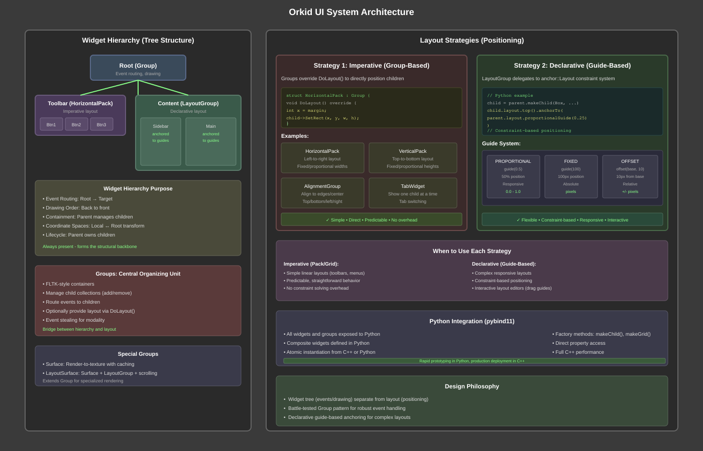
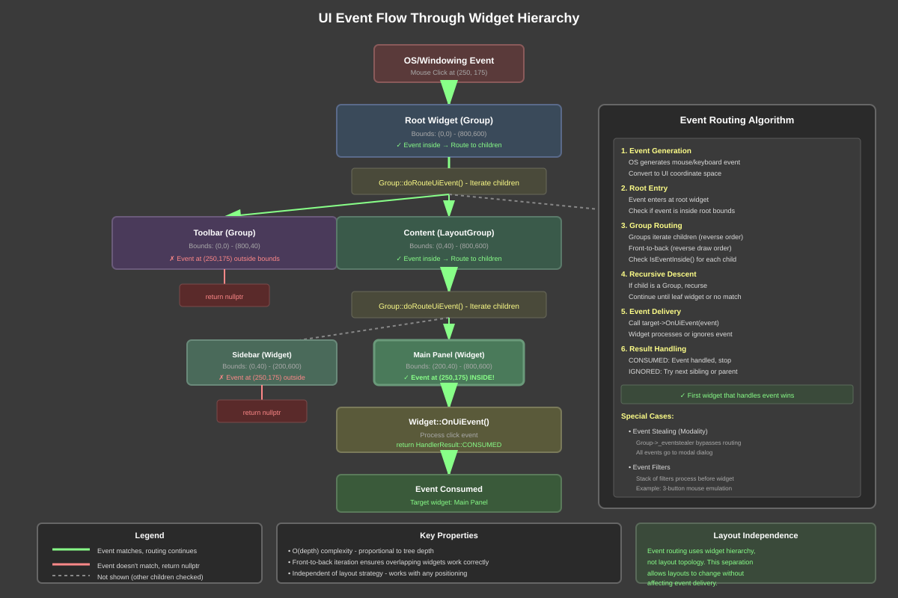
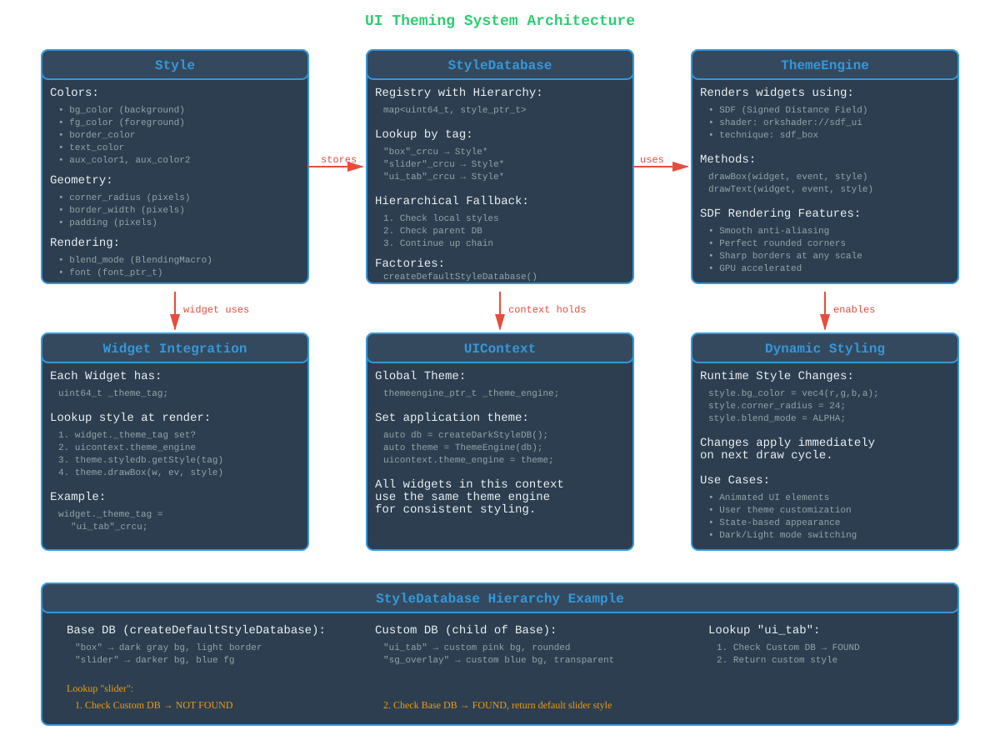

# Orkid UI System - Technical Design Document

---

## Overview

The Orkid UI system is a flexible, hierarchical UI framework that combines traditional widget trees with multiple layout strategies. It draws inspiration from FLTK's Group-based organization and QML's declarative anchor system, while maintaining clean separation between widget hierarchy and layout management.

### What It Does

- **Widget Hierarchy**: Tree structure for event routing, drawing order, and containment
- **Group Management**: Containers for child lifecycle and event coordination
- **Flexible Layouts**: Combinable imperitive and declaritive layout strategies
- **Python Integration**: Full pybind11 bindings enabling composite widgets defined in Python

### Key Benefits

- **Separation of Concerns**: Widget tree handles events/drawing; layout handles positioning
- **Multiple Layout Strategies**: Choose imperative (HorizontalPack) or declarative (LayoutGroup) as needed
- **FLTK Heritage**: Battle-tested Group pattern for robust event handling
- **Python Composites**: Composite/layout groups of c++ widgets in Python, instantiate atomically from python or C++

---

## Basic Concepts

### Widgets

Individual UI elements that handle their own drawing, events, and state:
- Buttons, text boxes, labels, sliders, etc.
- Each widget has geometry (x, y, width, height)
- Participate in parent-child hierarchy
- Respond to UI events (mouse, keyboard, touch)

### Groups

FLTK-style containers that manage collections of child widgets:
- Maintain child widget collection
- Route events to appropriate children
- Optionally provide layout for children via `DoLayout()`
- Handle child lifecycle (add, remove, destroy)
- Support event stealing for modal interactions

### Layout Strategies

Different approaches to positioning child widgets:

**Imperative Layout** (Group-based):
- Groups override `DoLayout()` to directly set child geometry
- Examples: `HorizontalPack`, `VerticalPack`, `TabWidget`, `AlignmentGroup`
- Simple, predictable, traditional approach

**Declarative Layout** (Guide-based):
- `LayoutGroup` uses `anchor::Layout` constraint system
- Widgets anchor to guides (vertical/horizontal constraint lines)
- Guides can be proportional, fixed, or offset
- QML-style declarative positioning

### The Separation

- **Widget Hierarchy**: Always present, handles events and drawing
- **Layout Management**: Optional, can be imperative or declarative
- **Independence**: Widgets can be repositioned without changing event routing

---

## Core Features

### Essential Capabilities

- **Hierarchical Widget Organization**
  - Tree structure with parent-child relationships
  - Event routing from root to target widget
  - Drawing order from back to front
  - Coordinate transformations (local ↔ root)

- **Group-Based Container Model**
  - Add/remove children dynamically
  - Event routing to visible, enabled children
  - Optional event stealing for modal behavior
  - Child geometry updates trigger parent relayout

- **Multiple Layout Strategies**
  - Imperative: HorizontalPack, VerticalPack, AlignmentGroup, TabWidget
  - Declarative: LayoutGroup with anchor::Layout system
  - Manual: Direct SetRect() calls
  - Hybrid: Mix strategies in same hierarchy

- **Guide-Based Constraint System**
  - Proportional guides (percentage-based)
  - Fixed guides (pixel-based)
  - Offset guides (relative to other guides)
  - Guide association graph for constraint propagation
  - Interactive guide dragging for layout editing

- **Surface Rendering**
  - Render-to-texture for caching
  - Pick buffers for GPU-based hit testing
  - Decoupled sizing (virtual space larger than widget)
  - Scrollable content regions

- **Python Integration**
  - All widgets exposed via pybind11
  - Composite widgets definable in Python
  - Atomic instantiation from C++ or Python
  - Direct property access and method calls

---

## High-Level Architecture



The architecture consists of two primary systems working together:

1. **Widget Hierarchy (Tree)**: Handles events, drawing, and containment
2. **Layout Management (Strategy)**: Handles positioning via different approaches

Groups serve as the bridge, managing both child widgets and (optionally) their layout.

---

## Widget Hierarchy

### Widget Base Class

All UI elements inherit from `Widget`:

```cpp
struct Widget : public ork::Object {
  Widget(const std::string& name, int x=0, int y=0, int w=0, int h=0);

  // Geometry
  int x(), y(), width(), height();
  void SetRect(int x, int y, int w, int h);

  // Hierarchy
  Group* parent() const;
  Group* root() const;

  // Events
  HandlerResult OnUiEvent(event_constptr_t ev);
  Widget* routeUiEvent(event_constptr_t ev);

  // Drawing
  void draw(ui::drawevent_constptr_t drwev);

  // Lifecycle
  void gpuInit(lev2::Context* target);
  void onPreDestroy();
};
```

**Key Responsibilities:**
- Maintain geometry (position and size)
- Handle UI events (mouse, keyboard, etc.)
- Render visual representation
- Coordinate space transformations

### Group: The Central Organizing Unit

Groups extend Widget to manage collections of children:

```cpp
struct Group : public Widget {
  // Child management
  void addChild(widget_ptr_t w);
  void removeChild(widget_ptr_t w);
  void visitHierarchy(visit_fn_t vfn);

  // Event routing
  Widget* doRouteUiEvent(event_constptr_t ev) override;

  // Layout (optional - override in subclasses)
  void DoLayout() override;

  // Children
  std::vector<widget_ptr_t> _children;
};
```

**FLTK Heritage:**
Groups in Orkid work like FLTK's Fl_Group:
- Manage child widget lifetime
- Route events to children based on position
- Optionally layout children via `DoLayout()`
- Support event stealing for modality

**Event Routing Algorithm:**
1. Check if event is inside group bounds
2. Iterate children front-to-back (reverse drawing order)
3. Call `routeUiEvent()` on each child
4. First child that handles event wins
5. If no child handles it, group itself handles it

---

## Layout Strategies

Orkid provides multiple ways to layout child widgets, each suited to different use cases.

### Strategy 1: Imperative Layout (Group-Based)

Groups override `DoLayout()` to directly position children using `SetRect()`:

**HorizontalPack Example:**
```cpp
struct HorizontalPack : public Group {
  void DoLayout() override {
    int x = _margin;
    for (auto& child : _children) {
      int w = child->_fixed_width ? child->_fixed_width : _item_width;
      child->SetRect(x, _margin, w, height() - 2*_margin);
      x += w + _spacing;
    }
  }

  int _margin = 0;
  int _spacing = 0;
  int _item_width = 100;
};
```

**Imperative Layout Groups:**
- `HorizontalPack`: Arranges children left-to-right
- `VerticalPack`: Arranges children top-to-bottom
- `AlignmentGroup`: Aligns children to edges or center
- `TabWidget`: Shows one child at a time
- `Split`: Resizable split panes

**Benefits:**
- Simple and direct
- Easy to understand control flow
- Predictable behavior
- No constraint solving overhead

**Use Cases:**
- Toolbars and button rows
- Simple vertical/horizontal flows
- Tab panels
- Situations where layout logic is straightforward

### Strategy 2: Declarative Layout (Guide-Based)

`LayoutGroup` delegates layout to the `anchor::Layout` constraint system:

```cpp
struct LayoutGroup : public Group {
  anchor::layout_ptr_t _layout;  // Constraint-based layout

  template<typename T, typename... A>
  LayoutItem<T> makeChild(A&&... args) {
    LayoutItem<T> item;
    item._widget = std::make_shared<T>(std::forward<A>(args)...);
    item._layout = _layout->childLayout(item._widget.get());
    addChild(item._widget);
    return item;
  }
};
```

**Guide System:**

Each `anchor::Layout` has guides (constraint lines):
- `top()`, `left()`, `bottom()`, `right()`: Edge guides
- `centerH()`, `centerV()`: Center guides
- `proportionalHorizontalGuide(0.5)`: Custom proportional guide
- `fixedVerticalGuide(100)`: Custom fixed guide
- `offsetGuide(base, 10)`: Offset from another guide

**Anchoring:**
```python
# Python example: Fill parent
child = parent.makeChild(lev2.ui.Box, "child", vec4(1,0,0,1))
child.layout.fill(parent.layout)

# Anchor to guides
child.layout.top.anchorTo(parent.layout.top)
child.layout.left.anchorTo(parent.layout.proportionalVerticalGuide(0.5))
```

**Benefits:**
- Declarative, constraint-based
- Responsive to parent resizing
- Complex relationships without deep nesting
- Interactive layout editing (drag guides)

**Use Cases:**
- Complex responsive layouts
- Proportional sizing
- Constraint-based positioning
- Layout editors and tools

### Strategy 3: Manual Layout

Widgets can be positioned manually without automatic layout:

```cpp
// No automatic layout - just set geometry directly
auto widget = std::make_shared<Button>("OK", 10, 10, 80, 30);
group->addChild(widget);

// Later, reposition manually
widget->SetRect(20, 20, 80, 30);
```

**Use Cases:**
- Absolute positioning
- One-off special cases
- Dynamic positioning logic

---

## The Two Topologies

Understanding why widget hierarchy and layout management are separate is key to effective use of the UI system.

### Widget Hierarchy (Always Present)

The widget tree defines:
- **Event Routing**: Which widget receives which events
- **Drawing Order**: Back-to-front rendering
- **Containment**: Parent-child lifecycle
- **Coordinate Spaces**: Local vs root transformations

**Example:**
```
Window (Group)
├── Toolbar (HorizontalPack)
│   ├── Button "New"
│   ├── Button "Open"
│   └── Button "Save"
└── ContentArea (LayoutGroup)
    ├── Sidebar (LayoutGroup)
    │   └── TreeView
    └── MainPanel (Surface)
        └── DocumentView
```

### Layout Management (Optional Strategy)

Layout determines geometry but doesn't change the tree:
- **Positioning**: Where widgets appear
- **Sizing**: How large widgets are
- **Constraints**: Relationships between widgets
- **Responsiveness**: Behavior on resize

### Why Separate?

**1. Different Concerns:**
- Event routing needs tree structure (parent contains children)
- Layout needs flexible relationships (widget A right-of widget B)

**2. Flexibility:**
- Widget can move in layout without changing event routing
- Same widget tree can have different layouts
- Layout can be changed at runtime without rebuilding tree

**3. Cleaner Code:**
- Event handling logic separated from positioning logic
- Layout groups don't need deep hierarchies
- Composite widgets can encapsulate both

**4. QML Analogy:**
QML separates item hierarchy from anchors for the same reasons:
```qml
Rectangle {
  // Item hierarchy
  Item {
    Button { anchors.left: parent.left }      // Layout independent
    Button { anchors.right: parent.right }    // of hierarchy
  }
}
```

### How They Work Together

Groups bridge the two systems:
- Maintain widget hierarchy (parent-child relationships)
- Optionally provide layout (via `DoLayout()` or `anchor::Layout`)
- Trigger layout updates when needed

**Example Flow:**
1. Window resizes
2. Root group receives resize event
3. Group calls `DoLayout()` (if imperative) or `_layout->updateAll()` (if declarative)
4. Child widgets get new geometry via `SetRect()`
5. Children that are also groups layout their children
6. Process continues down the tree

---

## Guide System Deep Dive

The guide-based layout system provides declarative, constraint-based positioning similar to QML's anchor system.

### Guide Types

**FIXED (Pixel-Based):**
```cpp
auto guide = layout->fixedHorizontalGuide(100);  // 100 pixels from top
```
- Absolute position in parent's coordinate space
- Doesn't change with parent resize

**PROPORTIONAL (Percentage-Based):**
```cpp
auto guide = layout->proportionalVerticalGuide(0.5);  // 50% across
```
- Relative to parent dimensions
- Updates when parent resizes
- Range: 0.0 (left/top) to 1.0 (right/bottom)

**OFFSET (Relative to Another Guide):**
```cpp
auto base = layout->proportionalVerticalGuide(0.5);
auto offset = layout->offsetVerticalGuide(base, 10);  // 10 pixels right of base
```
- Defined relative to another guide
- Can be positive or negative
- Updates when base guide moves

### Guide Association Graph

Unlike the widget tree, guides form an association graph:

```
Parent Layout
  ├─ top (PROPORTIONAL 0.0) ────────┐
  ├─ left (PROPORTIONAL 0.0)        │
  ├─ center (PROPORTIONAL 0.5) ◄────┼──── Child top anchors here
  └─ bottom (PROPORTIONAL 1.0)      │
                                    │
Child Layout                        │
  ├─ top ───────────────────────────┘
  ├─ left
  ├─ bottom
  └─ right
```

**Association Properties:**
- Guides track their associates (other guides anchored to them)
- Updates propagate through associations
- Cycles are prevented by visited-set during update
- Guides can be locked to prevent movement

### Layout Update Propagation

When geometry changes, updates flow through guide associations:

```cpp
void Guide::updateGeometry() {
  // Calculate this guide's position
  switch (_type) {
    case FIXED:
      _position = _fixed;
      break;
    case PROPORTIONAL:
      _position = parent_size * _proportion;
      break;
    case OFFSET:
      _position = _offset_base->_position + _offset;
      break;
  }

  // Apply margin
  _position += _sign * _margin;

  // Update widget geometry
  _layout->_widget->SetRect(...);
}

void Guide::updateAssociates(visit_set& visited) {
  for (auto* associate : _associates) {
    if (visited.insert(associate->_name).second) {
      associate->updateGeometry();
      associate->updateAssociates(visited);
    }
  }
}
```

**Update Process:**
1. Root layout receives resize
2. Root guide positions update
3. Each guide updates its associates
4. Associates update their associates (recursive)
5. Visited-set prevents cycles
6. Widget geometries update as guides move

### Factory Methods for Common Patterns

LayoutGroup provides convenient methods for common layouts:

**Grid:**
```python
items = layout_group.makeGrid(
    width=3, height=2,
    margin=4,
    uiclass=lev2.ui.Box,
    args=["box", vec4(0.5, 0.5, 0.5, 1)]
)
# Creates 3x2 grid with proportional guides
```

**Variable Rows/Cols:**
```python
items = layout_group.makeWidgetsRC(
    rccounts=[3, 2, 4],  # 3 cols in row 0, 2 in row 1, 4 in row 2
    margin=4,
    uiclass=lev2.ui.Button,
    args=["button"]
)
```

**Manual:**
```python
child = layout_group.makeChild(lev2.ui.Box, "box", vec4(1,0,0,1))
child.layout.top.anchorTo(layout_group.layout.proportionalHorizontalGuide(0.25))
child.layout.bottom.anchorTo(layout_group.layout.proportionalHorizontalGuide(0.75))
child.layout.fill(layout_group.layout)  # Fill horizontally
```

---

## Surface Rendering

Surfaces extend Group to provide render-to-texture capabilities:

```cpp
struct Surface : public Group {
  lev2::rtgroup_ptr_t _rtgroup;         // Render target
  bool mNeedsSurfaceRepaint;            // Dirty flag
  bool _alwaysRepaint;                  // Force refresh every frame
  lev2::PickBuffer* _pickbuffer;        // GPU-based hit testing

  void RePaintSurface(ui::drawevent_constptr_t drwev);
  void BeginSurface(lev2::Context* target);
  void EndSurface(lev2::Context* target);
};
```

**Benefits:**
- Cache rendered content (only repaint when dirty)
- Pick buffers for efficient hit testing
- Post-processing effects
- Decoupled sizing (texture larger than widget)

**LayoutSurface:**
Combines Surface with LayoutGroup for scrollable layouts:

```cpp
struct LayoutSurface : public Surface {
  int _virtualWidth, _virtualHeight;  // Texture size
  int _scrollX, _scrollY;             // Scroll position

  std::shared_ptr<LayoutGroup> _layoutGroup;  // Internal layout
};
```

**Use Cases:**
- Scrollable content regions
- Large canvases with viewport
- GPU-accelerated hit testing
- Cached complex layouts

---

## Usage Patterns

### C++ Usage

**Creating a Simple Hierarchy:**
```cpp
// Create root group
auto root = std::make_shared<Group>("root", 0, 0, 800, 600);

// Create toolbar with horizontal layout
auto toolbar = std::make_shared<HorizontalPack>("toolbar", 0, 0, 800, 40);
toolbar->_item_width = 80;
toolbar->_spacing = 4;
toolbar->_margin = 4;

auto btn_new = std::make_shared<Button>("New", 0, 0, 80, 32);
auto btn_open = std::make_shared<Button>("Open", 0, 0, 80, 32);
toolbar->addChild(btn_new);
toolbar->addChild(btn_open);

root->addChild(toolbar);

// Trigger layout
toolbar->DoLayout();
```

**Guide-Based Layout:**
```cpp
// Create layout group
auto layout_group = std::make_shared<LayoutGroup>("layout", 0, 0, 800, 600);

// Use makeChild<T>() - returns LayoutItem<T> with both widget and layout
auto left_panel = layout_group->makeChild<Box>("left", vec4(0.2, 0.2, 0.3, 1));

// Access layout via LayoutItem
auto left_layout = left_panel._layout;

// Anchor to left 30%
left_layout->top()->anchorTo(layout_group->_layout->top());
left_layout->left()->anchorTo(layout_group->_layout->left());
left_layout->bottom()->anchorTo(layout_group->_layout->bottom());
left_layout->right()->anchorTo(layout_group->_layout->proportionalVerticalGuide(0.3));

// Update layout
layout_group->_layout->updateAll();

// Access typed widget if needed
auto box_widget = left_panel.typedWidget();  // Returns std::shared_ptr<Box>
```

**Why use `makeChild<T>()`?**

The `makeChild<T>()` template method does three critical operations atomically:
1. Creates the widget via `std::make_shared<T>(args...)`
2. Creates the child layout via `childLayout(widget)`
3. Adds the widget to the parent via `addChild(widget)`

This ensures:
- **Atomicity**: All operations happen together in the correct order
- **Type Safety**: Returns `LayoutItem<T>` preserving the widget type
- **Correctness**: Layout is created and associated before widget enters hierarchy
- **Convenience**: One call instead of three manual steps
- **Error Prevention**: Can't forget a step or do them in wrong order
- **API Consistency**: Matches the Python `makeChild()` pattern

### Python Usage

Python provides the same API with cleaner syntax via pybind11. For production applications, use the **ComponentizedApplication** pattern which provides proper lifecycle management and component composition:

**ComponentizedApplication Pattern:**
```python
from orkengine.core import vec4
from orkengine import lev2
from ork.app.application import ComponentizedApplication

class MyApp(ComponentizedApplication):
  """
  ComponentizedApplication provides:
  - Component-based architecture (application-level ECS)
  - Lifecycle hooks: onGpuInit, onUpdate, onGpuUpdate, etc.
  - Component coordination and initialization ordering
  - Proper separation of initialization phases
  """

  def __init__(self):
    super().__init__()

    # Add components if needed
    # self.addComponent("scene", SceneComponent)

    # Create ezapp with configuration
    self.ezapp = lev2.OrkEzApp.create(
        self,
        width=1280,
        height=720,
        enable_graphics=True
    )
    self.ezapp.setRefreshPolicy(lev2.RefreshFastest, 0)
    self.ezapp.topWidget.enableUiDraw()

  def onGpuInit(self, ctx):
    """Called after GPU context is initialized - safe to create UI here"""
    super().onGpuInit(ctx)

    lg_group = self.ezapp.topLayoutGroup
    lg_group.clearColorGuide = vec4(0.2, 0.2, 0.25, 1)

    # Create grid of boxes
    self.griditems = lg_group.makeGrid(
        width=3, height=3,
        margin=6,
        uiclass=lev2.ui.Box,
        args=["box", vec4(0.3, 0.3, 0.5, 1)]
    )

    # Access individual items - note .widget property
    self.griditems[4].widget._color = vec4(1, 0, 0, 1)  # Center box red

  def onUpdate(self, updinfo):
    """Called each update tick"""
    super().onUpdate(updinfo)
    # Update logic here

  def onUiEvent(self, uievent):
    """Handle UI events"""
    return lev2.ui.HandlerResult()

# Run the app
MyApp().ezapp.mainThreadLoop()
```

**Why ComponentizedApplication?**

- **Lifecycle Management**: Proper init/update/exit phases (onGpuInit, onAudioInit, onUpdateInit, etc.)
- **Component Composition**: Add modular components via `addComponent(name, ComponentClass, **kwargs)`
- **Initialization Ordering**: GPU/Audio/Update threads initialize in correct order
- **Event Broadcasting**: All components receive lifecycle events in sorted order
- **Production Ready**: Used for movie capture of application, multi-scenegraph layouts, complex applications
- **Separation of Concerns**: UI setup in onGpuInit, simulation in onUpdate, rendering in onGpuUpdate

**Guide-Based Layout:**
```python
# In onGpuInit() of your ComponentizedApplication
def onGpuInit(self, ctx):
    super().onGpuInit(ctx)

    lg_group = self.ezapp.topLayoutGroup

    # Create child widget - returns LayoutItem
    child = lg_group.makeChild(
        uiclass=lev2.ui.TextBox,
        args=["label", vec4(1, 1, 1, 1), "Hello"]
    )

    # Access layout and anchor
    child.layout.setProportionalRect(
        parent=lg_group.layout,
        x=0.25, y=0.25,
        w=0.5, h=0.5
    )

    # Or manual anchoring using guide properties and methods
    child.layout.top.anchorTo(lg_group.layout.proportionalHorizontalGuide(0.25))
    child.layout.left.anchorTo(lg_group.layout.proportionalVerticalGuide(0.25))
```

**Horizontal Pack:**
```python
# In onGpuInit() of your ComponentizedApplication
def onGpuInit(self, ctx):
    super().onGpuInit(ctx)

    lg_group = self.ezapp.topLayoutGroup

    # Create horizontal pack - returns LayoutItem
    hpack = lg_group.makeChild(
        uiclass=lev2.ui.HorizontalPack,
        args=["toolbar"]
    )

    # Configure pack via .widget property
    hpack.widget.margin = 4
    hpack.widget.spacing = 2
    hpack.widget.item_width = 80

    # HorizontalPack is a Group, so it has makeChild()
    for label in ["New", "Open", "Save", "Close"]:
        btn = hpack.widget.makeChild(
            uiclass=lev2.ui.Button,
            args=[label]
        )
```

### Composite Widgets in Python

Python can define reusable composite widgets that integrate with the C++ `makeChild()` binding system. This requires implementing **static factory methods** that the pybind11 layer can invoke.

#### Factory Method Pattern

Python composite widgets don't inherit from UI widget classes. Instead, they provide static factory methods:

- **`uifactory(parent_layoutgroup, args)`** - For use with `LayoutGroup.makeChild()`
- **`wfactory(args)`** - For use with `Widget.makeChild()`

These factory methods:
1. Create a container widget (HorizontalPack, VerticalPack, LayoutGroup, etc.)
2. Instantiate the Python composite class
3. Store the instance in the container's `uservars` for later access
4. Return the container (or LayoutItem for uifactory)

This enables Python composite widgets to be used with the same API as C++ widgets:
```python
picker = layout_group.makeChild(uiclass=ColorPicker, args=["picker_name", vec4(1,0,0,1)])
```

#### Complete Example: ColorPicker

```python
from orkengine.core import vec4
from orkengine import lev2

class ColorPicker:
    """Composite widget with color preview and RGB sliders."""

    def __init__(self, container, name, initial_color, bg_color=None):
        """Initialize ColorPicker inside a container widget.

        Args:
            container: Container widget (HorizontalPack, VerticalPack, etc.)
            name: Widget name
            initial_color: Initial vec4 color
            bg_color: Optional background color for container
        """
        self._container = container
        self._name = name
        self._color = initial_color

        if bg_color:
            container.color = bg_color

        # Create preview box
        preview_item = container.makeChild(
            uiclass=lev2.ui.Box,
            args=["preview", initial_color]
        )
        self._preview = preview_item.widget

        # Create slider container
        slider_pack = container.makeChild(
            uiclass=lev2.ui.VerticalPack,
            args=["sliders"]
        ).widget

        # Create RGB sliders
        self._r_slider = slider_pack.makeChild(
            uiclass=lev2.ui.Slider,
            args=["R", 0.0, 1.0, initial_color.x]
        ).widget

        self._g_slider = slider_pack.makeChild(
            uiclass=lev2.ui.Slider,
            args=["G", 0.0, 1.0, initial_color.y]
        ).widget

        self._b_slider = slider_pack.makeChild(
            uiclass=lev2.ui.Slider,
            args=["B", 0.0, 1.0, initial_color.z]
        ).widget

        # Connect slider signals
        self._r_slider.onValueChanged = lambda v: self._updateColor()
        self._g_slider.onValueChanged = lambda v: self._updateColor()
        self._b_slider.onValueChanged = lambda v: self._updateColor()

    def _updateColor(self):
        """Update preview when sliders change."""
        r = self._r_slider.value
        g = self._g_slider.value
        b = self._b_slider.value
        self._color = vec4(r, g, b, 1.0)
        self._preview.color = self._color

    @property
    def color(self):
        """Get current color."""
        return self._color

    @staticmethod
    def uifactory(parent_layoutgroup, args):
        """Factory for use with LayoutGroup.makeChild().

        Called by pybind11 when:
            layout_group.makeChild(uiclass=ColorPicker, args=[name, color])

        Args:
            parent_layoutgroup: Parent LayoutGroup
            args: List [name, initial_color]

        Returns:
            LayoutItem containing the container widget
        """
        name = args[0]
        initial_color = args[1]

        # Create container using parent's makeChild
        container_item = parent_layoutgroup.makeChild(
            uiclass=lev2.ui.HorizontalPack,
            args=[name]
        )
        container = container_item.widget

        # Create ColorPicker instance and store in container's uservars
        picker = ColorPicker(container, name, initial_color)
        container.uservars.color_picker = picker

        return container_item

    @staticmethod
    def wfactory(args):
        """Factory for use with Widget.makeChild().

        Called by pybind11 when:
            widget.makeChild(uiclass=ColorPicker, args=[name, bg_color, initial_color])

        Args:
            args: List [name, bg_color, initial_color]

        Returns:
            Container widget
        """
        name = args[0]
        bg_color = args[1]
        initial_color = args[2]

        # Create container using Widget.wfactory (NOT makeChild)
        hpack = lev2.ui.HorizontalPack.wfactory([name])

        # Create ColorPicker instance and store in hpack's uservars
        picker = ColorPicker(hpack, name, initial_color, bg_color)
        hpack.uservars.color_picker = picker

        return hpack
```

#### Using Composite Widgets

```python
class MyApp(ComponentizedApplication):
    def onGpuInit(self, ctx):
        super().onGpuInit(ctx)
        lg_group = self.ezapp.topLayoutGroup

        # Use with LayoutGroup.makeChild()
        picker_item = lg_group.makeChild(
            uiclass=ColorPicker,
            args=["color_picker", vec4(1, 0, 0, 1)]
        )

        # Access the ColorPicker instance via container's uservars
        picker = picker_item.widget.uservars.color_picker

        # Access picker methods
        current_color = picker.color
```

#### Why Factory Methods?

The factory method pattern enables seamless integration between Python and C++:

1. **C++ Binding Limitation**: pybind11 can't directly instantiate Python classes that don't inherit from C++ classes
2. **Static Method Solution**: Factory methods are static, so pybind11 can call them without instantiation
3. **Container Pattern**: Factories create C++ container widgets that pybind11 understands
4. **Instance Storage**: The Python composite instance is stored in `container.uservars` for later access
5. **Unified API**: Both C++ and Python widgets use the same `makeChild(uiclass=T, args=[...])` interface

**Two Factory Methods:**
- `uifactory()` - Receives parent LayoutGroup, returns LayoutItem (includes layout)
- `wfactory()` - Receives only args, returns Widget (no layout binding)

This pattern allows Python developers to create sophisticated composite widgets that integrate seamlessly with the C++ UI system.

---

## Event Flow



Events flow through the widget hierarchy from root to target:

### Event Routing Algorithm

1. **Event Generation**: OS/windowing system generates event
2. **Root Entry**: Event enters at root widget
3. **Coordinate Transform**: Convert to root coordinate space
4. **Hit Testing**: Find target widget via recursive descent
5. **Event Delivery**: Call target's `OnUiEvent()`
6. **Event Handling**: Widget processes or ignores event
7. **Propagation**: If ignored, try parent or siblings

### Group Event Routing

```cpp
Widget* Group::doRouteUiEvent(event_constptr_t ev) {
  // Event stealing (modality)
  if (_eventstealer)
    return _eventstealer->routeUiEvent(ev);

  // Try children (front to back, reverse draw order)
  for (auto it = _children.rbegin(); it != _children.rend(); ++it) {
    auto child = *it;
    if (child->IsEventInside(ev)) {
      auto target = child->routeUiEvent(ev);
      if (target)
        return target;
    }
  }

  // Handle at this level
  return this;
}
```

**Event Stealing:**
Groups support event stealing for modal dialogs:
```cpp
group->_eventstealer = modal_dialog.get();  // All events go to dialog
```

### Event Filters

Widgets can push event filters for cross-platform behavior:

```cpp
auto filter = widget->pushEventFilter<Apple3ButtonMouseEmulationFilter>();
// Ctrl+Click becomes right-click on macOS
```

---

## Advanced Features

### Interactive Guide Dragging

Guides can be made draggable for interactive layout editing:

```python
# Enable guide highlighting
layout_group.highlightGuides = True

# Guides are automatically draggable unless locked
guide = layout_group.layout.proportionalVerticalGuide(0.5)
guide.unlock()  # Allow dragging

# Lock edge guides
layout_group.layout.top.lock()
layout_group.layout.left.lock()
```

### Programmatic Guide Manipulation

Guide positions can be changed programmatically at runtime, triggering layout updates:

```python
# Find guide between two layouts
guide = lg_group.findGuideBetween(analyzer_layout, panel1_layout)

# Change proportional position (0.0 to 1.0)
guide.proportion = 0.65  # Move to 65% of parent dimension

# The layout system automatically:
# 1. Updates the guide's position
# 2. Propagates changes to associated guides
# 3. Recalculates widget geometries
# 4. Triggers redraw
```

**Finding Guides:**
```python
# Find vertical guide between two horizontal neighbors
v_guide = parent.findGuideBetween(left_child, right_child)

# Find horizontal guide between two vertical neighbors
h_guide = parent.findGuideBetween(top_child, bottom_child)
```

**Modifying Guides:**
```python
# Change proportional guides (0.0 to 1.0 range)
guide.proportion = 0.5

# Change fixed guides (pixel offset)
guide.fixed = 150

# Change offset guides (relative to base guide)
guide.offset = 20
```

**Common Use Cases:**
- **Animated Transitions**: Smoothly transition layouts by interpolating guide positions
- **Responsive Layouts**: Adjust proportions based on window size or content
- **Split Panes**: Allow users to resize panels by changing separator guide positions
- **Dynamic UI**: Show/hide panels by collapsing guides to 0.0 or 1.0

**Example: Animated Panel Resize**
```python
def animatePanel(self, target_proportion, duration_ms):
    """Smoothly animate a panel resize."""
    start_prop = self.panel_guide.proportion
    start_time = current_time_ms()

    def onUpdate(self):
        elapsed = current_time_ms() - start_time
        t = min(1.0, elapsed / duration_ms)

        # Ease-in-out interpolation
        t = t * t * (3.0 - 2.0 * t)

        # Update guide position
        new_prop = start_prop + (target_proportion - start_prop) * t
        self.panel_guide.proportion = new_prop

        if t < 1.0:
            return True  # Continue animation
        return False  # Done
```

### Virtual Spaces and Scrolling

LayoutSurface (WIP) supports content larger than the widget:

```python
surface = root.makeChild(
    uiclass=lev2.ui.LayoutSurface,
    args=["canvas", 0, 0, 800, 600, 4]
)

# Set virtual size (render target size)
surface.widget.setVirtualSize(2000, 2000)

# Scroll to position
surface.widget.setScrollPosition(500, 300)

# Layout items in virtual space
surface.widget.layoutGroup().makeGrid(width=10, height=10, ...)
```

### Custom Guides and Constraints

Create custom guide relationships:

```python
# Split panel at 40%
divider = layout.proportionalVerticalGuide(0.4)

# Left panel
left.layout.right.anchorTo(divider)

# Right panel
right.layout.left.anchorTo(divider)

# Make divider draggable
divider.unlock()
```

### Theming System



The Orkid UI system provides a comprehensive theming architecture based on **Style**, **StyleDatabase**, and **ThemeEngine**. This system enables consistent, dynamic, and hierarchical styling of UI widgets.

#### Architecture Components

**Style** - Complete styling definition for a widget:
```cpp
struct Style {
  // Colors
  fvec4 _bg_color;         // Background color
  fvec4 _fg_color;         // Foreground color
  fvec4 _aux_color1;       // Auxiliary color 1 (e.g., highlight)
  fvec4 _aux_color2;       // Auxiliary color 2
  fvec4 _border_color;     // Border color
  fvec4 _text_color;       // Text color

  // Geometry
  int _corner_radius;      // Corner radius in pixels
  int _border_width;       // Border width in pixels
  int _padding;            // Padding in pixels

  // Rendering
  BlendingMacro _blend_mode;  // Blend mode (ALPHA, ADDITIVE, etc.)
  font_ptr_t _font;           // Font for text rendering
};
```

**StyleDatabase** - Registry of named styles with hierarchical lookup:
```cpp
struct StyleDatabase {
  // Register a style with a tag (crc64 token)
  void registerStyle(uint64_t tag, style_ptr_t style);

  // Lookup style by tag (searches parent chain if not found locally)
  style_ptr_t getStyle(uint64_t tag) const;

  // Create child database (inherits parent's styles)
  static styledatabase_ptr_t createChild(styledatabase_ptr_t parent);

private:
  std::unordered_map<uint64_t, style_ptr_t> _styles;
  styledatabase_weakptr_t _parent;  // Parent database for fallback
};
```

**ThemeEngine** - Renders widgets using StyleDatabase:
```cpp
struct ThemeEngine {
  ThemeEngine(styledatabase_ptr_t db);

  void gpuInit(Context* ctx);

  // Render methods
  void drawBox(const Widget* w, drawevent_constptr_t drwev, const Style* style);
  void drawText(const Widget* w, drawevent_constptr_t drwev, const Style* style, const std::string& text);

  styledatabase_ptr_t _styledb;
};
```

#### SDF-Based Rendering

ThemeEngine uses **Signed Distance Field (SDF)** shaders for high-quality rendering:

- **Shader**: `orkshader://sdf_ui`
- **Technique**: `sdf_box`
- **Benefits**:
  - Smooth anti-aliasing at any scale
  - Perfect rounded corners
  - Sharp borders without aliasing artifacts
  - GPU-accelerated
  - Resolution-independent

SDF rendering calculates the distance from each pixel to the box boundary in the fragment shader, producing mathematically perfect shapes with smooth gradients.

#### Hierarchical Style Lookup

StyleDatabase supports parent-child relationships for style inheritance:

```
BaseDB (createDefaultStyleDatabase)
  ├─ "box" → default box style
  ├─ "slider" → default slider style
  └─ "text" → default text style
      │
      └─ CustomDB (child of BaseDB)
           ├─ "ui_tab" → custom tab style (overrides)
           └─ "sg_overlay" → custom overlay style (new)
```

**Lookup Algorithm:**
1. Check local styles in current database
2. If not found, check parent database
3. Continue up chain until found or reach root
4. Return `nullptr` if not found anywhere

This enables **customization without duplication** - child databases override only what they need, inheriting the rest.

#### Usage in C++

**Setting Up Themes:**
```cpp
// Create base theme database
auto base_db = createDefaultStyleDatabase();

// Create child database for custom styles
auto custom_db = StyleDatabase::createChild(base_db);

// Create custom style
auto tab_style = std::make_shared<Style>();
tab_style->_bg_color = fvec4(0.5, 0.2, 0.3, 0.9);
tab_style->_border_color = fvec4(0.8, 0.5, 0.6, 1.0);
tab_style->_text_color = fvec4(1.0, 1.0, 1.0, 1.0);
tab_style->_corner_radius = 16;
tab_style->_border_width = 2;
tab_style->_blend_mode = BlendingMacro::ALPHA;

// Register style with tag
custom_db->registerStyle("ui_tab"_crcu, tab_style);

// Create theme engine
auto theme = std::make_shared<ThemeEngine>(custom_db);
theme->gpuInit(ctx);

// Set as UIContext's global theme
uicontext->_theme_engine = theme;
```

**Applying Theme to Widget:**
```cpp
// Set widget's theme tag
widget->_theme_tag = "ui_tab"_crcu;

// Widget will automatically use this style when rendered
// ThemeEngine looks up the style and renders with SDF shader
```

#### Usage in Python

**Creating Theme Database:**
```python
from orkengine.core import vec4, CrcStringProxy
from orkengine import lev2

tokens = CrcStringProxy()

# Create base and custom databases
base_db = lev2.ui.createDefaultStyleDatabase()
custom_db = lev2.ui.StyleDatabase.createChild(base_db)

# Create custom style
sg_overlay_style = lev2.ui.Style()
sg_overlay_style.bg_color = vec4(0.2, 0.3, 0.4, 0.85)
sg_overlay_style.border_color = vec4(0.6, 0.7, 0.8, 1.0)
sg_overlay_style.text_color = vec4(1.0, 1.0, 1.0, 1.0)
sg_overlay_style.corner_radius = 16
sg_overlay_style.border_width = 2
sg_overlay_style.blend_mode = tokens.ALPHA

# Register style
custom_db.registerStyle(tokens.sg_overlay, sg_overlay_style)

# Create and set theme engine
custom_theme = lev2.ui.ThemeEngine(custom_db)
uicontext.theme_engine = custom_theme
```

**Using Theme on Widget:**
```python
# Set widget's theme tag
box = layout_group.makeChild(uiclass=lev2.ui.EvTestBox, args=["themed_box", vec4(0,0,0,1)])
box.theme = tokens.sg_overlay  # Looks up "sg_overlay" style at render time
```

#### Dynamic Styling

Styles can be modified at runtime for animations and state changes:

```python
def onUpdate(self):
    abstime = self.absolutetime

    # Animate colors based on time
    t = (math.sin(abstime * 0.5) + 1.0) * 0.5
    self.sg_overlay_style.bg_color = vec4(0.2 + t * 0.3, 0.3 + t * 0.2, 0.4, 0.85)
    self.sg_overlay_style.border_color = vec4(0.5 + t * 0.4, 0.6 + t * 0.3, 0.8, 1.0)

    # Animate geometry
    self.ui_tab_style.corner_radius = int(16 + t * 16)  # 16-32 pixels
```

**Use Cases:**
- **Animated UI Elements**: Smoothly transition colors, sizes, borders
- **User Theme Customization**: Let users adjust colors and appearance
- **State-Based Styling**: Change appearance based on hover, pressed, disabled states
- **Dark/Light Mode**: Switch entire UI theme with database swap
- **Per-Widget Animation**: Animate individual widgets independently

#### Built-in Style Databases

Three factory functions create pre-configured databases:

**createDefaultStyleDatabase()** - Neutral dark theme:
- Dark gray backgrounds
- Light text
- Subtle borders
- Suitable for general-purpose UIs

**createDarkStyleDatabase()** - High-contrast dark theme:
- Very dark backgrounds (0.1, 0.1, 0.1)
- Bright white text (0.95, 0.95, 0.95)
- Darker UI elements
- Better for low-light environments

**createLightStyleDatabase()** - Light theme:
- Light gray backgrounds (0.95, 0.95, 0.95)
- Dark text (0.1, 0.1, 0.1)
- Suitable for high-light environments

Each database includes default styles for common widget types: `"box"`, `"slider"`, `"text"`, `"bright_box"`, `"highc_box"`.

#### Theme Tags

Widgets support optional theme tags for style lookup:

```cpp
widget->_theme_tag = "primary_button"_crcu; // crcstring (token)
// ThemeEngine.drawBox() looks up this tag in StyleDatabase
```

**Tag Workflow:**
1. Widget has `_theme_tag` set to a crc64 token
2. During `DoDraw()`, widget calls `ThemeEngine::drawBox(widget, event, style)`
3. ThemeEngine looks up `widget->_theme_tag` in `_styledb`
4. If found, uses that style; otherwise uses widget's default colors
5. Renders widget with SDF shader using the resolved style

#### Performance Characteristics

**Style Lookup:**
- O(1) hash table lookup per widget per frame
- Hierarchical lookup adds O(depth) in worst case
- Styles are typically cached by widgets for repeated access

**SDF Rendering:**
- Single GPU draw call per widget
- Fragment shader calculates distance fields in parallel
- More expensive than simple textured quads, but produces higher quality
- Excellent for UI where visual quality matters

**Memory:**
- Styles are shared pointers (lightweight copies)
- StyleDatabase stores references, not duplicates
- Single style instance can be used by thousands of widgets

**Best Practices:**
- Create base database once at startup
- Create child databases for theme variants
- Modify existing styles for animation rather than creating new ones
- Use theme tags for semantic meaning (`"primary_button"`, `"panel_header"`) rather than visual properties

---

## Design Principles

### Separation of Concerns

**Widget Hierarchy** handles:
- Event routing and dispatching
- Drawing order and rendering
- Coordinate space transformations
- Lifecycle management

**Layout System** handles:
- Widget positioning
- Size constraints
- Responsive behavior
- Visual organization

This separation enables:
- Changing layout without affecting events
- Multiple layout strategies
- Cleaner, more maintainable code

### FLTK Heritage

Groups work like FLTK's Fl_Group:
- Manage child collections
- Route events to children
- Provide optional layout via `DoLayout()`
- Support event stealing for modality

**Why FLTK's model?**
- Battle-tested for decades
- Simple and intuitive
- Efficient event routing
- Easy to reason about

### QML-Inspired Layouts

The guide system mirrors QML's anchors:
- Declarative positioning
- Constraint-based
- Responsive by default
- Separates structure from presentation

**Why like QML?**
- More flexible than absolute positioning
- More powerful than simple boxes
- Interactive layout editing
- Scales to complex UIs

### Python-First Composite Widgets

Python enables rapid UI development:
- Define composite widgets in Python
- Full access to C++ widget API
- Atomic instantiation (all children created in `__init__`)
- Hot-reload support for development

**Why Python?**
- Faster iteration
- More accessible to designers
- No recompilation needed
- Full C++ performance for core widgets

---

## Performance Characteristics

### Event Routing

- **Complexity**: O(depth) for event routing through tree
- **Hit Testing**: Back-to-front iteration through children
- **Optimization**: Early exit on first hit
- **Event Stealing**: O(1) bypass for modality

### Layout Updates

**Imperative Layout:**
- **Complexity**: O(children) per group
- **Overhead**: Direct geometry updates, minimal
- **Trigger**: Parent resize or explicit `DoLayout()` call

**Declarative Layout:**
- **Complexity**: O(guides + associates)
- **Overhead**: Constraint propagation through graph
- **Optimization**: Visited-set prevents redundant updates
- **Amortization**: Only on geometry changes

### Rendering

- **Dirty Tracking**: Only redraw when needed
- **Surface Caching**: Render-to-texture for expensive content
- **Scissor Testing**: Clip drawing to widget bounds
- **GPU Acceleration**: Full GPU rendering pipeline

---

## Conclusion

The Orkid UI system provides a flexible, performant framework for building complex user interfaces. By separating widget hierarchy from layout management and offering multiple layout strategies, it accommodates everything from simple button rows to sophisticated interactive editors.

Key architectural decisions:
- **Dual System**: Widget tree for events/drawing, separate layout for positioning
- **Group-Centric**: FLTK-style Groups as central organizing unit
- **Multiple Strategies**: Imperative (pack/grid) and declarative (guide-based) layouts
- **Python Integration**: Full pybind11 bindings for rapid development

The system draws on proven patterns (FLTK's Groups, QML's anchors) while maintaining the flexibility needed for a modern game engine UI toolkit.
